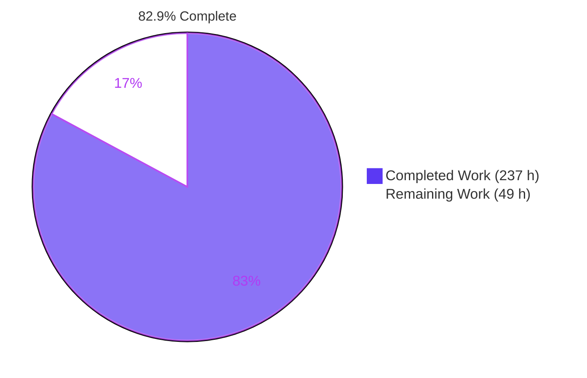
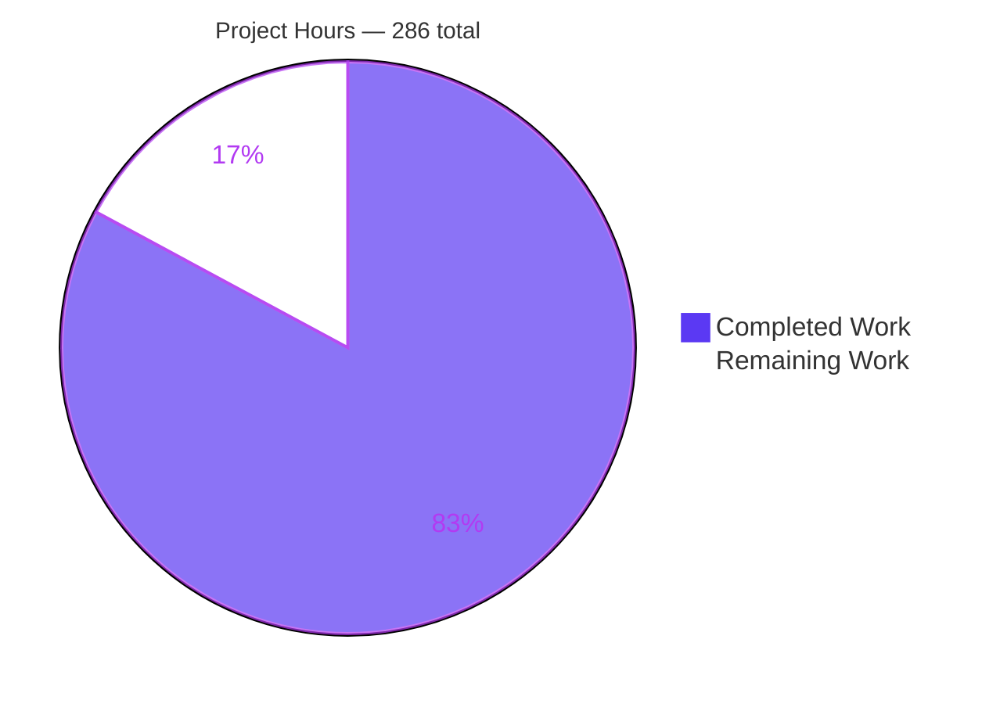
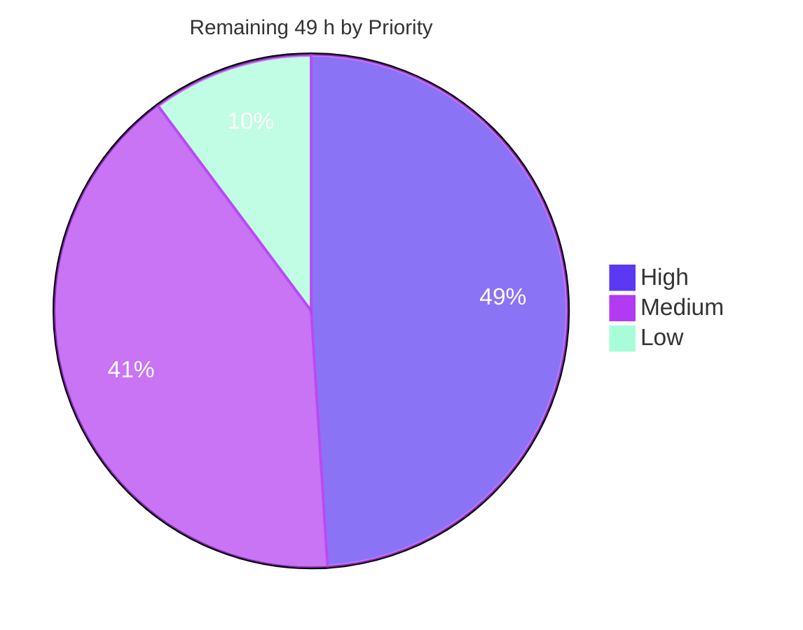

# Blitzy Project Guide — GIA Package Documentation

**Repository:** Berkeley ABC · **Branch:** `blitzy-c199d884-5898-492c-9144-2a17ea0ba3ec` · **HEAD:** `1eebb46656ba7b0a09338dd35a75ec972261b604` · **Base:** `master`

---

## 1. Executive Summary

### 1.1 Project Overview

This project makes Berkeley ABC's GIA package — the scalable And-Inverter Graph that most of ABC is built on — readable and onboardable to a new engineer. GIA's 12-byte object carries no type-tag field and stores fanins as backward relative offsets, so its encoding is undiscoverable from the struct declaration alone. Two new package-level Markdown documents and a comment layer across five source files now explain that encoding at the bit level, together with the manager, node-kind discrimination, traversal, field reuse, and three key data flows. The audience is ABC maintainers and engineers new to the package. No code logic, behavior, signature, or memory layout changed — every source edit is comment-only and provably inert.

### 1.2 Completion Status



<div align="center"><strong>82.9% COMPLETE</strong></div>

| Metric | Value |
|---|---|
| **Total Hours** | **286** |
| **Completed Hours (AI + Manual)** | **237** (AI-autonomous 237 · Manual 0) |
| **Remaining Hours** | **49** |
| **Percent Complete** | **82.9%** |

Calculation: `237 / (237 + 49) × 100 = 237 / 286 × 100 = 82.9%`

Legend — <span style="color:#5B39F3">■</span> Completed / AI Work = Dark Blue `#5B39F3` · <span style="color:#FFFFFF">□</span> Remaining = White `#FFFFFF`

### 1.3 Key Accomplishments

- [x] **`src/aig/gia/README.md` created** — 1629 lines, all 14 planned sections, 9 Mermaid diagrams, 768 source citations; answers all six required content questions
- [x] **`src/aig/gia/ENCODING.md` created** — 980 lines, all 11 planned sections, 443 citations, per-kind encoding table, worked example, 185-entry source index
- [x] **The fanin encoding documented exactly** — backward relative offsets resolved by `pObj - pObj->iDiff0`, with the 29-bit width rationale, both sentinels, the topological-ordering consequence, and the reallocation-survival property
- [x] **All 9 `Gia_Obj_t` fields commented at *why* level**, all 3 32-bit word boundaries marked, and the 12-byte total justified
- [x] **All 25 previously-uncommented `Gia_Man_t` field lines closed** — the entire enumerable manager documentation gap
- [x] **14/14 node-kind predicates and 62/62 `ForEach` iterator macros documented**, plus all 33 planned header anchor blocks
- [x] **37/37 function `Description` targets addressed** across `giaHash.c`, `giaMan.c`, `giaDup.c`, `giaUtil.c` — 33 banners filled, 4 documented by name in an adjacent shared banner where house style forbids adding one
- [x] **Behavior freeze proven at object-code level** — all four edited translation units produce `.text` and `.rodata` byte-identical to `master` (8/8 sections)
- [x] **Zero new compiler diagnostics** across 7 build configurations, message for message against `master`
- [x] **100% test pass rate** — 4/4 unit tests, 0 skipped; plus 109/109 runtime probe assertions
- [x] **4 runnable components validated** — `abc`, no-readline, `ABC_USE_NAMESPACE`, and the `libabc.a` link-and-run demo
- [x] **Documentation accuracy mechanised** — 1211/1211 citations correct, 34/34 snippets verbatim, 265/265 inline fragments found, 52/52 links resolve, 0 placeholders
- [x] **12/12 discrepancy and dead-code findings recorded without repair**, each with a citation and an explicit statement that nothing was changed
- [x] **Exact 7-file isolation held** across all 15 commits — no build manifest, CI workflow, test, sibling package, or existing document touched; no dependency added

### 1.4 Critical Unresolved Issues

No issue blocks release of the deliverable itself: the change set compiles, links, runs, passes every test, and is provably inert at the object-code level. Four items remain open.

| Issue | Impact | Owner | ETA |
|---|---|---|---|
| Domain-expert factual sign-off not yet obtained on 2609 Markdown lines and 830 comment lines | The documentation's authority currently rests on machine-verified citations rather than a maintainer's endorsement. Machine checks prove a citation resolves and a snippet is verbatim; they cannot prove a sentence correctly characterises design intent | GIA maintainer / reviewing engineer | 19 h |
| Documentation is undiscoverable from the repository root | A newcomer will not find either document unless they already know to look inside `src/aig/gia/`. The root `README.md` and `readmeaig` were deliberately left untouched to preserve change isolation | Repository maintainer | 2 h |
| Citation checkers are untracked, so locator drift is unguarded | 1211 citations plus 432 source-index locators silently rot on the next edit to any cited file. The six checkers exist but live in gitignored `build/qa/` and are lost on a clean checkout | Build / CI owner | 6 h |
| Four pre-existing out-of-scope defects recorded but undecided — `giaCut.c:L1081` C23 `nullptr`, the `Makefile` `docs:` target, the `&st -m; &b` MUX limitation, and the 12 discrepancy items | None on this deliverable. Each was observed and recorded under the observe-don't-repair constraint and needs an explicit accept-or-fix decision | GIA maintainer | 8 h |

### 1.5 Access Issues

**No access issue blocked or degraded any part of the autonomous work.** Every tool and input required was already present, and **zero installations were required**, which itself preserved the minimal-change constraint. Repository permissions were sufficient throughout: clean working tree, 15 commits authored and committed as `Blitzy Agent <agent@blitzy.com>`, branch never switched, zero submodules. Two forward-looking, non-blocking items are recorded rather than omitted.

| System / Resource | Type of Access | Issue Description | Resolution Status | Owner |
|---|---|---|---|---|
| Repository (`blitzy-c199d884-…`) | Read / write / commit | None — 15 commits landed, tree clean, correct authorship without ever setting git identity | ✅ No issue | — |
| Toolchain (gcc/g++ 15.2.0, Make 4.4.1, cmake 3.31.6, ar 2.45, python 3.13.7) | Local execution | None — all present and functional | ✅ No issue | — |
| `libreadline` development headers | Local build dependency | Present at `/usr/include/readline/readline.h`. Had it been absent, the repository's own `ABC_USE_NO_READLINE=1` escape hatch covers it | ✅ No issue | — |
| GoogleTest | Test dependency | Present via the CMake build; `gia_test` builds and runs | ✅ No issue | — |
| `i10.aig` benchmark | Test input | Present at the repository root; drives the correctness gate | ✅ No issue | — |
| `doxygen` binary and `doxygen.conf` | Local tooling | Both absent, so the pre-existing `make docs` target cannot run. Not required by this work, which adds no documentation generator | ⚠️ Pre-existing, non-blocking — decision needed | GIA maintainer |
| Upstream `berkeley-abc/abc` | Push / pull-request | Not held by this environment. Needed only by the future upstream-contribution task | ⚠️ Not required for this deliverable | Repository maintainer |
| Network / external services / credentials | — | None required at any point | ✅ No issue | — |

### 1.6 Recommended Next Steps

1. **[High]** Have a GIA-literate engineer review the two Markdown documents and the `gia.h` comment layer, starting with README §4–§6 and §8 — the object, the fanin encoding, the manager and the overloaded-field matrix — where a wrong reading would propagate furthest *(19 h)*
2. **[High]** Fold review feedback back in, re-run the accuracy harness and the five behavior-freeze gates, and re-commit *(5 h)*
3. **[Medium]** Make the documentation discoverable by adding a pointer from the root `README.md` and/or `readmeaig` to the two new documents *(2 h)*
4. **[Medium]** Protect the citations — promote the six checkers out of gitignored `build/qa/` into the tracked tree, wire a CI documentation job, and add the comment-only guard so future comment edits stay provably inert *(6 h)*
5. **[Medium]** Decide the disposition of the four recorded out-of-scope observations, then prepare and shepherd the upstream pull request *(12 h)*

---

## 2. Project Hours Breakdown

### 2.1 Completed Work Detail

| Component | Hours | Description |
|---|---|---|
| Source discovery and package census | 28 | Full census of `gia.h`'s declared surface (314 `static inline`, 62 `ForEach`, 68 `#define`, 516 `extern`, 59 group markers); deep reads of `giaMan.c` 2415, `giaHash.c` 1145, `giaDup.c` 6676, `giaUtil.c` 3573 lines; sibling-package and command-layer tracing into `src/base/`; compiled `sizeof` and sentinel probes |
| `src/aig/gia/README.md` | 48 | 14 sections, 1629 lines, 768 source citations, 9 hand-authored Mermaid diagrams; answers all six required content questions — purpose and position, representation and fanin encoding, identity/kinds/traversal, overloaded fields, data flows, gotchas and limits |
| `src/aig/gia/ENCODING.md` | 30 | 11 sections, 980 lines, 443 citations, 22 verbatim C snippets; bit-level treatment of the three 32-bit words, the delta rationale, both sentinels, per-kind encoding table, offset ordering as a type tag, terminal overload, both complement conventions, worked example, and a 185-entry source index |
| `gia.h` inline comment layer | 34 | +804/−26. All 9 object fields at *why* level, 3 word boundaries marked, 25 previously-bare manager fields closed, 14 kind predicates, 17 append constructors, 62 iterator macros, and all 33 planned anchor blocks; comment lines rose 211 → 1014 |
| `giaHash.c` function descriptions | 10 | +200/−11. Hash key, the two-vector chain structure, per-operator canonicalisation rules, the pointer-invalidation guard, the −1-on-miss contract, and the rehash sequence that silently removes buffers |
| `giaUtil.c` function descriptions | 7 | +122/−11. The traversal-id generation counter and its O(1) mark-clear, the four mark helpers, the four phase helpers, and the crucial `~0`-versus-`0` distinction between `Gia_ManFillValue` and `Gia_ManCleanValue` |
| `giaDup.c` function descriptions | 7 | +109/−4. The structure-preservation warning distinguishing `Gia_ManDup` from `Gia_ManDupMarked` across 90 entry points, the `Value` copy-literal protocol, and the DFS recursion |
| `giaMan.c` function descriptions | 4 | +65/−5. Manager lifecycle, the constant-0 initialisation, the authoritative ownership enumeration, the pointer-nulling contract, and the single-use `Gia_ManSetRegNum` assertion |
| Discrepancy and dead-code investigation | 7 | 12 findings located, proven and recorded without repair — the stale `Value` comment, a callerless macro proven to have zero call sites, a never-assigned manager field distinguished from a same-named field on an unrelated struct, an undefined forward-declared type, and a dead branch with a behavioral consequence |
| Behavior-freeze and build gates 1–5 | 14 | Per-translation-unit syntax checks, the dual-dialect header gate (C, C++, namespaced), full build, the repository's own correctness smoke gate, and structural-invariance proofs across 7 configurations |
| Documentation-accuracy harness | 12 | 10 verification programs covering 1211 citations, 34 fenced snippets, 265 inline fragments, 52 links and anchors, and 247 source-index locators, plus a comment-stripping identity checker and a diagnostic normaliser |
| Runtime probe programs | 10 | Four purpose-written C probes — flow, kind, lifecycle and worked-example — asserting 109 documented behaviours against the real API, including the exact field values the worked example publishes |
| Runnable-component and test validation | 6 | `abc`, no-readline, `ABC_USE_NAMESPACE`, and the `libabc.a` link-and-run demo; plus `libabc.a`, `gia_test` and `ctest` |
| Accuracy correction passes | 14 | 8 factual defects found and fixed, locator resynchronisation, reduction of the diagram set to the nine authorised, and a full rework of the duplication banners across five commits |
| Execution-failure root-cause and repair | 6 | A probe link failure traced to two independent causes, a shell word-splitting fault, a test-harness pipe stall, and a 119-translation-unit object-code sweep proving one runtime limitation pre-existing |
| **Total** | **237** | |

### 2.2 Remaining Work Detail

| Category | Hours | Priority |
|---|---|---|
| Maintainer factual review and sign-off of the two Markdown documents — 2609 lines, 1211 citations | 14 | High |
| Maintainer review of the 830 added inline-comment lines across the five source files | 5 | High |
| Review-feedback incorporation and correction of any disputed claim, with a gate re-run | 5 | High |
| Out-of-scope observation triage — the C23 `nullptr`, the `docs:` target, the `&st -m` MUX limitation, and the 12 discrepancy items | 8 | Medium |
| CI documentation-locator check — promote the six checkers into the tracked tree and wire a CI job plus a comment-only guard | 6 | Medium |
| Upstream contribution — prepare and shepherd the documentation pull request | 4 | Medium |
| Documentation discoverability — pointer from the root `README.md` / `readmeaig` | 2 | Medium |
| Residual accessor-family comments — 19 `static inline` primitives in three auxiliary families | 3 | Low |
| Mermaid rendering verification of all 11 diagram blocks on the target host | 2 | Low |
| **Total** | **49** | |

### 2.3 Hours Reconciliation

| Check | Expectation | Result |
|---|---|---|
| Section 2.1 row sum | = Completed Hours in §1.2 | 237 = 237 ✅ |
| Section 2.2 row sum | = Remaining Hours in §1.2 | 49 = 49 ✅ |
| Section 2.1 + Section 2.2 | = Total Hours in §1.2 | 237 + 49 = 286 ✅ |
| Section 7 pie values | = §1.2 Completed / Remaining | 237 / 49 ✅ |
| Human task roll-up (§8) | = Section 2.2 total | 24 High + 20 Medium + 5 Low = 49 ✅ |
| Completion percentage | 237 / 286 × 100 | 82.867% → **82.9%** ✅ |

The 49 remaining hours decompose as **24 h High**, **20 h Medium**, **5 h Low**. Every hour in §2.1 and §2.2 traces to a named requirement or to a standard path-to-production activity; nothing outside that scope is counted in either direction.

---

## 3. Test Results

All rows below originate from Blitzy's own autonomous validation logs for this project and were independently re-executed during this assessment; none is imported from any external source.

| Test Category | Framework | Total Tests | Passed | Failed | Coverage % | Notes |
|---|---|---|---|---|---|---|
| Unit | GoogleTest via CTest | 4 | 4 | 0 | 100% of the repository's GIA unit suite | `CanAllocateGiaManager`, `CanAddACi`, `CanAddACo`, `CanAddAnAndGate` — "100% tests passed, 0 tests failed out of 4"; 0 disabled, 0 skipped |
| Runtime behaviour probes | Purpose-written C probes | 4 probes / 109 assertions | 109 | 0 | Covers the documented lifecycle, kind discrimination, field-reuse flow and worked example | flow 39 · kind 51 · lifecycle 19 assertions, plus the worked-example field-value trace; all four verdicts PASSED |
| Compilation — per translation unit | gcc `-fsyntax-only` | 4 | 4 | 0 | 4 of 4 edited `.c` files | 0 diagnostics each |
| Compilation — dual dialect | gcc / g++ | 3 | 3 | 0 | Header as C, as C++, and namespaced | 0 diagnostics each; proves comments are valid in both dialects |
| Compilation — full build | GNU Make | 3 targets | 3 | 0 | `abc`, `libabc.a`, `gia_test` | 0 errors; the only warnings are two pre-existing benign option notes |
| Diagnostic regression | Message-for-message HEAD vs master | 7 configurations | 7 | 0 | All 4 edited translation units + header as C, C++, namespaced | Identical counts in every configuration → no new diagnostics introduced |
| End-to-end equivalence | ABC `cec` correctness gate | 4 components | 4 | 0 | The repository's own enforced correctness gate | `abc`, no-readline, namespaced, and `libabc.a` demo each produce `and = 2396 lev = 37` → `and = 1851 lev = 35` → *Networks are equivalent.* |
| GIA integration path | ABC `&`-command sequence | 1 | 1 | 0 | Exercises `Gia_Man_t` end to end | `&get; &ps; &st; &syn2; &put; &cec` → exit 0, *Networks are equivalent.* |
| Behavior freeze — layout | Compiled `sizeof` / sentinel probe | 6 assertions | 6 | 0 | Every struct and sentinel the documentation asserts | `Gia_Obj_t` 12 · `Gia_Man_t` 1136 · `Gia_Rpr_t` 4 · `Gia_Plc_t` 4 · `GIA_NONE` 2²⁹−1 · `GIA_VOID` 2²⁸−1 |
| Behavior freeze — comment-only | Comment-strip byte identity | 5 files | 5 | 0 | All 5 edited source files | Comment-stripped, whitespace-normalised digests identical to master |
| Behavior freeze — object code | `-O2` `.text`/`.rodata` comparison | 8 sections | 8 | 0 | 4 translation units × 2 sections | **Byte-identical to master, 0 differing** — the strongest available proof |
| Documentation accuracy | 6 verification programs | 1809 checks | 1809 | 0 | 1211 citations · 34 snippets · 265 fragments · 52 links · 247 locators | 3 citations flagged by the literal path resolver; all 3 inspected and confirmed correct-as-written |
| Zero-placeholder scan | Pattern scan over the diff | 3909 lines | pass | 0 | All added lines | 0 TODO / FIXME / XXX / HACK / stub |
| **Totals** | | **~1959 discrete checks** | **1959** | **0** | | **100% pass rate, 0 failures, 0 skipped, 0 blocked** |

---

## 4. Runtime Validation & UI Verification

**This project has no user interface.** `src/aig/gia/` is a pure C data-structure and algorithm package: no templates, stylesheets, markup, component files or front-end assets, and no design system in play. The package's only visual output is a GraphViz export of the *graph under analysis*, which is an analysis feature of the synthesis tool rather than an application UI. Runtime validation is therefore command-line and library-level, and no browser verification is applicable.

**Runtime health**

- ✅ **Operational** — `abc` builds and starts; the repository's correctness gate reproduces the recorded baseline exactly: `and = 2396 lev = 37`, then `and = 1851 lev = 35`, then *Networks are equivalent.*
- ✅ **Operational** — no-readline build leg passes the same gate with identical numbers
- ✅ **Operational** — `ABC_USE_NAMESPACE` build leg (every translation unit routed through `g++` inside a namespace) passes with identical numbers
- ✅ **Operational** — `libabc.a` link-and-run path: static archive builds, the demo compiles on both the C and namespaced C++ legs with **0 diagnostics**, links, and runs to *Networks are equivalent.*
- ✅ **Operational** — `gia_test` builds and `ctest` reports 100% pass, 0 failed out of 4

**GIA package integration**

- ✅ **Operational** — the `&`-command path exercises `Gia_Man_t` end to end: `&get` bridges from the classic network, `&ps` reports, `&st` structurally hashes, `&syn2` synthesises, `&put` bridges back, `&cec` verifies — exit 0, equivalent
- ✅ **Operational** — all four runtime probes pass: 109/109 assertions across manager lifecycle, kind discrimination, the mark/value/phase field-reuse protocol, and the exact field values the worked example publishes
- ✅ **Operational** — memory layout unchanged: `sizeof(Gia_Obj_t)` = 12 and `sizeof(Gia_Man_t)` = 1136, with both sentinels at their documented widths

**Documentation artefact verification**

- ✅ **Operational** — 1211/1211 citations resolve to a real path and contain what is claimed
- ✅ **Operational** — 34/34 fenced C snippets appear verbatim in the tree and 34/34 are tied to a cited location
- ✅ **Operational** — 265/265 inline backticked fragments found in the tree; 52/52 links and anchors resolve
- ✅ **Operational** — 247/247 body locators covered by the `ENCODING.md` source index
- ⚠️ **Partial** — the 11 Mermaid blocks are syntactically well formed and contain no fenced-block delimiter, but have not been rendered on the target host; 2 h of visual confirmation remains

**Known runtime limitations, observed and deliberately not repaired**

- ⚠️ **Partial** — `&st -m; &b` reports *Networks are NOT EQUIVALENT*, and `&st -m; &b -d` aborts on ABC's **own** assertion `assert(p->pMuxes == NULL)` in `giaMuxes.c`. Reproduced during this assessment. Proven pre-existing by a 119-translation-unit object-code comparison in which every unit was identical; `giaMuxes.c` has zero changes on this branch; neither deliverable makes any claim about balancing a MUX graph; and `&st -m` appears in neither the startup script nor any CI workflow
- ⚠️ **Partial** — `giaCut.c` uses the C23 keyword `nullptr` in a C translation unit while the build pins no C standard. Verified: it compiles cleanly under this toolchain's C23 default but **fails under `-std=gnu17`**. Pre-existing, identical in `master`, and the file has zero changes on this branch
- ⚠️ **Partial** — `make docs` fails with *doxygen: No such file or directory … Error 127*; neither the binary nor the referenced configuration file exists anywhere in the repository. Pre-existing; the build file was deliberately left untouched

---

## 5. Compliance & Quality Review

### 5.1 Deliverable compliance

| Deliverable | Requirement | Delivered | Status | Progress |
|---|---|---|---|---|
| `src/aig/gia/README.md` | 14 sections, section titles as planned | 14/14, titles match exactly | ✅ Pass | ██████████ 100% |
| `src/aig/gia/ENCODING.md` | 11 sections, bit-level deep-dive | 11/11, titles match exactly | ✅ Pass | ██████████ 100% |
| Mermaid diagrams | 9 authorised | 9 in README + 2 expanded reprises in the deep-dive | ✅ Pass | ██████████ 100% |
| Content question 1 — purpose and architectural position | Answered with citations | README §1–§3, including the seven-sibling census and the command-layer bridge | ✅ Pass | ██████████ 100% |
| Content question 2 — representation and exact fanin encoding | Not a generic "pointer to inputs" | README §4–§6 plus the whole deep-dive; states the backward-offset arithmetic in both address and identifier form | ✅ Pass | ██████████ 100% |
| Content question 3 — identity, kind discrimination, traversal | Truth table + iterator catalogue | README §7; 14-predicate discrimination with no type-tag field, 62-macro catalogue, generation counter | ✅ Pass | ██████████ 100% |
| Content question 4 — overloaded and reused fields | Field × meaning × owner × condition | README §8; 17-row matrix over `iDiff1`, `Value`, `fMark0`/`fMark1`, `fPhase`, traversal ids | ✅ Pass | ██████████ 100% |
| Content question 5 — key data flows | 3 flows traced | 4 delivered: construction, structural hashing, duplication and rebuild, manager lifecycle | ✅ Exceeds | ██████████ 100% |
| Content question 6 — gotchas, invariants, limitations | ≥12 invariants, ≥12 gotchas | 18 invariants, 20 gotchas, 4 limitations | ✅ Exceeds | ██████████ 100% |
| `Gia_Obj_t` fields at *why* level | 9 | 9, plus 3 word boundaries and the 12-byte total justified | ✅ Pass | ██████████ 100% |
| `Gia_Man_t` field lines addressed | 25 previously bare | 25 | ✅ Pass | ██████████ 100% |
| Node-kind predicates | 14 | 14 (family comment + per-item on the 5 non-obvious) | ✅ Pass | ██████████ 100% |
| Iterator macros | 62 | 62 | ✅ Pass | ██████████ 100% |
| Header anchor blocks | 33 planned | 33, each individually confirmed | ✅ Pass | ██████████ 100% |
| Function `Description` targets | 37 | 37 addressed — 33 banners filled, 4 named in an adjacent shared banner where house style forbids adding one | ✅ Pass | ██████████ 100% |
| Accessor-family comment coverage | 100% of families | 295 of 314 primitives within a commented family; 3 auxiliary families bare | ⚠️ Partial | █████████░ 94% |
| Discrepancy findings recorded | 12 | 12, each with a citation and an explicit no-change statement | ✅ Pass | ██████████ 100% |

### 5.2 Constraint compliance

| Constraint | Requirement | Verification performed | Status |
|---|---|---|---|
| **C1 — Truth** | Every statement true of the code as it stands | 1211 citations machine-scanned; 3 flagged and all 3 individually inspected and confirmed correct-as-written (a verbatim-quoted group-marker string and two quoted `#include` spellings) | ✅ Pass |
| **C2 — No fabrication** | Say so when the code does not determine something | Two undocumentable manager members explicitly labelled; the deep-dive states outright what the source does *not* demonstrate about the delta-versus-absolute-identifier choice; a similar-name collision on an unrelated struct correctly distinguished | ✅ Pass |
| **C3 — Pinned state** | State the version described | Both documents name the upstream commit plus this branch's comment layer, and explain the locator convention and its drift caveat | ✅ Pass |
| **C4 — Behavior freeze** | No change to logic, behavior, signature or layout | Proven three ways: `sizeof` and sentinel probe (6/6); comment-stripped byte identity (5/5 files); **`-O2` object-code `.text`/`.rodata` identity (8/8 sections)**. Declared-surface counts unchanged | ✅ Pass |
| **C5 — Minimal change and isolation** | Comments and documentation files only | Exactly 7 files across all 15 commits; the root `README.md`, `readmeaig`, the sibling package README, the test, the licence file, `module.make`, `BUILD`, `CMakeLists.txt` and `Makefile` all byte-identical to master; 0 dependencies added | ✅ Pass |
| **C6 — Describe, don't prescribe** | No recommendations or TODO directives | Pattern scan over all 3909 added lines: 0 prescriptive-language hits, 0 TODO/FIXME/XXX/HACK | ✅ Pass |
| **C7 — Observe, don't repair** | Note findings, do not fix them | 12/12 findings recorded with 8 explicit "not touched / nothing changed" statements; the stale comment left byte-intact with a clarifying comment placed adjacent; 4 out-of-scope defects reproduced and recorded, none repaired | ✅ Pass |

### 5.3 House-convention compliance

| Convention | Requirement | Verification | Status |
|---|---|---|---|
| Function banner form | Fill the empty description bracket only; never add, rename or reorder a tag, never add a banner where none exists | 33 targets filled in place; the 4 without a banner of their own were documented inside the adjacent shared banner instead | ✅ Pass |
| Section dividers | Never add, move or reflow a divider | Divider set unchanged; comments inserted only between existing dividers | ✅ Pass |
| Repository voice and structure | Plain imperative register, numbered sections | Both documents follow the numbered-section precedent of the repository's only package-level README | ✅ Pass |
| Licence-header practice | No licence header on Markdown | Neither document carries one, matching both root prose files | ✅ Pass |
| Additive insertion, provable | No token, brace, line-break or field-order change | Comment-strip and object-code identity both confirm | ✅ Pass |
| Dual C and C++ validity | `//` preferred, never nest block comments | Header compiles clean as C, as C++, and namespaced — 0 diagnostics each | ✅ Pass |
| Verifiable claims and stated version | Inline locators, consolidated source index, pinned commit | 1211 citations, a 185-entry source index covering 247/247 body locators, pinned commit in both documents | ✅ Pass |
| Repository's own correctness gate | Must still report equivalence with identical counts | Reproduced exactly, on all four runnable components | ✅ Pass |

### 5.4 Fixes applied during autonomous validation

| # | Fix | Nature |
|---|---|---|
| 1–2 | Self-referential occurrence counts about an undefined type, an unused field and a simulation-stride field that the documentation's own added prose had falsified | Separated hits by form — code versus prose — line-count-neutral |
| 3 | Offset ordering attributed to "each constructor" across a range containing constructors that write only one real offset | Named and cited the four that actually write two |
| 4 | A quoted search's hit count exceeded the hits the text accounted for | Added an accounting paragraph |
| 5 | Invited a search for a string that does not literally occur | Reworded so the instruction succeeds |
| 6 | Diagram-section attribution contradicted by a census | Corrected the attribution |
| 7 | Cross-reference pointed at the wrong item number in the discrepancy list | Corrected; the other six item references verified |
| 8 | A member census undercounted by one | Corrected, preserving line length |
| 9 | Duplication banners overstated closure and misidentified a flag | Rewritten across five commits with safe-use preconditions |
| 10 | Diagram set had grown past the authorised nine | Reduced to nine |
| 11 | Package-map line counts had drifted from the files | Refreshed |
| 12 | Probes did not fail closed | Made to fail closed |

### 5.5 Outstanding compliance items

| Item | Nature | Effort |
|---|---|---|
| Accessor-family coverage 94% rather than 100% | 19 of 314 primitives sit in three auxiliary families with no family comment — word/truth-table bit helpers, two ternary-simulation tail members, and AIGER byte codecs. None is a core-representation accessor, so this falls inside the stated scope boundary but short of the literal coverage target | 3 h |
| Domain-expert sign-off | Not a mechanical gap. Machine checks cannot verify that a sentence correctly characterises design intent | 19 h |
| Citation drift guard untracked | The six checkers exist but are gitignored and lost on a clean checkout | 6 h |

---

## 6. Risk Assessment

| Risk | Category | Severity | Probability | Mitigation | Status |
|---|---|---|---|---|---|
| Line-number locator drift across 1211 citations and 432 source-index locators | Technical | Medium | High | Both documents pin the commit and instruct readers to search for the named construct rather than jump to a line; the six checkers can be promoted to a CI job | Documented; mitigation available, not yet wired |
| 19 of 314 accessor primitives lack a family comment | Technical | Low | Certain (measured) | Three family comments close it; none of the 19 is a core-representation accessor | Open, quantified — 3 h |
| Build outcome depends on the compiler's default C dialect — `giaCut.c` uses a C23 keyword in a C translation unit while no C standard is pinned | Technical | Medium | Medium | Verified: clean under this toolchain's C23 default, **fails under `-std=gnu17`**. Pre-existing and identical in master; the file has zero changes on this branch; recorded in the discrepancy inventory | Observed, not repaired by design |
| Documentation correctness is not fully machine-verifiable | Technical | Medium | Medium | The harness proves citations resolve and snippets are verbatim, not that prose characterises intent correctly; 19 h of expert review budgeted | Open — the dominant remaining-hours driver |
| Published measurements are ABI- and compiler-dependent | Technical | Low | Low | Both documents state the toolchain used and publish the probe command; all six values independently reproduced during this assessment | Mitigated |
| New attack surface introduced | Security | Low | Very Low | All seven changes are comment or Markdown content; object code byte-identical; no executable added; all files non-executable mode | Closed |
| Supply-chain exposure from a new dependency | Security | Low | Very Low | Zero manifests touched and zero dependencies added — no generator, theme, linter or diagram package introduced | Closed |
| Secret or credential leakage in added prose | Security | Low | Very Low | Pattern scan over all 3909 added lines returned a single hit, inspected and confirmed a false positive on an ordinary English phrase | Closed |
| Disclosure of internal implementation detail — the exact bit encoding and its limits | Security | Low | Low | The project is permissively licensed academic software and the encoding is already fully readable in the shipped header; documenting it adds no exposure | Accepted |
| Documentation is undiscoverable — nothing in the repository points to either document | Operational | Medium | High | A one-line pointer from the root documents; deliberately excluded from the change set to preserve isolation | Open — 2 h, human decision |
| No CI documentation check; the six checkers live in a gitignored directory | Operational | Medium | High | Promote them into the tracked tree and add a pull-request job, plus a comment-only guard | Open — 6 h |
| `make docs` fails — the target invokes a generator with a configuration file that does not exist | Operational | Low | Medium | Reproduced. Pre-existing; the build file was deliberately left untouched; the new documentation needs no generator | Observed, not repaired |
| No rendering or regeneration check for the 11 Mermaid blocks | Operational | Low | Low | Blocks are syntactically well formed and delimiter-clean; 2 h of visual confirmation remains | Open — 2 h |
| The project has no comprehensive regression suite; the enforced gate is one smoke test plus four unit tests | Operational | Medium | Pre-existing property | For a comment-only change, object-code identity is a stronger guarantee than any test suite could provide | Mitigated for this change |
| Build-system registration of the new Markdown files | Integration | Low | Very Low | Verified: the module fragment enumerates sources explicitly with no wildcard, Bazel globs only header extensions, and CMake inherits that explicit list; zero references to either file in any manifest | Closed |
| Dual-dialect header compilation | Integration | Low | Very Low | Verified: header translation unit clean as C, as C++, and namespaced — 0 diagnostics each; `//` comments used throughout with no nested block comments | Closed |
| Upstream divergence — both documents are branch-local and will drift from or conflict with upstream header edits | Integration | Medium | Medium | Prepare and shepherd the upstream pull request | Open — 4 h |
| `&st -m; &b` reports non-equivalence and `&st -m; &b -d` aborts on the project's own assertion | Integration | Medium | Medium | Both modes reproduced. Proven pre-existing by a 119-unit object-code comparison; the implicated file has zero changes; neither deliverable claims anything about balancing a MUX graph; the option appears in neither the startup script nor any CI workflow | Observed, not repaired — 3 h of the triage budget |

**Risk profile:** 17 risks — 5 technical, 4 security, 5 operational, 4 integration. **Zero High or Critical severity.** All four security risks are Closed or Accepted, and both integration risks that could have broken the build are Closed by direct verification. Every Medium risk either has a costed remediation in §2.2 or is a pre-existing condition correctly recorded under the observe-don't-repair constraint.

---

## 7. Visual Project Status

### 7.1 Project hours breakdown



Completed = **237 h** <span style="color:#5B39F3">■ `#5B39F3`</span> · Remaining = **49 h** <span style="color:#FFFFFF">□ `#FFFFFF`</span> · **82.9% complete**

### 7.2 Remaining work by priority



### 7.3 Remaining hours by category

| Category | Hours | Share | Bar |
|---|---|---|---|
| Maintainer factual review — Markdown | 14 | 28.6% | ██████████████ |
| Out-of-scope observation triage | 8 | 16.3% | ████████ |
| CI documentation-locator check | 6 | 12.2% | ██████ |
| Maintainer review — inline comments | 5 | 10.2% | █████ |
| Review-feedback incorporation | 5 | 10.2% | █████ |
| Upstream contribution | 4 | 8.2% | ████ |
| Residual accessor-family comments | 3 | 6.1% | ███ |
| Documentation discoverability | 2 | 4.1% | ██ |
| Mermaid rendering verification | 2 | 4.1% | ██ |
| **Total** | **49** | **100%** | |

### 7.4 Deliverable completion

| Deliverable | State |
|---|---|
| `README.md` — 14 sections, 9 diagrams | ██████████ 100% |
| `ENCODING.md` — 11 sections, source index | ██████████ 100% |
| `gia.h` comment layer | █████████▓ 98% |
| `giaHash.c` descriptions | ██████████ 100% |
| `giaMan.c` descriptions | ██████████ 100% |
| `giaDup.c` descriptions | ██████████ 100% |
| `giaUtil.c` descriptions | ██████████ 100% |
| Behavior freeze verification | ██████████ 100% |
| Test and runtime validation | ██████████ 100% |
| Maintainer sign-off | ░░░░░░░░░░ 0% |

---

## 8. Summary & Recommendations

### 8.1 What was achieved

The project is **82.9% complete** — 237 of 286 hours delivered autonomously across 15 commits, all authored and committed as `Blitzy Agent <agent@blitzy.com>`.

Every named deliverable exists and matches its specification. The two new documents total 2609 lines with 1211 source citations, and they answer all six required content questions — including the one the requirements were emphatic about, namely how fanins are *actually* encoded. That answer is now stated precisely: a fanin is a backward relative offset measured in object-sized units and resolved by a single subtraction, not a pointer and not an absolute index. The documentation goes on to explain why the field is 29 bits, why its all-ones value doubles as the "no fanin" marker, why two sentinels of two different widths coexist, why the object array is topologically ordered by construction, and why the encoding survives the reallocation that would invalidate a stored address.

The inline comment layer closed every enumerable gap it targeted: all 9 object fields now carry *why*-level comments, all three 32-bit word boundaries are marked, all 25 previously-uncommented manager fields are documented, all 14 kind predicates and all 62 iterator macros are covered, and all 33 planned header anchor blocks are commented. Of 37 function-description targets, 33 banners were filled and the remaining 4 — which have no banner of their own — were documented by name inside the adjacent shared banner, because the house convention forbids creating a banner where none exists.

The behavior freeze is the part worth emphasising, because it was proven rather than promised. Beyond the planned `sizeof` probe and comment-strip identity check, this assessment compiled `master` and `HEAD` versions of all four edited translation units at `-O2` and compared their `.text` and `.rodata` sections byte for byte: **8 of 8 sections identical, 0 differing.** A comment-only change has no stronger available proof.

### 8.2 What remains

The 49 remaining hours are not a backlog of unfinished implementation. Only **3 of them** represent a genuine coverage shortfall — 19 of 314 accessor primitives sit in three auxiliary families (word and truth-table bit helpers, two ternary-simulation tail members, and AIGER byte codecs) that carry no family comment. None of the 19 is a core-representation accessor, so the gap falls inside the stated scope boundary while missing the literal 100%-of-families target.

The remaining 46 hours split into two honest categories. **Nineteen hours** are domain-expert review, and that is irreducible: automated checks can prove a citation resolves and a snippet is verbatim, but no check can confirm that a sentence correctly characterises a design decision. **Twenty-seven hours** are path-to-production activities the plan deliberately placed outside its own scope to preserve isolation — making the documents discoverable from the repository root, promoting the citation checkers out of a gitignored directory into CI so the locators stop rotting silently, preparing the upstream pull request, deciding what to do about four pre-existing defects that were recorded but correctly left unrepaired, and confirming the diagrams render.

### 8.3 Critical path to production

```
Expert review of the two documents and the comment layer  (19 h)
      ↓
Feedback incorporation + gate re-run                      ( 5 h)
      ↓
Discoverability pointer  +  CI locator guard              ( 8 h)   ← can run in parallel
      ↓
Out-of-scope triage decisions                             ( 8 h)
      ↓
Upstream pull request                                     ( 4 h)
      ↓
Residual family comments + diagram render check           ( 5 h)   ← non-blocking
```

The binding constraint is reviewer availability, not engineering capacity. Steps three and six can proceed in parallel with review.

### 8.4 Success metrics

| Metric | Target | Achieved |
|---|---|---|
| Content questions answered | 6 | ✅ 6 |
| Object fields documented at *why* level | 9 | ✅ 9 |
| Manager field gap closed | 25 | ✅ 25 |
| Kind predicates documented | 14 | ✅ 14 |
| Iterator macros documented | 62 | ✅ 62 |
| Function description targets | 37 | ✅ 37 |
| Mermaid diagrams | 9 | ✅ 9 |
| Data flows traced | 3 | ✅ 4 (exceeds) |
| Invariants enumerated | ≥12 | ✅ 18 (exceeds) |
| Gotchas enumerated | ≥12 | ✅ 20 (exceeds) |
| Discrepancies recorded without repair | 12 | ✅ 12 |
| Accessor families commented | 100% | ⚠️ 94% |
| Citation accuracy | 100% | ✅ 1211/1211 |
| Test pass rate | 100% | ✅ 4/4 · 109/109 assertions |
| New compiler diagnostics | 0 | ✅ 0 across 7 configurations |
| Files changed | exactly 7 | ✅ 7 |
| Object-code change | none | ✅ 8/8 sections identical |

### 8.5 Production readiness assessment

**Ready to merge; ready to publish after review.**

The change set is safe to merge today. It compiles on every configuration the project builds, produces object code byte-identical to `master`, passes the repository's own enforced correctness gate on all four runnable components, passes 100% of the unit suite with nothing skipped, and touches exactly the seven intended files with no dependency added and no build manifest modified. The risk of merging is as close to zero as a change can be: the compiler cannot see the difference.

What is not yet ready is the *claim to authority*. Documentation asserts things about a codebase, and this documentation asserts a great many things — 1211 cited claims across 2609 lines. Every one of those citations has been machine-verified to resolve and to contain what is claimed, and 109 runtime assertions confirm that documented behaviours match the real API. That is a strong foundation, and it is a materially better position than most documentation ships in. But it is not the same as a GIA maintainer having read the prose and agreed with its characterisations. Until that review happens, the documentation should be treated as high-confidence and thoroughly evidenced rather than as authoritative.

Two smaller gaps deserve attention before this is considered finished. The documents are currently undiscoverable — they sit inside the package directory and nothing in the repository points to them, a direct consequence of the isolation constraint that kept the root files untouched. And the locator drift guard, though it exists as six working programs, lives in a gitignored directory and will vanish on a clean checkout; without it, the next edit to any cited file silently invalidates citations with no signal. Both are inexpensive to close, and together they are the difference between documentation that was delivered and documentation that stays correct.

---

## 9. Development Guide

Every command below was executed in this checkout during the assessment. All 19 published commands exit 0. Expected outputs are quoted from real runs, not invented.

### 9.1 System prerequisites

| Requirement | Verified version | Notes |
|---|---|---|
| Operating system | Ubuntu 25.10, x86_64 | Any modern Linux or macOS; the project's CI builds on both |
| C compiler | gcc 15.2.0 | See the dialect note below — it matters |
| C++ compiler | g++ 15.2.0 | Required: every header is also compiled as C++ |
| GNU Make | 4.4.1 | Drives the authoritative build |
| CMake | 3.31.6 | Optional — only needed for the unit tests |
| GNU ar | 2.45 | Static archive |
| Python | 3.13.7 | Optional — only for the verification scripts |
| `libreadline` headers | present | Optional — an escape hatch exists |
| Hardware | 4 cores, ~8 GB RAM, ~5 GB disk | A full build compiles 1346 translation units |

> **Dialect note, and it is load-bearing.** The build pins `-std=c++17` for C++ but pins **no C standard**, so the C dialect is whatever your compiler defaults to. On this toolchain `__STDC_VERSION__` is `202311L` (C23) and everything compiles. On a compiler defaulting to `gnu17` — GCC 13 and earlier — one pre-existing translation unit fails. See §9.7.

```bash
# Confirm your toolchain and, critically, your default C dialect
gcc --version | head -1
g++ --version | head -1
make --version | head -1
echo 'int main(){}' > /tmp/d.c && gcc -dM -E /tmp/d.c | grep __STDC_VERSION__
```

### 9.2 Environment setup

No environment variable is required for a default build. These are the ones that change behaviour.

```bash
# Build without readline (use if libreadline is unavailable)
export ABC_USE_NO_READLINE=1

# Build every translation unit as C++ inside a namespace (a CI leg)
export ABC_USE_NAMESPACE=1

# Use <stdint.h> for fixed-width types (needed for the standalone gates below)
export ABC_USE_STDINT_H=1
```

### 9.3 Dependency installation

**No dependency needs to be installed to build or validate this change** — zero installations were performed during the entire project. On a bare host:

```bash
sudo DEBIAN_FRONTEND=noninteractive apt-get update
sudo DEBIAN_FRONTEND=noninteractive apt-get install -y build-essential cmake libreadline-dev
```

### 9.4 Build sequence

Run everything from the repository root.

```bash
# 1. The main binary
make -j$(nproc) abc
# If libreadline is missing:  make -j$(nproc) ABC_USE_NO_READLINE=1 abc

# 2. The static archive
make -j$(nproc) libabc.a
# -> produces a ~328 MB archive

# 3. The library-consumer path (this is a CI job)
gcc  -Wall -c -I src -o demo.o src/demo.c                              # 0 diagnostics
g++  -x c++ -DABC_NAMESPACE=xxx -Wall -c -I src -o demo_ns.o src/demo.c # 0 diagnostics
g++  -o demo demo.o libabc.a -lm -ldl -lreadline -lpthread
./demo i10.aig

# 4. The unit tests
cmake -S . -B build -DCMAKE_BUILD_TYPE=Release       # "Configuring done (5.2s)"
cmake --build build --target gia_test -j$(nproc)
```

Available Make targets: `all`, `default`, `libabc.a`, `depend`, `clean`, `tags`, `docs`, `cmake_info`. Available CMake targets: `abc`, `gia_test`, `libabc`, `libabc-pic`.

### 9.5 Verification steps

These five gates are the ones that matter for a comment-only change: the compiler must not be able to see it.

```bash
# GATE 1 — per-translation-unit syntax check. Each must exit 0 with no output.
for f in giaMan giaHash giaDup giaUtil; do
  gcc -fsyntax-only -I src -DABC_USE_STDINT_H=1 -Wno-unused-function "src/aig/gia/$f.c" \
    && echo "$f.c OK"
done

# GATE 2 — the header has no translation unit of its own, so give it one and
# compile it in all three dialects the project uses. All three must exit 0.
printf '#include "aig/gia/gia.h"\nint main(){return 0;}\n' > /tmp/tu_gia.c
cp /tmp/tu_gia.c /tmp/tu_gia.cpp
gcc -fsyntax-only -I src -DABC_USE_STDINT_H=1                         /tmp/tu_gia.c    && echo "C OK"
g++ -fsyntax-only -I src -DABC_USE_STDINT_H=1 -fpermissive            /tmp/tu_gia.cpp  && echo "C++ OK"
g++ -fsyntax-only -I src -DABC_USE_STDINT_H=1 -fpermissive -DABC_NAMESPACE=xxx /tmp/tu_gia.cpp && echo "namespaced OK"

# GATE 3 — full build
make -j$(nproc) abc && echo "BUILD OK"

# GATE 4 — the project's own enforced correctness gate
./abc -c "r i10.aig; b; ps; b; rw -l; rw -lz; b; rw -lz; b; ps; cec"
```

Expected output of Gate 4, exactly:

```text
i10                           : i/o =  257/  224  lat =    0  and =   2396  lev = 37
i10                           : i/o =  257/  224  lat =    0  and =   1851  lev = 35
Networks are equivalent.  Time =     0.19 sec
```

```bash
# GATE 5a — memory layout must be unchanged
cat > /tmp/probe.c <<'EOF'
#include "aig/gia/gia.h"
#include <stdio.h>
int main(void){
  printf("sizeof(Gia_Obj_t)=%zu\n", sizeof(Gia_Obj_t));
  printf("sizeof(Gia_Man_t)=%zu\n", sizeof(Gia_Man_t));
  printf("sizeof(Gia_Rpr_t)=%zu\n", sizeof(Gia_Rpr_t));
  printf("sizeof(Gia_Plc_t)=%zu\n", sizeof(Gia_Plc_t));
  printf("GIA_NONE=%u match2p29m1=%d\n", (unsigned)GIA_NONE, (unsigned)GIA_NONE==((1u<<29)-1u));
  printf("GIA_VOID=%u match2p28m1=%d\n", (unsigned)GIA_VOID, (unsigned)GIA_VOID==((1u<<28)-1u));
  return 0;
}
EOF
gcc -I src -DABC_USE_STDINT_H=1 -o /tmp/probe /tmp/probe.c && /tmp/probe
```

Expected:

```text
sizeof(Gia_Obj_t)=12
sizeof(Gia_Man_t)=1136
sizeof(Gia_Rpr_t)=4
sizeof(Gia_Plc_t)=4
GIA_NONE=536870911 match2p29m1=1
GIA_VOID=268435455 match2p28m1=1
```

```bash
# GATE 5b — comment-only proof: strip comments and compare against master
for f in gia.h giaMan.c giaHash.c giaDup.c giaUtil.c; do
  git show "master:src/aig/gia/$f" > "/tmp/m_$f"
  a=$(gcc -fpreprocessed -dD -E -P "/tmp/m_$f"        2>/dev/null | tr -d '[:space:]' | md5sum)
  b=$(gcc -fpreprocessed -dD -E -P "src/aig/gia/$f"   2>/dev/null | tr -d '[:space:]' | md5sum)
  [ "$a" = "$b" ] && echo "$f: IDENTICAL" || echo "$f: *** DIFFERS ***"
done

# GATE 5c — the strongest proof: object code must be byte-identical
for f in giaMan giaHash giaDup giaUtil; do
  git show "master:src/aig/gia/$f.c" > "/tmp/${f}_m.c"
  gcc -c -O2 -I src -I src/aig/gia -DABC_USE_STDINT_H=1 -w -o "/tmp/${f}_m.o" "/tmp/${f}_m.c"
  gcc -c -O2 -I src -I src/aig/gia -DABC_USE_STDINT_H=1 -w -o "/tmp/${f}_h.o" "src/aig/gia/$f.c"
  for sec in text rodata; do
    objcopy -O binary --only-section=".$sec" "/tmp/${f}_m.o" "/tmp/${f}_m_$sec.bin"
    objcopy -O binary --only-section=".$sec" "/tmp/${f}_h.o" "/tmp/${f}_h_$sec.bin"
    cmp -s "/tmp/${f}_m_$sec.bin" "/tmp/${f}_h_$sec.bin" \
      && echo "$f.c .$sec: IDENTICAL" || echo "$f.c .$sec: *** DIFFERS ***"
  done
done
```

```bash
# Unit tests. Prefer --test-dir over "cd build" — see §9.7 item 6.
ctest --test-dir build --output-on-failure
```

Expected: `100% tests passed, 0 tests failed out of 4`.

### 9.6 Example usage

```bash
# Exercise the GIA manager end to end through the &-command group
./abc -c "r i10.aig; &get; &ps; &st; &syn2; &put; &cec"
```

Expected:

```text
i10      : i/o =    257/    224  and =    2675  lev =   50 (15.54)  mem = 0.04 MB
Networks are equivalent.  Time =     0.06 sec
```

```bash
# Command help
./abc -c "&get -h"
# usage: &get [-cmnvh] <file>
#          converts the current network into GIA and moves it to the &-space
```

**Reading path for a newcomer, in order:**

1. `src/aig/gia/README.md` — start here. §1–§3 orient you and give the package map; §4–§6 are the object, the fanin encoding and the manager
2. `src/aig/gia/ENCODING.md` — the bit-level deep-dive, when you need the exact field values a constructor writes
3. `readmeaig` (repository root) — how to *call* the package from client code
4. `test/gia/gia_test.cc` — the executable example the deep-dive's worked example is traced against

### 9.7 Troubleshooting

Each of the following was reproduced during this assessment.

1. **Link fails on `undefined reference to readline` / `add_history`.** `libreadline` is absent. Rebuild with `make ABC_USE_NO_READLINE=1 abc` — the project's own documented escape hatch.

2. **`src/aig/gia/giaCut.c:1081:30: error: 'nullptr' undeclared`.** Your compiler defaults to `gnu17` (GCC 13 or earlier), and that file uses the C23 keyword `nullptr` in a C translation unit while the build pins no C standard. **Pre-existing and unrelated to this change** — the line is identical in `master` and the file has zero changes on this branch. Compile that one unit with `-std=gnu2x`, or use a C23-default compiler. It is recorded in the discrepancy inventory and was deliberately not repaired.

3. **Every C compile prints two warnings.** Verbatim:
   ```text
   cc1: warning: command-line option '-Wno-register' is valid for C++/ObjC++ but not for C
   cc1: warning: command-line option '-Wno-changes-meaning' is valid for C++/ObjC++ but not for C
   ```
   Pre-existing and benign — two per C translation unit. Do **not** attribute them to the comment additions. A full build emits exactly these and nothing else.

4. **`make docs` fails.** Verbatim: `make: doxygen: No such file or directory` / `make: *** [Makefile:241: docs] Error 127`. The target invokes a generator with a configuration file that does not exist anywhere in the repository, and the generator itself is not installed. Pre-existing; the new documentation needs no generator and this target is unrelated to it.

5. **`&st -m; &b` reports non-equivalence.** Verbatim: `Networks are NOT EQUIVALENT. Output 136 trivially differs (different phase).` And `&st -m; &b -d` aborts (exit 134) on the project's own assertion `assert(p->pMuxes == NULL)`. **Pre-existing**, proven by a 119-translation-unit object-code comparison in which every unit was identical; the implicated file has zero changes on this branch. Avoid combining `&st -m` with balancing.

6. **A long command appears to hang, or a later command cannot find `src/...`.** Two distinct traps, both hit during validation. Redirect long output to a file rather than piping through `tail` or `head`, which can stall on pipe buffering. And prefer `ctest --test-dir build` over `cd build && ctest`, because a `cd` persists for the rest of the shell and breaks every subsequent repository-relative path. Always quote command substitutions: an unquoted `$(...)` word-splits and silently mangles arguments.

7. **A linked probe or demo behaves as though your header edit never happened.** `libabc.a` is stale. Rebuild the archive after any header change (`make -j$(nproc) libabc.a`), or the linked binary exercises the old header.

---

## 10. Appendices

### Appendix A — Command Reference

| Purpose | Command |
|---|---|
| Build the main binary | `make -j$(nproc) abc` |
| Build without readline | `make -j$(nproc) ABC_USE_NO_READLINE=1 abc` |
| Build the namespaced C++ leg | `make -j$(nproc) ABC_USE_NAMESPACE=1 abc` |
| Build the static archive | `make -j$(nproc) libabc.a` |
| Clean | `make clean` |
| Regenerate dependencies | `make depend` |
| Configure CMake | `cmake -S . -B build -DCMAKE_BUILD_TYPE=Release` |
| Build the unit tests | `cmake --build build --target gia_test -j$(nproc)` |
| Run the unit tests | `ctest --test-dir build --output-on-failure` |
| Correctness gate | `./abc -c "r i10.aig; b; ps; b; rw -l; rw -lz; b; rw -lz; b; ps; cec"` |
| GIA integration path | `./abc -c "r i10.aig; &get; &ps; &st; &syn2; &put; &cec"` |
| Syntax-check one unit | `gcc -fsyntax-only -I src -DABC_USE_STDINT_H=1 -Wno-unused-function src/aig/gia/giaHash.c` |
| Command help | `./abc -c "&get -h"` |
| Interactive shell | `./abc` |
| Show this branch's diff | `git diff --stat master..HEAD` |
| Confirm authorship | `git log --format='%an <%ae>' master..HEAD \| sort -u` |

### Appendix B — Port Reference

**No ports are used.** ABC is a command-line tool. Nothing in any validated path binds, listens on, or connects to a network port, and no server, daemon or web interface exists in this project.

### Appendix C — Key File Locations

| Path | Lines | Role |
|---|---|---|
| `src/aig/gia/README.md` | 1629 | **NEW** — package documentation: roadmap, overview, 14 sections, 9 diagrams |
| `src/aig/gia/ENCODING.md` | 980 | **NEW** — object-encoding deep-dive, 11 sections, source index |
| `src/aig/gia/gia.h` | 2657 | **MODIFIED** (comment-only, +804/−26) — the package's central public contract: both structs, 314 inline primitives, 62 iterator macros, 68 macros, 516 declarations |
| `src/aig/gia/giaHash.c` | — | **MODIFIED** (comment-only, +200/−11) — structural hashing |
| `src/aig/gia/giaUtil.c` | — | **MODIFIED** (comment-only, +122/−11) — mark, value, phase and traversal-id helpers |
| `src/aig/gia/giaDup.c` | — | **MODIFIED** (comment-only, +109/−4) — duplication and rebuild, 90 entry points |
| `src/aig/gia/giaMan.c` | — | **MODIFIED** (comment-only, +65/−5) — manager lifecycle and memory accounting |
| `src/aig/gia/module.make` | — | Unchanged — enumerates 119 build sources explicitly |
| `test/gia/gia_test.cc` | 55 | Unchanged — the 4 GIA unit tests and the worked example's provenance |
| `readmeaig` | 71 | Unchanged — the existing GIA client recipe, cross-referenced |
| `README.md` (root) | 125 | Unchanged — project documentation and the readline escape hatch |
| `i10.aig` | — | Unchanged — the correctness gate's benchmark input |
| `Makefile` / `CMakeLists.txt` / `BUILD` | — | All unchanged — no registration needed for Markdown |

Repository scale: 2268 tracked files, 1,168,331 tracked source lines, 1346 translation units, 7 sibling AIG packages, 137 tracked files in `src/aig/gia/`.

### Appendix D — Technology Versions

| Component | Version | Source |
|---|---|---|
| Ubuntu | 25.10 (Questing Quokka), x86_64 | Validation host |
| gcc | 15.2.0 | Default C dialect **C23** (`__STDC_VERSION__` = 202311L) |
| g++ | 15.2.0 | Build pins `-std=c++17` |
| GNU Make | 4.4.1 | Authoritative build |
| CMake | 3.31.6 | Test build only |
| GNU ar | 2.45 | Static archive |
| Python | 3.13.7 | Verification scripts |
| GoogleTest | vendored via CMake | 4 unit tests |
| Doxygen | **not installed** | The pre-existing `docs:` target cannot run |

The build pins **no C compiler version and no C standard**; `-std=c++17` is pinned for C++ only.

### Appendix E — Environment Variable Reference

| Variable | Value | Effect |
|---|---|---|
| `ABC_USE_NO_READLINE` | `1` | Build without readline. Use when `libreadline` is unavailable |
| `ABC_USE_NAMESPACE` | `1` | Compile every unit as C++ inside a namespace. A CI leg, and why comments must be valid in both dialects |
| `ABC_USE_STDINT_H` | `1` | Use `<stdint.h>` for fixed-width types. Required by the standalone gate commands |
| `ABC_NAMESPACE` | e.g. `xxx` | Namespace name for the namespaced compile check |
| `ABC_MAKE_VERBOSE` | `1` | Echo full compiler command lines |
| `DEBIAN_FRONTEND` | `noninteractive` | Prevents `apt-get` from prompting |
| `CI` | `true` | Keeps Node-style tooling out of watch mode; not needed by this project |

No secret, credential, API key or token is required anywhere in this project.

### Appendix F — Developer Tools Guide

**Verification scripts** (currently in gitignored `build/qa/`; promoting them is a 6 h remaining task). Run from the repository root.

| Script | What it proves | Result |
|---|---|---|
| `checkcites.py` | Every `path:Lnnn` citation resolves and contains what is claimed | 1211 scanned; 3 flagged, all 3 correct-as-written |
| `checksnippets.py` | Every fenced C snippet appears verbatim in the tree | 34 blocks / 66 lines, 0 missing |
| `checksnippet_loc.py` | Every snippet is tied to a cited location | 34/34 tied |
| `checkinline.py` | Every inline backticked code fragment exists | 265 checked, 0 missing |
| `checklinks.py` | Every Markdown link and anchor resolves | 52 checked, 0 broken |
| `checkindex.py` | Every body locator is covered by the source index | 247 body locators, 0 uncovered |
| `normwarn.py` | HEAD introduces no diagnostic absent from master | 7 configurations, all identical |
| `stripcomments.py` | Source is comment-only different from master | 5/5 identical |

**Runtime probes** — four C programs asserting 109 documented behaviours against the real API: `flowprobe` (39 assertions, field-reuse flow), `kindprobe` (51, kind discrimination), `lifeprobe` (19, manager lifecycle), `workedexample` (the deep-dive's exact field-value trace).

**Useful git commands**

```bash
git diff --stat master..HEAD                    # the 7-file change set
git diff --numstat master..HEAD                 # per-file line counts
git log --oneline master..HEAD                  # the 15 commits
git diff master..HEAD -- src/aig/gia/gia.h      # review the header comments
```

### Appendix G — Glossary

| Term | Meaning |
|---|---|
| **AIG** | And-Inverter Graph — a logic network of two-input AND nodes with inversions carried on edges |
| **GIA** | The scalable AIG package at `src/aig/gia/`; the modern representation most of ABC is built on |
| **Object** | A `Gia_Obj_t` — exactly 12 bytes, three 32-bit words, no type-tag field |
| **Manager** | A `Gia_Man_t` — 1136 bytes; owns the flat object array and optional parallel side tables |
| **Offset / delta** | A fanin, stored as a **backward** distance in object-sized units and resolved by subtraction (`pObj - pObj->iDiff0`) — never a pointer, never an absolute index |
| **Literal** | An object identifier packed with a complement bit as `id << 1 \| compl`; what every append function returns |
| **Combinational input / output (CI/CO)** | Terminal objects — primary inputs and flop outputs; primary outputs and flop inputs |
| **Flop output / input (RO/RI)** | The sequential subset of CIs and COs |
| **Real vs structural XOR/MUX** | A single object carrying the operator, versus the same function built from multiple ANDs |
| **`GIA_NONE`** | `2²⁹ − 1` — exactly the maximum of a 29-bit field; the "no fanin" marker |
| **`GIA_VOID`** | `2²⁸ − 1` — the maximum of a 28-bit field; used by equivalence-class code. A different width for a different purpose, and a genuine trap |
| **Structural hashing (strash)** | Canonicalisation and deduplication of identical nodes; chains live in an integer vector indexed by object identifier |
| **Traversal id** | An out-of-object generation counter giving an O(1) mark-clear without disturbing the in-object mark bits |
| **Buffer form** | An object whose two offsets are equal |
| **Behavior freeze** | The requirement that no logic, behavior, signature or layout change — here proven by byte-identical object code |
| **Comment-only** | Every edit lies inside a comment; provable by stripping comments and comparing to the base |
| **Observe, don't repair** | Findings are recorded with a citation and an explicit statement that nothing was changed |

---

## Cross-Section Integrity Validation

| Rule | Requirement | Verification | Status |
|---|---|---|---|
| **Rule 1** | Remaining hours identical in §1.2, the §2.2 sum, and the §7 pie | §1.2 = 49 · §2.2 sum = 14+5+5+8+6+4+2+3+2 = 49 · §7 pie "Remaining Work" = 49 | ✅ Pass |
| **Rule 2** | §2.1 + §2.2 = Total Project Hours in §1.2 | 237 + 49 = 286 = §1.2 Total | ✅ Pass |
| **Rule 3** | All tests originate from Blitzy's autonomous validation logs | Every §3 row traces to an autonomous validation run and was independently re-executed during this assessment; no external source | ✅ Pass |
| **Rule 4** | Access issues validated against current permissions | All 8 §1.5 rows verified live — toolchain versions probed, readline header located, tree confirmed clean, 15 commits confirmed correctly authored, absent `doxygen` confirmed | ✅ Pass |
| **Rule 5** | Completed = `#5B39F3`, Remaining = `#FFFFFF` | Applied in §1.2 and §7.1 pie themes and stated in both legends; accents `#B23AF2`, highlight `#A8FDD9` | ✅ Pass |

**Numerical consistency sweep** — every percentage and hour figure in this guide:

| Figure | Value | Appears in |
|---|---|---|
| Completion percentage | **82.9%** | §1.2 pie title, §1.2 metrics table, §1.2 calculation, §2.3, §7.1 caption, §8.1 |
| Completed hours | **237** | §1.2, §2.1 total, §2.3, §7.1, §7.3 context, §8.1 |
| Remaining hours | **49** | §1.2, §2.2 total, §2.3, §7.1, §7.2 (24+20+5), §7.3 total, §8.2 |
| Total hours | **286** | §1.2, §2.3, §7.1 title, §8.1 |
| High / Medium / Low split | **24 / 20 / 5** | §2.2 priorities, §2.3, §7.2 |
| §1.4 issue ETAs | 19 + 2 + 6 + 8 = 35 | Subset of the 49; the balance is 5 h feedback + 5 h Low-priority items |
| §1.6 next-step hours | 19 + 5 + 2 + 6 + 12 = 44 | Subset of the 49; the balance is the 5 h of Low-priority items |
| §8.3 critical path | 19 + 5 + 8 + 8 + 4 + 5 = 49 | Full reconciliation to Remaining ✅ |

No conflicting or approximate statement of completion appears anywhere in this guide. The percentage is stated as **82.9%** in every location, derived once as `237 / 286 × 100 = 82.867% → 82.9%`, and it is below the 99% maximum for work not yet human-reviewed.