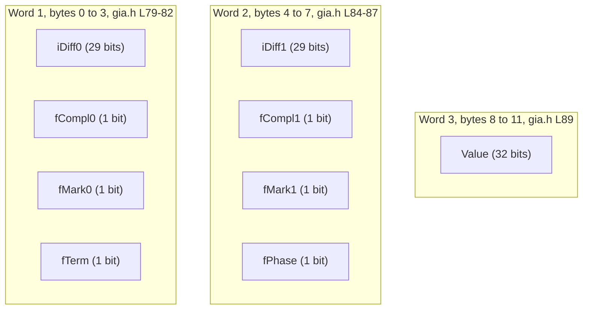
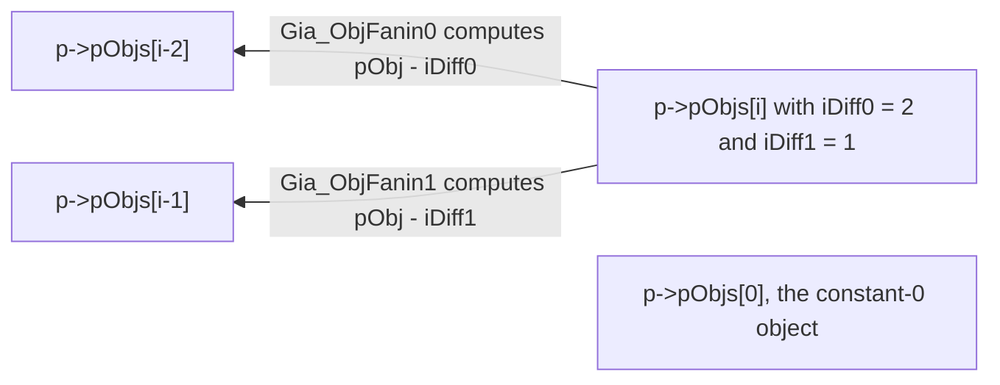

# GIA Object Encoding

A GIA object is exactly twelve bytes wide, carries no type-tag field, and stores its fanins as
backward relative offsets rather than as addresses. Most kinds of node in the graph — constant,
combinational input, combinational output, AND-shaped, real XOR, buffer — are told apart from the
twelve bytes alone, by one flag bit, two sentinel values, and the relative ordering of the two
offset fields `src/aig/gia/gia.h:L510-523`. A real MUX is the exception: its twelve bytes carry the
same pattern as an AND-shaped object's, and it is separated from a plain AND only by manager-side
metadata, the `p->pMuxes` side array `src/aig/gia/gia.h:L516-518`. None of that is visible in the
struct declaration. This document takes the twelve bytes apart bit by bit and shows which
constructor writes which field, why the offsets run backwards, why the fields are 29 bits wide, and
what the encoding therefore cannot express.

Contents:

- [1. Scope and How to Read This](#1-scope-and-how-to-read-this)
- [2. The Three Words](#2-the-three-words)
- [3. Why Deltas Instead of Addresses or Absolute Identifiers](#3-why-deltas-instead-of-addresses-or-absolute-identifiers)
- [4. Why 29 Bits, and the Two Sentinels](#4-why-29-bits-and-the-two-sentinels)
- [5. Encoding Every Object Kind](#5-encoding-every-object-kind)
- [6. Offset Ordering as a Type Tag](#6-offset-ordering-as-a-type-tag)
- [7. Terminal Overload](#7-terminal-overload)
- [8. Literals, Complementation, and the Two Conventions](#8-literals-complementation-and-the-two-conventions)
- [9. Worked Example](#9-worked-example)
- [10. What the Encoding Cannot Express](#10-what-the-encoding-cannot-express)
- [11. Source Index](#11-source-index)

## 1. Scope and How to Read This

This document covers one subject: the in-memory encoding of a single GIA object, `Gia_Obj_t`,
declared at `src/aig/gia/gia.h:L76-90`. It covers the three 32-bit words, the two sentinels, the
fanin offsets, the complement bits, the terminal overload of `iDiff1`, the exact field values each
constructor writes, and the limits that follow from the layout.

It does not cover the manager `Gia_Man_t`, the algorithms layered over the representation, the
`&`-command layer that drives GIA, or how to call the package from client code. Those live
elsewhere: see [`./README.md`](./README.md) for the package overview, the manager, the key data
flows, the invariants, the gotchas, and the inventory of observed discrepancies and dead code.
The root `readmeaig` holds the client recipe, under the heading at `readmeaig:L26`.

Read this document with `src/aig/gia/gia.h` open beside it, and in particular with the struct at
`src/aig/gia/gia.h:L76-90` in view. Statements here come in three kinds, and each kind is marked so a
reader knows what backs it:

- **Statements about the code** carry an inline citation of the form `path:Lnnn` for a single
  line or `path:Lnnn-mmm` for a range, naming the file and the lines that establish them. Section 11 collects
  those citations into a single table so the document can be re-verified claim by claim. Code
  snippets are quoted verbatim from the cited lines, so they can be found with `grep`. Arithmetic
  performed on a quoted value — converting the hexadecimal sentinels of section 4 to decimal, for
  instance — is part of this kind, and the cited literal is shown alongside it.
- **Measurements** — the struct sizes and the alignment — are results of compiling and running a
  probe against the real header, not deductions from the declarations. Each is introduced as a
  measurement and the command that produces it is given, so it can be re-run. They describe the
  toolchain recorded below and are not properties the header states.
- **Statements about what the source does not establish** are labelled as such rather than filled in
  with a plausible explanation. Section 3 carries the main one: the code shows why the encoding
  cannot hold addresses, and records no reason for preferring a delta to an absolute identifier.

Every measurement below comes from the probe that follows, built with the repository's default
toolchain — `gcc` on `x86_64` Linux, the `CC := gcc` of `Makefile:L2` with no version pinned anywhere
in the build. The command is:

```bash
printf '#include <stdio.h>\n#include "aig/gia/gia.h"\nint main(void){printf("%%zu %%zu %%zu %%zu\\n",sizeof(Gia_Obj_t),sizeof(Gia_Man_t),sizeof(Gia_Rpr_t),sizeof(Gia_Plc_t));return 0;}\n' > /tmp/probe.c
gcc -I src -DABC_USE_STDINT_H=1 -o /tmp/probe /tmp/probe.c -lm && /tmp/probe
```

It prints `12 1136 4 4`.

This description was written against branch `master` at commit `17cadca08`. The line numbers belong
to that commit, and the measured values belong to that commit compiled by the toolchain named above;
a reader on a later commit, or with a different toolchain, can re-run the probe and compare.

## 2. The Three Words

The object is declared as nine members. The typedef is at `src/aig/gia/gia.h:L76`, the struct name
at `src/aig/gia/gia.h:L77`, the opening brace at `src/aig/gia/gia.h:L78`, the members at
`src/aig/gia/gia.h:L79-89`, and the closing brace at `src/aig/gia/gia.h:L90`. Two blank lines, at
`src/aig/gia/gia.h:L83` and `src/aig/gia/gia.h:L88`, separate the three words.

The first word, quoted verbatim from `src/aig/gia/gia.h:L79-82`:

```c
    unsigned       iDiff0 :  29;  // the diff of the first fanin
    unsigned       fCompl0:   1;  // the complemented attribute
    unsigned       fMark0 :   1;  // first user-controlled mark
    unsigned       fTerm  :   1;  // terminal node (CI/CO)
```

The second word, quoted verbatim from `src/aig/gia/gia.h:L84-87`:

```c
    unsigned       iDiff1 :  29;  // the diff of the second fanin
    unsigned       fCompl1:   1;  // the complemented attribute
    unsigned       fMark1 :   1;  // second user-controlled mark
    unsigned       fPhase :   1;  // value under 000 pattern
```

The third word, quoted verbatim from `src/aig/gia/gia.h:L89`:

```c
    unsigned       Value;         // application-specific value
```

### Field table

| Field | Width | Word | What it holds |
|---|---|---|---|
| `iDiff0` | 29 bits | 1 | Backward offset, in units of `Gia_Obj_t`, from this object to its first fanin; resolved by subtraction at `src/aig/gia/gia.h:L549`. Holds `GIA_NONE` when there is no first fanin, which is the case for the constant-0 object and for every combinational input `src/aig/gia/gia.h:L709`, `src/aig/gia/giaMan.c:L64` |
| `fCompl0` | 1 bit | 1 | Complement attribute of the first fanin, written from `Abc_LitIsCompl` of the incoming literal `src/aig/gia/gia.h:L727`; read back by `Gia_ObjFaninC0` `src/aig/gia/gia.h:L545` |
| `fMark0` | 1 bit | 1 | First user-controlled mark, per the declaration comment `src/aig/gia/gia.h:L81`. The append layer writes it only on the *fanins* of a new AND, and only when `p->fSweeper` is set `src/aig/gia/gia.h:L747` |
| `fTerm` | 1 bit | 1 | Set to 1 by the two terminal constructors and by nothing else in the append family: `Gia_ManAppendCi` `src/aig/gia/gia.h:L708` and `Gia_ManAppendCo` `src/aig/gia/gia.h:L832`. `Gia_ObjIsTerm` reads it directly `src/aig/gia/gia.h:L510` |
| `iDiff1` | 29 bits | 2 | Backward offset to the second fanin for non-terminals, resolved at `src/aig/gia/gia.h:L550`; **for terminals it is the combinational-I/O index instead** — see section 7 and `src/aig/gia/gia.h:L498` |
| `fCompl1` | 1 bit | 2 | Complement attribute of the second fanin `src/aig/gia/gia.h:L729`; read back by `Gia_ObjFaninC1` `src/aig/gia/gia.h:L546` |
| `fMark1` | 1 bit | 2 | Second user-controlled mark, per the declaration comment `src/aig/gia/gia.h:L86`; written on the fanins of a new AND under `p->fSweeper` `src/aig/gia/gia.h:L747-748` |
| `fPhase` | 1 bit | 2 | The value under the all-zero pattern, per the declaration comment `src/aig/gia/gia.h:L87`. The append layer computes it as a conjunction of the fanin phases under `p->fSweeper` `src/aig/gia/gia.h:L749` and again under `p->fBuiltInSim` `src/aig/gia/gia.h:L755` |
| `Value` | 32 bits | 3 | Application-specific, per the declaration comment `src/aig/gia/gia.h:L89`; read and written through `Gia_ObjValue` and `Gia_ObjSetValue` `src/aig/gia/gia.h:L500-501`. The note at `src/aig/gia/gia.h:L91-93` lists two of its uses; the current placement of the structural-hashing chain is covered in [`./README.md`](./README.md) |

### The arithmetic

Word 1 is `29 + 1 + 1 + 1 = 32` bits. Word 2 is likewise `29 + 1 + 1 + 1 = 32` bits. Word 3 is one
full-width `unsigned`, 32 bits. Three 32-bit words are twelve bytes, with nothing left over for
padding — and the compiled probe of section 1 reports `sizeof(Gia_Obj_t)` as exactly 12, confirming
that the bit fields pack as the arithmetic predicts.

The twelve-byte figure is what makes the two 29-bit offset widths load-bearing rather than
arbitrary: both bit-field words are already full, so neither has a spare bit. How much an object
would grow if a field were widened is not something the source or the C standard fixes — bit-field
packing and struct layout are implementation defined — so no figure for that is claimed here. What
can be said is that on the toolchain named in section 1 the two bit-field words are exactly full at
32 bits each, and the measured total is 12 bytes for every object in the graph.



Diagram: the three 32-bit words of `Gia_Obj_t`, from `src/aig/gia/gia.h:L76-90`.

## 3. Why Deltas Instead of Addresses or Absolute Identifiers

Objects live in one flat array owned by the manager. The array is allocated zero-filled by
`Gia_ManStart`:

```c
    p->pObjs = ABC_CALLOC( Gia_Obj_t, nObjsMax );
```

at `src/aig/gia/giaMan.c:L63`. When the array fills, `Gia_ManAppendObj` grows it
`src/aig/gia/gia.h:L682-704`. Three lines of that function matter here. The new capacity doubles,
capped at 2^29:

```c
        int nObjNew = Abc_MinInt( 2 * p->nObjsAlloc, (1 << 29) );
```

at `src/aig/gia/gia.h:L686`. The array is then reallocated and the grown tail zeroed:

```c
        p->pObjs = ABC_REALLOC( Gia_Obj_t, p->pObjs, nObjNew );
        memset( p->pObjs + p->nObjsAlloc, 0, sizeof(Gia_Obj_t) * (nObjNew - p->nObjsAlloc) );
```

at `src/aig/gia/gia.h:L693-694`. The `p->pMuxes` side array is reallocated and zeroed in parallel
whenever it is non-null `src/aig/gia/gia.h:L695-699`.

Two consequences follow, and both are used throughout this document.

**Every field a constructor does not write is zero.** The initial array comes from `ABC_CALLOC`
`src/aig/gia/giaMan.c:L63` and each grown tail is `memset` to zero `src/aig/gia/gia.h:L694`, so an
object handed out by `Gia_ManAppendObj` `src/aig/gia/gia.h:L703` starts with every bit clear. That
is why the per-kind table in section 5 can state a field's value even for fields no constructor
touches.

**The array moves.** `ABC_REALLOC` at `src/aig/gia/gia.h:L693` may return a different base address,
which is the reason the encoding cannot store addresses. An address written into `iDiff0` would
name a location the object no longer occupies after the very next growth. A *backward offset*,
measured in units of `Gia_Obj_t` from the referencing object down to its fanin, is unchanged by the
move: relocating the whole array shifts referrer and referent by the same amount, so their
difference is preserved. Resolution is a single subtraction, in the address form:

```c
static inline Gia_Obj_t *  Gia_ObjFanin0( Gia_Obj_t * pObj )                   { return pObj - pObj->iDiff0;  }
```

at `src/aig/gia/gia.h:L549`, and in the identifier form, which performs the same arithmetic on
integers:

```c
static inline int          Gia_ObjFaninId0( Gia_Obj_t * pObj, int ObjId )      { return ObjId - pObj->iDiff0;    }
```

at `src/aig/gia/gia.h:L556`. The second fanin uses the matching pair, `Gia_ObjFanin1`
`src/aig/gia/gia.h:L550` and `Gia_ObjFaninId1` `src/aig/gia/gia.h:L557`.

An observed property of the same growth step: a `Gia_Obj_t *` a caller is holding does not survive
an append that reallocates, because `src/aig/gia/gia.h:L693` may move the base address. Object
identifiers, obtained from `Gia_ObjId` `src/aig/gia/gia.h:L497`, are unaffected — which is why the
identifier-form accessors exist alongside the address-form ones.

**What this section does not establish.** The argument above settles deltas against *addresses*, and
that much the code demonstrates. It says nothing about deltas against *absolute object identifiers*,
which are equally position independent — `Gia_ObjId` `src/aig/gia/gia.h:L497` produces them and the
identifier-form accessors consume them, so the package plainly works with them elsewhere. No
comparison of the two schemes, and no recorded reason for preferring the delta, exists anywhere in the
pinned source, so this document does not offer one. The section heading names both alternatives
because both are alternatives to what the code does; only the first has an answer here.

A second piece of the package treats the relative difference as the storage form to be restored.
`src/aig/gia/giaFront.c` implements the frontier representation, per its file synopsis at
`src/aig/gia/giaFront.c:L9`, in which the offset fields temporarily hold frontier slot numbers.
`Gia_ManFrontTransform` `src/aig/gia/giaFront.c:L65-93` converts those slots back into backward
offsets, once for a combinational output:

```c
            pObj->iDiff0 = i - pFrontToId[Gia_ObjDiff0(pObj)];
```

at `src/aig/gia/giaFront.c:L76`, and once for each fanin of an AND at
`src/aig/gia/giaFront.c:L81-82`. Subtracting an absolute identifier from the current index `i` is
the encoding of this document, reconstructed.



Diagram: offset resolution over the flat array. The two labelled arrows are the only edges the
accessors establish, from `src/aig/gia/gia.h:L549` and `src/aig/gia/gia.h:L556`. Both targets of the
object at index *i* sit at lower indices, so both precede it. `p->pObjs[0]` is drawn only to fix the
low end of the array and is deliberately unconnected — no edge to it is implied.

## 4. Why 29 Bits, and the Two Sentinels

The header defines two sentinels, quoted verbatim from `src/aig/gia/gia.h:L45-46`:

```c
#define GIA_NONE 0x1FFFFFFF
#define GIA_VOID 0x0FFFFFFF
```

In decimal those two literals are 536870911 and 268435455, which are exactly 2^29 − 1 and
2^28 − 1. That is arithmetic on the quoted values, not a measurement.

`GIA_NONE` is therefore the largest value a 29-bit field can hold. That is what lets it serve as
the "no fanin" marker for `iDiff0` and `iDiff1` without a separate flag bit and without shrinking
the usable offset range by anything more than the single largest offset. The offset fields are the
fields that key on it: `Gia_ManStart` writes it into both offsets of the constant-0 object
`src/aig/gia/giaMan.c:L64`, `Gia_ManAppendCi` writes it into `iDiff0`
`src/aig/gia/gia.h:L709`, and five of the fourteen kind predicates listed in section 6 test against
it: `Gia_ObjIsCi` `src/aig/gia/gia.h:L512`, `Gia_ObjIsCo` `src/aig/gia/gia.h:L513`, `Gia_ObjIsAnd`
`src/aig/gia/gia.h:L514`, `Gia_ObjIsBuf` `src/aig/gia/gia.h:L519` and `Gia_ObjIsConst0`
`src/aig/gia/gia.h:L522`.

`GIA_VOID` is the largest value a *28*-bit field can hold, and it belongs to a different struct.
`Gia_Rpr_t` records equivalence-class information and declares a 28-bit representative field
`src/aig/gia/gia.h:L57-65`:

| Field | Width | Declaration | Comment in the source |
|---|---|---|---|
| `iRepr` | 28 bits | `src/aig/gia/gia.h:L60` | `representative node` |
| `fProved` | 1 bit | `src/aig/gia/gia.h:L61` | `marks the proved equivalence` |
| `fFailed` | 1 bit | `src/aig/gia/gia.h:L62` | `marks the failed equivalence` |
| `fColorA` | 1 bit | `src/aig/gia/gia.h:L63` | `marks cone of A` |
| `fColorB` | 1 bit | `src/aig/gia/gia.h:L64` | `marks cone of B` |

The measured `sizeof(Gia_Rpr_t)` is 4, matching `28 + 1 + 1 + 1 + 1 = 32` bits. The
equivalence-class code keys on `GIA_VOID`, never on `GIA_NONE`: `Gia_ObjUnsetRepr` writes it
`src/aig/gia/gia.h:L1067`, `Gia_ObjHasRepr` tests against it `src/aig/gia/gia.h:L1068`,
`Gia_ObjIsHead` and `Gia_ObjIsNone` compare against it `src/aig/gia/gia.h:L1093-1094`, and
`Gia_ClassUndoPair` restores it `src/aig/gia/gia.h:L1100`. `Gia_ObjSetRepr` also carries the
assertion `assert( Num == GIA_VOID || Num < Id );` `src/aig/gia/gia.h:L1065`, so a representative
either is the sentinel or has a strictly smaller identifier — the same backward discipline the
fanin offsets follow.

An observed property worth holding in mind while reading either subsystem: the two sentinels differ
by one hex digit, are declared on consecutive lines `src/aig/gia/gia.h:L45-46`, have different
widths, and are not interchangeable. A 29-bit offset field set to `GIA_VOID` is an ordinary offset
of 268435455, not a "none"; a 28-bit `iRepr` cannot hold `GIA_NONE` at all.

The third small struct in the same region is unrelated to either sentinel but shares the four-byte
budget. `Gia_Plc_t` holds placement data `src/aig/gia/gia.h:L67-74`: `fFixed` at 1 bit
`src/aig/gia/gia.h:L70`, `xCoord` at 15 bits `src/aig/gia/gia.h:L71`, `fUndef` at 1 bit
`src/aig/gia/gia.h:L72`, and `yCoord` at 15 bits `src/aig/gia/gia.h:L73`, summing to 32 bits, with
a measured `sizeof` of 4. Its coordinate comments read `x-ooordinate of the placement`
`src/aig/gia/gia.h:L71` and `y-ooordinate of the placement` `src/aig/gia/gia.h:L73`; they are
quoted here exactly as the source spells them.

## 5. Encoding Every Object Kind

Seven kinds of object exist. Six of them are written by an append constructor; the seventh, the
constant-0 object, is established by `Gia_ManStart` before any append happens.

The header defines seventeen `static inline` functions whose names begin with `Gia_ManAppend`, all
within `src/aig/gia/gia.h:L682-914`: one storage-growth helper, `Gia_ManAppendObj`
`src/aig/gia/gia.h:L682`, and sixteen constructors. Of those sixteen, exactly six write an object's
fields themselves — they are the six that call `Gia_ManAppendObj` directly, at
`src/aig/gia/gia.h:L707`, `src/aig/gia/gia.h:L720`, `src/aig/gia/gia.h:L764`,
`src/aig/gia/gia.h:L789`, `src/aig/gia/gia.h:L819` and `src/aig/gia/gia.h:L831`. The other ten
compose those six, and are described at the end of this section.

### What each constructor writes

| Kind | Constructor | `fTerm` | `iDiff0` | `fCompl0` | `iDiff1` | `fCompl1` | Other effects |
|---|---|---|---|---|---|---|---|
| constant-0 | none — established by `Gia_ManStart` `src/aig/gia/giaMan.c:L57-69` | 0 | `GIA_NONE` | 0 | `GIA_NONE` | 0 | `p->pObjs->iDiff0 = p->pObjs->iDiff1 = GIA_NONE;` at `src/aig/gia/giaMan.c:L64`, then `p->nObjs = 1;` at `src/aig/gia/giaMan.c:L65`. Object 0, and only object 0 |
| combinational input | `Gia_ManAppendCi` `src/aig/gia/gia.h:L705-713` | 1 `src/aig/gia/gia.h:L708` | `GIA_NONE` `src/aig/gia/gia.h:L709` | 0 — never written, so zero from `src/aig/gia/giaMan.c:L63` or `src/aig/gia/gia.h:L694` | `Vec_IntSize( p->vCis )`, read *before* the push `src/aig/gia/gia.h:L710` | 0 — never written | identifier pushed onto `p->vCis` `src/aig/gia/gia.h:L711`; returns `Gia_ObjId( p, pObj ) << 1` `src/aig/gia/gia.h:L712` |
| combinational output | `Gia_ManAppendCo` `src/aig/gia/gia.h:L826-840` | 1 `src/aig/gia/gia.h:L832` | `Gia_ObjId(p, pObj) - Abc_Lit2Var(iLit0)` `src/aig/gia/gia.h:L833` | `Abc_LitIsCompl(iLit0)` `src/aig/gia/gia.h:L834` | `Vec_IntSize( p->vCos )`, read before the push `src/aig/gia/gia.h:L835` | 0 — never written | identifier pushed onto `p->vCos` `src/aig/gia/gia.h:L836`; fanout link added when `p->pFanData` is set `src/aig/gia/gia.h:L837-838`; asserts its driver is not itself a combinational output `src/aig/gia/gia.h:L830` |
| AND | `Gia_ManAppendAnd` `src/aig/gia/gia.h:L718-761` | 0 | offset to `Abc_Lit2Var(iLit0)` when `iLit0 < iLit1` `src/aig/gia/gia.h:L724-726`, otherwise offset to `Abc_Lit2Var(iLit1)` `src/aig/gia/gia.h:L735` | the matching `Abc_LitIsCompl` `src/aig/gia/gia.h:L727` or `src/aig/gia/gia.h:L736` | offset to the other operand `src/aig/gia/gia.h:L728` or `src/aig/gia/gia.h:L733` | the matching `Abc_LitIsCompl` `src/aig/gia/gia.h:L729` or `src/aig/gia/gia.h:L734` | result satisfies `iDiff0 >= iDiff1`, and satisfies it strictly whenever the assertion at `src/aig/gia/gia.h:L723` holds the two fanin variables distinct; fanout links under `p->pFanData` `src/aig/gia/gia.h:L738-742`; fanin marks and `fPhase` under `p->fSweeper` `src/aig/gia/gia.h:L743-750`; `fPhase` and a simulation step under `p->fBuiltInSim` `src/aig/gia/gia.h:L751-757`; support update under `p->vSuppWords` `src/aig/gia/gia.h:L758-759` |
| real XOR | `Gia_ManAppendXorReal` `src/aig/gia/gia.h:L762-786` | 0 | offset to the operand with the **larger variable** `src/aig/gia/gia.h:L770-772` | matching `Abc_LitIsCompl` `src/aig/gia/gia.h:L773` | offset to the operand with the smaller variable `src/aig/gia/gia.h:L774` | matching `Abc_LitIsCompl` `src/aig/gia/gia.h:L775` | `p->nXors++` `src/aig/gia/gia.h:L784`; result satisfies `iDiff0 < iDiff1`; two assertions on the incoming complement bits are commented out at `src/aig/gia/gia.h:L768-769` |
| real MUX | `Gia_ManAppendMuxReal` `src/aig/gia/gia.h:L787-816` | 0 | offset to the data operand with the **smaller variable** `src/aig/gia/gia.h:L798-800` | matching `Abc_LitIsCompl` `src/aig/gia/gia.h:L801` | offset to the data operand with the larger variable `src/aig/gia/gia.h:L802` | matching `Abc_LitIsCompl` `src/aig/gia/gia.h:L803` | requires `p->pMuxes != NULL` `src/aig/gia/gia.h:L790`; stores the control literal outside the object, as `p->pMuxes[Gia_ObjId(p, pObj)] = iLitC` `src/aig/gia/gia.h:L804` or `= Abc_LitNot(iLitC)` `src/aig/gia/gia.h:L812`; `p->nMuxes++` `src/aig/gia/gia.h:L814`; result satisfies `iDiff0 > iDiff1` |
| buffer | `Gia_ManAppendBuf` `src/aig/gia/gia.h:L817-825` | 0 | `Gia_ObjId(p, pObj) - Abc_Lit2Var(iLit)` `src/aig/gia/gia.h:L821` | `Abc_LitIsCompl(iLit)` `src/aig/gia/gia.h:L822` | identical to `iDiff0` `src/aig/gia/gia.h:L821` | identical to `fCompl0` `src/aig/gia/gia.h:L822` | `p->nBufs++` `src/aig/gia/gia.h:L823`; result satisfies `iDiff0 == iDiff1` |

The buffer writes both offsets in one statement, and that single line is what makes equal offsets
the buffer tag:

```c
    pObj->iDiff0  = pObj->iDiff1  = Gia_ObjId(p, pObj) - Abc_Lit2Var(iLit);
```

at `src/aig/gia/gia.h:L821`.

### Fields the constructors leave alone

None of the six object-writing constructors assigns `Value`, and none assigns `fMark0`, `fMark1` or
`fPhase` on the object it is creating in the default configuration. Those fields are zero on a
fresh object because the storage is zero-filled — `ABC_CALLOC` at `src/aig/gia/giaMan.c:L63` and
the `memset` of each grown tail at `src/aig/gia/gia.h:L694`.

Three manager flags change that, all inside `Gia_ManAppendAnd`:

- with `p->fSweeper` set, the two *fanins* have their `fMark0` and `fMark1` written
  `src/aig/gia/gia.h:L747-748`, and the new object's `fPhase` is written as the conjunction of the
  fanin phases `src/aig/gia/gia.h:L749`;
- with `p->fBuiltInSim` set, the new object's `fPhase` is written the same way
  `src/aig/gia/gia.h:L755` before a simulation step runs `src/aig/gia/gia.h:L756`;
- with `p->fGiaSimple` set, the assertion that the two fanin variables differ is relaxed
  `src/aig/gia/gia.h:L723`. Section 10 records what that permits the encoding to represent.

### Which fields the encoding fixes a meaning for, and which it does not

Five of the nine members declared at `src/aig/gia/gia.h:L76-90` carry a meaning the encoding itself
determines, because the accessors at `src/aig/gia/gia.h:L543-574` and the kind predicates at
`src/aig/gia/gia.h:L510-523` read them back and depend on them: `iDiff0`, `iDiff1`, `fCompl0`,
`fCompl1` and `fTerm`. Sections 6 and 7 cover how each is interpreted.

The remaining four — `fMark0`, `fMark1`, `fPhase` and `Value` — hold whatever the pass currently
running puts there, and the encoding does not determine which meaning applies. The source says so
of the marks in its own declaration comments, calling them user-controlled
`src/aig/gia/gia.h:L81`, `src/aig/gia/gia.h:L86`. A second accessor family in the same header reads
the two mark bits together as one four-valued state rather than as two independent marks:
`Gia_ObjTerSimSetC`, `Gia_ObjTerSimSet0`, `Gia_ObjTerSimSet1` and `Gia_ObjTerSimSetX` write the
pair `src/aig/gia/gia.h:L946-949`, and `Gia_ObjTerSimGetC`, `Gia_ObjTerSimGet0`,
`Gia_ObjTerSimGet1` and `Gia_ObjTerSimGetX` read it back `src/aig/gia/gia.h:L951-954`. The same two
bits therefore mean a pair of marks to one piece of code and a single ternary value to another.
`Value` is declared application-specific `src/aig/gia/gia.h:L89` and is reached through
`Gia_ObjValue` and `Gia_ObjSetValue` `src/aig/gia/gia.h:L500-501`; the note at
`src/aig/gia/gia.h:L91-93` lists two of its uses.

Reading any of those four therefore requires knowing which pass last wrote it, which is information
the twelve bytes do not carry. The field-by-meaning-by-condition matrix is in
[`./README.md`](./README.md).

### The ten composing constructors

Four of them build the **structural** form of an operator, that is, several AND objects rather than
one object of a dedicated kind: `Gia_ManAppendOr` `src/aig/gia/gia.h:L841-844` inverts around a
single AND, `Gia_ManAppendMux` `src/aig/gia/gia.h:L845-850` emits three ANDs,
`Gia_ManAppendMaj` `src/aig/gia/gia.h:L851-857` composes ORs and ANDs, and `Gia_ManAppendXor`
`src/aig/gia/gia.h:L858-861` delegates to `Gia_ManAppendMux`. None of them produces an object that
`Gia_ObjIsXor` `src/aig/gia/gia.h:L515` or `Gia_ObjIsMux` `src/aig/gia/gia.h:L517` will recognise;
the **real** forms in the table above are the single-object encodings, and they are produced only by
`Gia_ManAppendXorReal` and `Gia_ManAppendMuxReal`.

The other six are the `*2` variants, which fold constants before appending anything:
`Gia_ManAppendAnd2` `src/aig/gia/gia.h:L863-877` handles four cases — either literal constant,
identical literals, complementary literals — inside `if ( !p->fGiaSimple )`
`src/aig/gia/gia.h:L865`, and only then calls `Gia_ManAppendAnd` `src/aig/gia/gia.h:L876`.
`Gia_ManAppendXorReal2` `src/aig/gia/gia.h:L900-914` folds the four analogous cases before calling
`Gia_ManAppendXorReal` `src/aig/gia/gia.h:L913`. `Gia_ManAppendOr2` `src/aig/gia/gia.h:L878-881`,
`Gia_ManAppendMux2` `src/aig/gia/gia.h:L882-887`, `Gia_ManAppendMaj2` `src/aig/gia/gia.h:L888-894`
and `Gia_ManAppendXor2` `src/aig/gia/gia.h:L895-898` compose `Gia_ManAppendAnd2`.

The observed consequence is that `Gia_ManAppendAnd` `src/aig/gia/gia.h:L718` performs no constant
folding of its own: an `AND` with a constant literal creates an object.

## 6. Offset Ordering as a Type Tag

There is no type-tag field anywhere in the twelve bytes declared at `src/aig/gia/gia.h:L76-90`.
Within the object, kind is inferred from three things: the `fTerm` bit `src/aig/gia/gia.h:L82`, the
`GIA_NONE` sentinel `src/aig/gia/gia.h:L45` in `iDiff0`, and the relative ordering of `iDiff0`
against `iDiff1`. The ordering is not incidental — each constructor in `src/aig/gia/gia.h:L705-905`
deliberately arranges it, and the predicates at `src/aig/gia/gia.h:L510-523` read it back.

Those three carry the classification exactly this far and no further: terminal against non-terminal,
combinational input against combinational output, constant-0, buffer, real XOR, and AND-shaped
`src/aig/gia/gia.h:L510-523`. Separating a real MUX from a plain AND takes one more input that is
not in the object — the manager-side `p->pMuxes` array `src/aig/gia/gia.h:L516-518`. The rest of this
section derives each ordering from its constructor and then shows why that last step has to reach
outside the twelve bytes.

### Where each ordering comes from

**AND gives `iDiff0 >= iDiff1`.** `Gia_ManAppendAnd` chooses its branch on a comparison of the two
**literals**, `if ( iLit0 < iLit1 )` at `src/aig/gia/gia.h:L724`. A literal packs the variable
above the complement bit, so `iLit0 < iLit1` implies `Abc_Lit2Var(iLit0) <= Abc_Lit2Var(iLit1)`.
The taken branch writes the offset to `iLit0`'s variable into `iDiff0`
`src/aig/gia/gia.h:L726`; since that variable is the smaller of the two, its backward offset is the
larger of the two. The `else` branch writes the offset to `iLit1`'s variable into `iDiff0`
`src/aig/gia/gia.h:L735`, and there `iLit1 <= iLit0`, so again `iDiff0` carries the larger offset.
Either way `iDiff0 >= iDiff1`.

**Real XOR gives `iDiff0 < iDiff1`, strictly.** `Gia_ManAppendXorReal` compares **variables**,
`if ( Abc_Lit2Var(iLit0) > Abc_Lit2Var(iLit1) )` at `src/aig/gia/gia.h:L770`, and puts the offset
to the larger variable into `iDiff0` `src/aig/gia/gia.h:L772`. A larger variable is nearer, so its
offset is smaller. The two variables are asserted distinct at `src/aig/gia/gia.h:L767`, so the
inequality cannot degenerate into equality.

**Real MUX gives `iDiff0 > iDiff1`.** `Gia_ManAppendMuxReal` also compares **variables**,
`if ( Abc_Lit2Var(iLit0) < Abc_Lit2Var(iLit1) )` at `src/aig/gia/gia.h:L798`, and puts the offset
to the smaller data variable into `iDiff0` `src/aig/gia/gia.h:L800`; that offset is the larger one.
The data variables are asserted distinct at `src/aig/gia/gia.h:L794`.

**Buffer gives `iDiff0 == iDiff1`.** Both offsets come from the same literal in one statement at
`src/aig/gia/gia.h:L821`.

So a real MUX and a real AND are indistinguishable from the twelve bytes alone: both satisfy
`iDiff0 > iDiff1` with `fTerm` clear. The discriminator lives outside the object, in the `p->pMuxes`
side array. `Gia_ObjIsMuxId` is `p->pMuxes && p->pMuxes[iObj] > 0` `src/aig/gia/gia.h:L516`, and
`Gia_ObjIsAndReal` therefore has to exclude it explicitly:
`Gia_ObjIsAnd(pObj) && pObj->iDiff0 > pObj->iDiff1 && !Gia_ObjIsMux(p, pObj)`
`src/aig/gia/gia.h:L518`.

### The comparison operand differs by layer

The append layer and the structural-hashing layer do not compare the same thing, and a statement
about one is false about the other.

| Operator | Append layer | Hashing layer |
|---|---|---|
| AND | swaps on the **literals**, `if ( iLit0 < iLit1 )` `src/aig/gia/gia.h:L724` | `Gia_ManHashAnd` swaps on the **literals**, `if ( iLit0 > iLit1 )` `src/aig/gia/giaHash.c:L599` |
| real XOR | swaps on the **variables**, `if ( Abc_Lit2Var(iLit0) > Abc_Lit2Var(iLit1) )` `src/aig/gia/gia.h:L770` | `Gia_ManHashXorReal` swaps on the **literals**, `if ( iLit0 < iLit1 )` `src/aig/gia/giaHash.c:L483` |
| real MUX | swaps on the **variables**, `if ( Abc_Lit2Var(iLit0) < Abc_Lit2Var(iLit1) )` `src/aig/gia/gia.h:L798` | `Gia_ManHashMuxReal` swaps on the **literals**, `if ( iLit0 > iLit1 )` `src/aig/gia/giaHash.c:L540-541`, negating the control literal when the data literals swap |

### The fourteen predicates

Declared consecutively at `src/aig/gia/gia.h:L510-523`, in this order. The conditions below are
abbreviated: the `pObj->` prefix on each field is dropped for width, so read the cited line for the
exact text.

| Predicate | Line | Condition |
|---|---|---|
| `Gia_ObjIsTerm` | `L510` | `fTerm` |
| `Gia_ObjIsAndOrConst0` | `L511` | `!fTerm` |
| `Gia_ObjIsCi` | `L512` | `fTerm && iDiff0 == GIA_NONE` |
| `Gia_ObjIsCo` | `L513` | `fTerm && iDiff0 != GIA_NONE` |
| `Gia_ObjIsAnd` | `L514` | `!fTerm && iDiff0 != GIA_NONE` |
| `Gia_ObjIsXor` | `L515` | `Gia_ObjIsAnd(pObj) && iDiff0 < iDiff1` |
| `Gia_ObjIsMuxId` | `L516` | `p->pMuxes && p->pMuxes[iObj] > 0` |
| `Gia_ObjIsMux` | `L517` | `Gia_ObjIsMuxId( p, Gia_ObjId(p, pObj) )` |
| `Gia_ObjIsAndReal` | `L518` | `Gia_ObjIsAnd(pObj) && iDiff0 > iDiff1 && !Gia_ObjIsMux(p, pObj)` |
| `Gia_ObjIsBuf` | `L519` | `iDiff0 == iDiff1 && iDiff0 != GIA_NONE && !fTerm` |
| `Gia_ObjIsAndNotBuf` | `L520` | `Gia_ObjIsAnd(pObj) && iDiff0 != iDiff1` |
| `Gia_ObjIsCand` | `L521` | `Gia_ObjIsAnd(pObj) \|\| Gia_ObjIsCi(pObj)` |
| `Gia_ObjIsConst0` | `L522` | `iDiff0 == GIA_NONE && iDiff1 == GIA_NONE` |
| `Gia_ManObjIsConst0` | `L523` | `pObj == p->pObjs` |

Read down the `iDiff0` column and the discrimination becomes a two-step decision. `fTerm` splits
terminals from non-terminals `src/aig/gia/gia.h:L510-511`. Within each half, `iDiff0 == GIA_NONE`
splits again: among terminals it separates combinational inputs from combinational outputs
`src/aig/gia/gia.h:L512-513`; among non-terminals it separates the constant-0 object from
everything with fanins `src/aig/gia/gia.h:L514`. Only then does the ordering of the two offsets
select among AND, real XOR, real MUX and buffer.

### The dispatch-order hazard

`Gia_ObjIsAnd` tests only `!fTerm && iDiff0 != GIA_NONE` `src/aig/gia/gia.h:L514`. It is
therefore **true** for a buffer, for a real XOR object and for a real MUX object as well as for a
plain AND — all four have `fTerm` clear and a real offset in `iDiff0`. `Gia_ObjIsBuf`
`src/aig/gia/gia.h:L519` does not test `Gia_ObjIsAnd` but reaches the same set through
`!pObj->fTerm`, and `Gia_ObjIsAndNotBuf` `src/aig/gia/gia.h:L520` exists precisely so that a caller
can ask for "AND, and not a buffer" in one call.

The observed property: code that tests `Gia_ObjIsAnd` before testing `Gia_ObjIsXor`
`src/aig/gia/gia.h:L515`, `Gia_ObjIsMux` `src/aig/gia/gia.h:L517` or `Gia_ObjIsBuf`
`src/aig/gia/gia.h:L519` will classify all four kinds as plain ANDs, because the first test already
succeeded. `Gia_ObjFaninNum` `src/aig/gia/gia.h:L573` shows the same ordering effect from the other
side: it asks `Gia_ObjIsMux` first and so reports 3 for a real MUX, but it has no buffer case, so a
buffer — whose two offsets name the same object — is reported as having 2 fanins.

## 7. Terminal Overload

For a terminal — an object with `fTerm` set `src/aig/gia/gia.h:L82` — `iDiff1` is not an offset. It
is the index of the object within the manager's combinational-input or combinational-output
identifier list, which is what `Gia_ObjCioId` returns `src/aig/gia/gia.h:L498`.

`Gia_ManAppendCi` writes the index the new object is about to occupy, taken *before* the push, then
pushes:

```c
    pObj->iDiff1 = Vec_IntSize( p->vCis );
    Vec_IntPush( p->vCis, Gia_ObjId(p, pObj) );
```

at `src/aig/gia/gia.h:L710-711`. `Gia_ManAppendCo` does the same against `p->vCos` at
`src/aig/gia/gia.h:L835-836`. Reading the size before the push is what makes the two directions
agree: `p->vCis` maps index to object identifier, and `iDiff1` maps object back to index.

The two accessors that read and write that index both assert the bit that licenses the
reinterpretation:

```c
static inline int          Gia_ObjCioId( Gia_Obj_t * pObj )                    { assert( pObj->fTerm ); return pObj->iDiff1;                 }
static inline void         Gia_ObjSetCioId( Gia_Obj_t * pObj, int v )          { assert( pObj->fTerm ); pObj->iDiff1 = v;                    }
```

at `src/aig/gia/gia.h:L498-499`. Nothing else guards the field, so the `fTerm` assertion is the
whole of the type discipline here.

With `iDiff1` spent on the index, `iDiff0` carries the kind for terminals. A combinational input
keeps `GIA_NONE` there `src/aig/gia/gia.h:L709`, which is exactly what `Gia_ObjIsCi` tests
`src/aig/gia/gia.h:L512`. A combinational output stores a genuine backward offset to its driver
`src/aig/gia/gia.h:L833`, which is what `Gia_ObjIsCo` tests `src/aig/gia/gia.h:L513`. The index in
`iDiff1` is further split by comparison against the primary counts, which is how flop outputs and
flop inputs are told from primary inputs and primary outputs: `Gia_ObjIsPi`, `Gia_ObjIsPo`,
`Gia_ObjIsRo` and `Gia_ObjIsRi` all combine a kind test with a `Gia_ObjCioId` comparison
`src/aig/gia/gia.h:L533-536`.

Two functions *in this header* mutate an existing object's first-fanin encoding in place, and both
are scoped to combinational outputs. They are the header's whole offering for the job; they are not
the only way the fields get rewritten in the tree, and the paths that bypass them are listed at the
end of this section.

`Gia_ManPatchCoDriver` `src/aig/gia/gia.h:L916-922` redirects a combinational output to a new
driver. It asserts the backward-offset invariant explicitly before writing:

```c
    assert( Gia_ObjId(p, pObjCo) > Abc_Lit2Var(iLit0) );
```

at `src/aig/gia/gia.h:L919`, then writes `iDiff0` `src/aig/gia/gia.h:L920` and `fCompl0`
`src/aig/gia/gia.h:L921`. The assertion is the invariant of section 3 stated as code: the new
driver must have a strictly smaller identifier, or the offset would point forwards.

`Gia_ObjFlipFaninC0` `src/aig/gia/gia.h:L572` flips a single complement bit, and asserts
`Gia_ObjIsCo(pObj)` before doing so. It leaves both offsets untouched.

### Code that writes the offset fields directly

The two helpers above are not a chokepoint. Callers assign `iDiff0` and `iDiff1` directly as well,
and those assignments carry whatever discipline their own author supplied. The enumeration below was
produced by `grep -rnE '(->|\.)iDiff[01][^=!<>]*=[^=]' src/ --include=*.c --include=*.h --include=*.cpp`,
so it can be re-run; it is split by whether the target object was just appended or already existed,
because only the second group is a rewrite.

Writes to a *freshly appended* object are the constructors themselves and their equivalents:
`src/aig/gia/gia.h:L709-710`, `L726-735`, `L772-781`, `L800-810`, `L821`, `L833-835`; the constant-0
object in `Gia_ManStart` `src/aig/gia/giaMan.c:L64`; and, in the package, the new objects built by
`src/aig/gia/giaFront.c:L198` and `src/aig/gia/giaFront.c:L216-221`.

One further write in the header belongs to neither group, because it is not an offset at all:
`Gia_ObjSetCioId` `src/aig/gia/gia.h:L499` assigns `iDiff1` on an existing terminal, where the field
holds the combinational-I/O index described above rather than a fanin offset.

Writes that *rewrite an object already in the array* are these, all outside the two helpers:

| Site | What it does |
|---|---|
| `src/aig/gia/giaFront.c:L76` and `src/aig/gia/giaFront.c:L81-82` | `Gia_ManFrontTransform` `src/aig/gia/giaFront.c:L65-93` converts frontier slot numbers held in the offset fields back into backward offsets, for combinational outputs and for AND objects |
| `src/aig/gia/giaEquiv.c:L892` and `src/aig/gia/giaEquiv.c:L894` | `Gia_ManEquivFixOutputPairs` `src/aig/gia/giaEquiv.c:L882-897` writes each of two matched primary outputs' own identifiers into `iDiff0`, making them drive object 0 |
| `src/aig/gia/giaSimBase.c:L2970` and `src/aig/gia/giaSimBase.c:L2972` | `Gia_ManRelDerive2` `src/aig/gia/giaSimBase.c:L2959-2981` writes the object's own iteration index into one offset, which resolves that fanin to object 0, and toggles the matching complement bit. It does this on a duplicate obtained from `Gia_ManDup` `src/aig/gia/giaSimBase.c:L2966`, not on the caller's manager |
| `src/sat/bmc/bmcChain.c:L264` | `Gia_ObjMakePoConst0` `src/sat/bmc/bmcChain.c:L261-266`, a file-local helper, asserts `Gia_ObjIsCo` and then writes the output's own identifier into `iDiff0` |
| `src/base/wln/wlnRead.c:L2646` | `Gia_ManPatchBufDriver` `src/base/wln/wlnRead.c:L2642-2648`, a file-local helper, writes both offsets of an existing object from one literal, asserting only `iObj > Abc_Lit2Var(iLit0)` |
| `src/base/abc/abcHieGia.c:L277` | A second, separately declared `Gia_ManPatchBufDriver` `src/base/abc/abcHieGia.c:L272-279`, which additionally asserts `Gia_ObjIsBuf` |
| `src/proof/acec/acecXor.c:L453` and `src/proof/acec/acecXor.c:L458` | Copies one fanin's offset and complement bit over the other's to build a temporary variant, having saved the object with `Gia_Obj_t Obj = *pObj;` `src/proof/acec/acecXor.c:L448` and restoring it with `*pObj = Obj;` `src/proof/acec/acecXor.c:L464` |

Two observations follow, and both are observations rather than judgements. First, the whole-object
assignment at `src/proof/acec/acecXor.c:L464` writes all nine members at once, so a search for the
field names alone does not find every path that changes an object's encoding. Second, the two
`Gia_ManPatchBufDriver` definitions at `src/base/wln/wlnRead.c:L2642` and
`src/base/abc/abcHieGia.c:L272` are separate `static inline` functions in separate files that do for a
buffer what `Gia_ManPatchCoDriver` `src/aig/gia/gia.h:L916-922` does for a combinational output.
Nothing here was changed on either account.

One commented-out write exists as well, `//        pRootCopy->iDiff0 = Gia_ObjId( pAigCopy, pRootCopy );`
at `src/aig/gia/giaCTas.c:L1593`. It is inert and is left as found.

## 8. Literals, Complementation, and the Two Conventions

The package carries two complement conventions side by side, plus the per-fanin complement bits
inside the object itself. All three are in use, and a reader needs to recognise which one a given
value belongs to.

### Literals

A literal packs an object identifier and a complement bit into one `int`. The helpers are declared
in `src/misc/util/abc_global.h`, reachable from `gia.h` through its include of `misc/vec/vec.h`
`src/aig/gia/gia.h:L34`, which includes `misc/util/abc_global.h` `src/misc/vec/vec.h:L29`:

```c
static inline int      Abc_Var2Lit( int Var, int c )          { assert(Var >= 0 && !(c >> 1)); return Var + Var + c;        }
static inline int      Abc_Lit2Var( int Lit )                 { assert(Lit >= 0); return Lit >> 1;                          }
static inline int      Abc_LitIsCompl( int Lit )              { assert(Lit >= 0); return Lit & 1;                           }
```

at `src/misc/util/abc_global.h:L308-310`. The complement occupies bit 0 and the variable everything
above it. `Abc_LitNot` flips bit 0 `src/misc/util/abc_global.h:L311` and `Abc_LitNotCond` flips it
conditionally `src/misc/util/abc_global.h:L312`.

Every one of the six object-writing constructors returns the uncomplemented literal of the object it
just created, written as a left shift of the identifier:
`Gia_ManAppendCi` `src/aig/gia/gia.h:L712`, `Gia_ManAppendAnd` `src/aig/gia/gia.h:L760`,
`Gia_ManAppendXorReal` `src/aig/gia/gia.h:L785`, `Gia_ManAppendMuxReal` `src/aig/gia/gia.h:L815`,
`Gia_ManAppendBuf` `src/aig/gia/gia.h:L824` and `Gia_ManAppendCo` `src/aig/gia/gia.h:L839` all end
with:

```c
    return Gia_ObjId( p, pObj ) << 1;
```

The constant literals are the two literals of object 0, the constant-0 object: literal 0 is
constant-0 and literal 1 is its complement, constant-1. The header states them as functions
`src/aig/gia/gia.h:L458-462`:

```c
static inline int          Gia_ManConst0Lit()                  { return 0; }
static inline int          Gia_ManConst1Lit()                  { return 1; }
```

at `src/aig/gia/gia.h:L458-459`, with `Gia_ManIsConst0Lit` `src/aig/gia/gia.h:L460`,
`Gia_ManIsConst1Lit` `src/aig/gia/gia.h:L461` and `Gia_ManIsConstLit`, which is simply `iLit <= 1`
`src/aig/gia/gia.h:L462`.

### Tagged addresses

The second convention stores the complement in the low bit of a `Gia_Obj_t *`. The bit is available
because the type's *alignment* leaves it clear in any address the allocator hands out, which is a
separate fact from the type's size: the same probe as section 1, extended with `_Alignof`, measures
`_Alignof(Gia_Obj_t)` as **4** while `sizeof(Gia_Obj_t)` is 12.

```bash
printf '#include <stdio.h>\n#include "aig/gia/gia.h"\nint main(void){printf("%%zu %%zu\\n",sizeof(Gia_Obj_t),_Alignof(Gia_Obj_t));return 0;}\n' > /tmp/probe2.c
gcc -I src -DABC_USE_STDINT_H=1 -o /tmp/probe2 /tmp/probe2.c -lm && /tmp/probe2
```

It prints `12 4`. Both numbers are measurements taken with the toolchain named in section 1, not
properties the header states; the size does not imply the alignment, and neither is declared
anywhere in `src/aig/gia/gia.h`. Four helpers implement the convention
`src/aig/gia/gia.h:L464-467`, each casting through `ABC_PTRUINT_T`: `Gia_Regular` clears the bit with
`& ~01`
`src/aig/gia/gia.h:L464`, `Gia_Not` toggles it with `^ 01` `src/aig/gia/gia.h:L465`,
`Gia_NotCond` toggles it conditionally `src/aig/gia/gia.h:L466`, and `Gia_IsComplement` reads it
with `& 01` `src/aig/gia/gia.h:L467`. `Gia_ManConst1` is built this way, as
`Gia_Not(Gia_ManConst0(p))` `src/aig/gia/gia.h:L488`, where `Gia_ManConst0` is just `p->pObjs`
`src/aig/gia/gia.h:L487`.

A value in this convention must be passed through `Gia_Regular` `src/aig/gia/gia.h:L464` before it is
dereferenced or before its offsets are read, since the low bit may be set.

### The bridge

Converting between the two conventions has a sanctioned pair, so it never has to be hand-rolled:

```c
static inline int          Gia_Obj2Lit( Gia_Man_t * p, Gia_Obj_t * pObj )      { return Abc_Var2Lit(Gia_ObjId(p, Gia_Regular(pObj)), Gia_IsComplement(pObj)); }
static inline Gia_Obj_t *  Gia_Lit2Obj( Gia_Man_t * p, int iLit )              { return Gia_NotCond(Gia_ManObj(p, Abc_Lit2Var(iLit)), Abc_LitIsCompl(iLit));  }
```

at `src/aig/gia/gia.h:L525-526`. `Gia_Obj2Lit` strips the tag, converts the address to an
identifier, and re-attaches the complement as bit 0; `Gia_Lit2Obj` reverses that.

### The bits inside the object

The object's own complement bits are the third place a complement can live. `fCompl0` and `fCompl1`
are one bit per fanin, written from `Abc_LitIsCompl` of the incoming literal by every constructor in
the section 5 table, and read back by `Gia_ObjFaninC0` `src/aig/gia/gia.h:L545` and
`Gia_ObjFaninC1` `src/aig/gia/gia.h:L546`. `Gia_ObjChild0` and `Gia_ObjChild1` combine the fanin
with its bit to produce a tagged address `src/aig/gia/gia.h:L553-554`, and `Gia_ObjFaninLit0` and
`Gia_ObjFaninLit1` combine them to produce a literal instead `src/aig/gia/gia.h:L564-565`.

The third fanin of a real MUX has no bit inside the object; its complement travels in the control
literal held in `p->pMuxes`, which is why `Gia_ObjFaninC2` reads that array rather than a field
`src/aig/gia/gia.h:L547`.

The two conventions also meet in the phase accessors. `Gia_ObjPhase` returns the stored bit
`src/aig/gia/gia.h:L502`, while `Gia_ObjPhaseReal` accounts for a tagged address by exclusive-oring
the tag into it:

```c
static inline int          Gia_ObjPhaseReal( Gia_Obj_t * pObj )                { return Gia_Regular(pObj)->fPhase ^ Gia_IsComplement(pObj);  }
```

at `src/aig/gia/gia.h:L503`.

## 9. Worked Example

`test/gia/gia_test.cc` is the repository's executable example of GIA construction. Its fourth case,
`TEST(GiaTest, CanAddAnAndGate)` at
[`../../../test/gia/gia_test.cc`](../../../test/gia/gia_test.cc)`:L32-52`, builds a two-input AND
and drives a combinational output from it. The file never calls `Gia_ManHashStart`, so this is the
raw append path and no structural hashing takes place; the recipe in the root `readmeaig` uses
`Gia_ManHashAnd` and `Gia_ManHashOr` instead `readmeaig:L37` and therefore travels a different
path.

The construction calls, quoted verbatim from `test/gia/gia_test.cc:L33`, `L35`, `L36`, `L38` and
`L39` — the blank lines at `L34`, `L37` and `L40` are elided here:

```c
  Gia_Man_t* aig_manager =  Gia_ManStart(100);
  int input1 = Gia_ManAppendCi(aig_manager);
  int input2 = Gia_ManAppendCi(aig_manager);
  int and_output = Gia_ManAppendAnd(aig_manager, input1, input2);
  Gia_ManAppendCo(aig_manager, and_output);
```

The test then allocates a stimulus vector `test/gia/gia_test.cc:L41`, pushes two words into it
`test/gia/gia_test.cc:L42-43`, simulates `test/gia/gia_test.cc:L44`, checks the input and output
counts `test/gia/gia_test.cc:L46-47` and the simulated value `test/gia/gia_test.cc:L49`, frees the
output vector `test/gia/gia_test.cc:L50` and stops the manager `test/gia/gia_test.cc:L51`. The whole
file is wrapped in `ABC_NAMESPACE_IMPL_START` `test/gia/gia_test.cc:L5` and
`ABC_NAMESPACE_IMPL_END` `test/gia/gia_test.cc:L54`.

### Field values, step by step

| Step | Object id | `fTerm` | `iDiff0` | `iDiff1` | Returned literal | Why |
|---|---|---|---|---|---|---|
| `Gia_ManStart(100)` | 0 | 0 | `GIA_NONE` | `GIA_NONE` | — | both offsets set at `src/aig/gia/giaMan.c:L64`; `p->nObjs` becomes 1 at `src/aig/gia/giaMan.c:L65` |
| first `Gia_ManAppendCi` | 1 | 1 | `GIA_NONE` | 0 | 2 | `fTerm` at `src/aig/gia/gia.h:L708`, sentinel at `src/aig/gia/gia.h:L709`; `iDiff1` is `Vec_IntSize(p->vCis)` before the push, which is 0 `src/aig/gia/gia.h:L710`; returns `1 << 1` `src/aig/gia/gia.h:L712` |
| second `Gia_ManAppendCi` | 2 | 1 | `GIA_NONE` | 1 | 4 | the list now holds one entry, so `iDiff1` is 1 `src/aig/gia/gia.h:L710`; returns `2 << 1` `src/aig/gia/gia.h:L712` |
| `Gia_ManAppendAnd(p, 2, 4)` | 3 | 0 | 2 | 1 | 6 | `iLit0 = 2 < iLit1 = 4`, so the first branch runs `src/aig/gia/gia.h:L724-729`: `iDiff0 = 3 - Abc_Lit2Var(2) = 3 - 1 = 2` and `iDiff1 = 3 - Abc_Lit2Var(4) = 3 - 2 = 1`; both complement bits 0; `iDiff0 = 2 >= iDiff1 = 1`, so it reads as an AND and not as a real XOR `src/aig/gia/gia.h:L515` |
| `Gia_ManAppendCo(p, 6)` | 4 | 1 | 1 | 0 | 8 | `iDiff0 = 4 - Abc_Lit2Var(6) = 4 - 3 = 1` `src/aig/gia/gia.h:L833`; `iDiff1 = Vec_IntSize(p->vCos) = 0` `src/aig/gia/gia.h:L835`; returns `4 << 1` `src/aig/gia/gia.h:L839` |

### The resulting array

```text
index   fTerm  iDiff0     iDiff1   fCompl0  fCompl1  fMark0  fMark1  fPhase  Value   kind
  0       0    GIA_NONE   GIA_NONE    0        0       0       0       0       0     constant-0
  1       1    GIA_NONE   0           0        0       0       0       0       0     combinational input, index 0
  2       1    GIA_NONE   1           0        0       0       0       0       0     combinational input, index 1
  3       0    2          1           0        0       0       0       0       0     AND of objects 1 and 2
  4       1    1          0           0        0       0       0       0       0     combinational output, index 0
```

Every field that no constructor wrote is 0, for the reason given in section 3: the array came from
`ABC_CALLOC` `src/aig/gia/giaMan.c:L63`.

### Resolving one fanin

Object 3 has `iDiff0 = 2`. `Gia_ObjFanin0` computes `pObj - pObj->iDiff0`
`src/aig/gia/gia.h:L549`, which is `&p->pObjs[3] - 2`, that is `&p->pObjs[1]` — the first
combinational input. Its `iDiff1 = 1` resolves the same way to `&p->pObjs[2]`, the second
combinational input `src/aig/gia/gia.h:L550`. The identifier form gives the same answers as
integers: `Gia_ObjFaninId0(pObj, 3)` is `3 - 2 = 1` `src/aig/gia/gia.h:L556` and
`Gia_ObjFaninId1(pObj, 3)` is `3 - 1 = 2` `src/aig/gia/gia.h:L557`.

Both targets, 1 and 2, are smaller than 3. The combinational output at index 4 reaches index 3 the
same way. Because every offset is subtracted, a *positive* offset always resolves to an earlier
object, which is what puts the array in topological order. The arithmetic itself does not force
positivity: the field is unsigned `src/aig/gia/gia.h:L79`, so no offset can reach *forward*, but
subtracting zero resolves to the object itself and subtracting an object's own identifier resolves to
object 0. The second of those is written on purpose by passes outside the constructors — for example
`pObj0->iDiff0  = Gia_ObjId(p, pObj0);` in `Gia_ManEquivFixOutputPairs`
`src/aig/gia/giaEquiv.c:L892` — and section 7 enumerates every site in the tree that writes
these fields directly.

One further observation about the test itself: the stimulus vector allocated at
`test/gia/gia_test.cc:L41` is not freed, while the output vector is freed at
`test/gia/gia_test.cc:L50`.

## 10. What the Encoding Cannot Express

**Forward references.** A fanin is a *backward* offset, subtracted from the referencing object
`src/aig/gia/gia.h:L549` and `src/aig/gia/gia.h:L556`. An object can therefore only name objects
that already exist when it is created, and the arithmetic gives no way to express the opposite
direction. The header's own rewiring helper asserts the same direction before it writes
`src/aig/gia/gia.h:L919`; the call sites that assign the fields directly, enumerated in section 7,
each supply their own assertion or none. Construction is consequently topological, not by convention
but by encoding.

**More than three fanins, and more than two inside the object.** There are exactly two offset
fields `src/aig/gia/gia.h:L79` and `src/aig/gia/gia.h:L84`. A third input exists only for a real
MUX, and it is not in the object at all: the control literal is written into the `p->pMuxes` side
array at `src/aig/gia/gia.h:L804` or `src/aig/gia/gia.h:L812`, indexed by object identifier.
`Gia_ObjFaninNum` reports 3, 2, 1 or 0 by kind `src/aig/gia/gia.h:L573`. Two accessors for that
third input test only whether the side array exists, rather than whether the object is a MUX:
`Gia_ObjFanin2` is `p->pMuxes ? ... : NULL` `src/aig/gia/gia.h:L551` and `Gia_ObjFaninC2` is
`p->pMuxes && Abc_LitIsCompl(...)` `src/aig/gia/gia.h:L547`.

**A per-object type tag.** There is none. Kind is inferred from `fTerm`, from `GIA_NONE` in
`iDiff0`, and from the ordering of the two offsets, as set out in section 6
`src/aig/gia/gia.h:L510-523`.

**More than 2^29 objects.** `Gia_ManAppendObj` caps its doubling at `(1 << 29)`
`src/aig/gia/gia.h:L686`, and on reaching that count it prints and terminates the process:

```c
        if ( p->nObjs == (1 << 29) )
            printf( "Hard limit on the number of nodes (2^29) is reached. Quitting...\n" ), exit(1);
```

at `src/aig/gia/gia.h:L687-688`. The observed failure mode is `exit(1)` from inside the
constructor, not an error returned to the caller. The bound is the same 2^29 as the offset field
width, and `GIA_NONE` is 2^29 − 1 `src/aig/gia/gia.h:L45`.

**More than 2^28 equivalence representatives.** `Gia_Rpr_t::iRepr` is 28 bits wide
`src/aig/gia/gia.h:L60`, and its "none" value is `GIA_VOID`, which is 2^28 − 1
`src/aig/gia/gia.h:L46`. So the equivalence-class layer addresses a smaller identifier space than
the object array itself does.

**An unambiguous AND under one manager flag.** `Gia_ManAppendAnd` normally asserts that its two
fanin variables differ, but the assertion is disabled when `p->fGiaSimple` is set:

```c
    assert( p->fGiaSimple || Abc_Lit2Var(iLit0) != Abc_Lit2Var(iLit1) );
```

at `src/aig/gia/gia.h:L723`. With the flag set, `AND(x, x)` writes the same offset into both fields,
and an object with `iDiff0 == iDiff1` and `fTerm` clear is what `Gia_ObjIsBuf`
`src/aig/gia/gia.h:L519` reports as a buffer. The encoding has no room to distinguish the two
cases. This is recorded here because it bears directly on the offset-ordering tag; the
observation is listed with the rest of the package's findings in [`./README.md`](./README.md).

**A complement on the constant-0 object's own fields.** `Gia_ObjIsConst0` recognises the object
solely by both offsets holding `GIA_NONE` `src/aig/gia/gia.h:L522`, so any object with that pair
reads as constant-0 regardless of position; `Gia_ManObjIsConst0` is the address-based test that
identifies the actual object 0 `src/aig/gia/gia.h:L523`. Note also that `Gia_ObjIsBuf` excludes the
constant-0 object explicitly through its `iDiff0 != GIA_NONE` term `src/aig/gia/gia.h:L519`, since
that object also satisfies `iDiff0 == iDiff1`.

## 11. Source Index

Every locator this document cites, with the claim it establishes. Measurements are not listed here,
since no line of source states them; each is given with its probe command where it appears. Each
citation is also a relative link to that range — `./gia.h` and its neighbours resolve from this
directory, files elsewhere under `src/` from two levels up, and `readmeaig`, `Makefile` and
`test/gia/gia_test.cc` from the repository root — so a claim can be opened where it is made. The
citation text is unchanged by the linking, so the same strings remain greppable, and a viewer that
ignores the `#Lnnn` fragment still lands on the right file.

| Section | Claim | Source |
|---|---|---|
| 1 | Object declaration under discussion | [`src/aig/gia/gia.h:L76-90`](./gia.h#L76-L90) |
| 1 | Client recipe lives in the root document | [`readmeaig:L26`](../../../readmeaig#L26) |
| 1 | Compiler the measurements were taken with, unpinned in the build | [`Makefile:L2`](../../../Makefile#L2) |
| 5, 6 | The fanin accessor block the encoding is read through | [`src/aig/gia/gia.h:L543-574`](./gia.h#L543-L574) |
| 2 | Typedef, struct name, braces, members, blank separators | [`src/aig/gia/gia.h:L76`](./gia.h#L76), [`L77`](./gia.h#L77), [`L78`](./gia.h#L78), [`L79-89`](./gia.h#L79-L89), [`L83`](./gia.h#L83), [`L88`](./gia.h#L88), [`L90`](./gia.h#L90) |
| 2 | Word 1 members `iDiff0`, `fCompl0`, `fMark0`, `fTerm` | [`src/aig/gia/gia.h:L79-82`](./gia.h#L79-L82) |
| 2 | Word 2 members `iDiff1`, `fCompl1`, `fMark1`, `fPhase` | [`src/aig/gia/gia.h:L84-87`](./gia.h#L84-L87) |
| 2 | Word 3 member `Value` | [`src/aig/gia/gia.h:L89`](./gia.h#L89) |
| 2 | `Value` note listing two of its uses | [`src/aig/gia/gia.h:L91-93`](./gia.h#L91-L93) |
| 2 | `Gia_ObjValue` and `Gia_ObjSetValue` | [`src/aig/gia/gia.h:L500-501`](./gia.h#L500-L501) |
| 2, 3 | Fanin resolution by subtraction, address form and identifier form | [`src/aig/gia/gia.h:L549`](./gia.h#L549), [`L550`](./gia.h#L550), [`L556`](./gia.h#L556), [`L557`](./gia.h#L557) |
| 2, 8 | `Gia_ObjFaninC0` and `Gia_ObjFaninC1` | [`src/aig/gia/gia.h:L545-546`](./gia.h#L545-L546) |
| 3 | Object array allocated zero-filled | [`src/aig/gia/giaMan.c:L63`](./giaMan.c#L63) |
| 3 | Growth doubling capped at 2^29 | [`src/aig/gia/gia.h:L686`](./gia.h#L686) |
| 3 | Reallocation and zeroing of the grown tail | [`src/aig/gia/gia.h:L693-694`](./gia.h#L693-L694) |
| 3 | `p->pMuxes` grown and zeroed in parallel | [`src/aig/gia/gia.h:L695-699`](./gia.h#L695-L699) |
| 3 | New object handed out by the growth helper | [`src/aig/gia/gia.h:L703`](./gia.h#L703) |
| 3 | Identifier from address, with range assertion | [`src/aig/gia/gia.h:L497`](./gia.h#L497) |
| 3 | Frontier representation, and conversion back to offsets | [`src/aig/gia/giaFront.c:L9`](./giaFront.c#L9), [`L65-93`](./giaFront.c#L65-L93), [`L76`](./giaFront.c#L76), [`L81-82`](./giaFront.c#L81-L82) |
| 4 | The two sentinel definitions | [`src/aig/gia/gia.h:L45-46`](./gia.h#L45-L46) |
| 4 | `GIA_NONE` written into both offsets of object 0 | [`src/aig/gia/giaMan.c:L64`](./giaMan.c#L64) |
| 4 | `GIA_NONE` written into a combinational input's `iDiff0` | [`src/aig/gia/gia.h:L709`](./gia.h#L709) |
| 4 | Predicates that test against `GIA_NONE` | [`src/aig/gia/gia.h:L512`](./gia.h#L512), [`L513`](./gia.h#L513), [`L514`](./gia.h#L514), [`L519`](./gia.h#L519), [`L522`](./gia.h#L522) |
| 4 | `Gia_Rpr_t` and its 28-bit representative field | [`src/aig/gia/gia.h:L57-65`](./gia.h#L57-L65), [`L60-64`](./gia.h#L60-L64) |
| 4 | Equivalence-class code keying on `GIA_VOID` | [`src/aig/gia/gia.h:L1065`](./gia.h#L1065), [`L1067`](./gia.h#L1067), [`L1068`](./gia.h#L1068), [`L1093-1094`](./gia.h#L1093-L1094), [`L1100`](./gia.h#L1100) |
| 4 | `Gia_Plc_t` fields and their source comments | [`src/aig/gia/gia.h:L67-74`](./gia.h#L67-L74), [`L70`](./gia.h#L70), [`L71`](./gia.h#L71), [`L72`](./gia.h#L72), [`L73`](./gia.h#L73) |
| 5 | Seventeen `Gia_ManAppend` definitions, one of them the growth helper | [`src/aig/gia/gia.h:L682-914`](./gia.h#L682-L914), [`L682`](./gia.h#L682) |
| 5 | The six constructors that write an object directly | [`src/aig/gia/gia.h:L707`](./gia.h#L707), [`L720`](./gia.h#L720), [`L764`](./gia.h#L764), [`L789`](./gia.h#L789), [`L819`](./gia.h#L819), [`L831`](./gia.h#L831) |
| 5 | Constant-0 established by `Gia_ManStart` | [`src/aig/gia/giaMan.c:L57-69`](./giaMan.c#L57-L69), [`L64`](./giaMan.c#L64), [`L65`](./giaMan.c#L65) |
| 5, 7 | `Gia_ManAppendCi` field writes, list push and return | [`src/aig/gia/gia.h:L705-713`](./gia.h#L705-L713), [`L708`](./gia.h#L708), [`L709`](./gia.h#L709), [`L710`](./gia.h#L710), [`L711`](./gia.h#L711), [`L712`](./gia.h#L712) |
| 5, 7 | `Gia_ManAppendCo` field writes, driver assertion, list push, fanout, return | [`src/aig/gia/gia.h:L826-840`](./gia.h#L826-L840), [`L830`](./gia.h#L830), [`L832`](./gia.h#L832), [`L833`](./gia.h#L833), [`L834`](./gia.h#L834), [`L835`](./gia.h#L835), [`L836`](./gia.h#L836), [`L837-838`](./gia.h#L837-L838), [`L839`](./gia.h#L839) |
| 5, 6 | `Gia_ManAppendAnd` branches and side effects | [`src/aig/gia/gia.h:L718-761`](./gia.h#L718-L761), [`L723`](./gia.h#L723), [`L724`](./gia.h#L724), [`L726-729`](./gia.h#L726-L729), [`L733-736`](./gia.h#L733-L736), [`L738-742`](./gia.h#L738-L742), [`L743-750`](./gia.h#L743-L750), [`L751-757`](./gia.h#L751-L757), [`L758-759`](./gia.h#L758-L759), [`L760`](./gia.h#L760) |
| 5, 6 | `Gia_ManAppendXorReal`, including the commented-out assertions | [`src/aig/gia/gia.h:L762-786`](./gia.h#L762-L786), [`L767`](./gia.h#L767), [`L768-769`](./gia.h#L768-L769), [`L770`](./gia.h#L770), [`L772-775`](./gia.h#L772-L775), [`L784`](./gia.h#L784), [`L785`](./gia.h#L785) |
| 5, 6 | `Gia_ManAppendMuxReal` and the control literal in the side array | [`src/aig/gia/gia.h:L787-816`](./gia.h#L787-L816), [`L790`](./gia.h#L790), [`L794`](./gia.h#L794), [`L798`](./gia.h#L798), [`L800-803`](./gia.h#L800-L803), [`L804`](./gia.h#L804), [`L812`](./gia.h#L812), [`L814`](./gia.h#L814), [`L815`](./gia.h#L815) |
| 5, 6 | `Gia_ManAppendBuf` writing both offsets in one statement | [`src/aig/gia/gia.h:L817-825`](./gia.h#L817-L825), [`L821`](./gia.h#L821), [`L822`](./gia.h#L822), [`L823`](./gia.h#L823), [`L824`](./gia.h#L824) |
| 5 | The two mark bits read together as one four-valued state | [`src/aig/gia/gia.h:L946-949`](./gia.h#L946-L949), [`L951-954`](./gia.h#L951-L954) |
| 5 | Structural composites: `Or`, `Mux`, `Maj`, `Xor` | [`src/aig/gia/gia.h:L841-844`](./gia.h#L841-L844), [`L845-850`](./gia.h#L845-L850), [`L851-857`](./gia.h#L851-L857), [`L858-861`](./gia.h#L858-L861) |
| 5 | Constant-folding `*2` variants | [`src/aig/gia/gia.h:L863-877`](./gia.h#L863-L877), [`L865`](./gia.h#L865), [`L876`](./gia.h#L876), [`L878-881`](./gia.h#L878-L881), [`L882-887`](./gia.h#L882-L887), [`L888-894`](./gia.h#L888-L894), [`L895-898`](./gia.h#L895-L898), [`L900-914`](./gia.h#L900-L914), [`L913`](./gia.h#L913) |
| 6 | The fourteen kind predicates | [`src/aig/gia/gia.h:L510-523`](./gia.h#L510-L523) |
| 6 | Hashing-layer swap conditions | [`src/aig/gia/giaHash.c:L483`](./giaHash.c#L483), [`L540-541`](./giaHash.c#L540-L541), [`L599`](./giaHash.c#L599) |
| 6, 10 | `Gia_ObjFaninNum` dispatch order | [`src/aig/gia/gia.h:L573`](./gia.h#L573) |
| 7 | `Gia_ObjCioId` and `Gia_ObjSetCioId`, each asserting `fTerm` | [`src/aig/gia/gia.h:L498-499`](./gia.h#L498-L499) |
| 7 | Primary versus flop discrimination by index | [`src/aig/gia/gia.h:L533-536`](./gia.h#L533-L536) |
| 7 | `Gia_ManPatchCoDriver` and its backward-offset assertion | [`src/aig/gia/gia.h:L916-922`](./gia.h#L916-L922), [`L919`](./gia.h#L919), [`L920`](./gia.h#L920), [`L921`](./gia.h#L921) |
| 7 | `Gia_ObjFlipFaninC0` asserting a combinational output | [`src/aig/gia/gia.h:L572`](./gia.h#L572) |
| 7 | Frontier slots converted back to offsets on existing objects, and written on new ones | [`src/aig/gia/giaFront.c:L65-93`](./giaFront.c#L65-L93), [`L76`](./giaFront.c#L76), [`L81-82`](./giaFront.c#L81-L82), [`L198`](./giaFront.c#L198), [`L216-221`](./giaFront.c#L216-L221) |
| 7 | Matched primary outputs redirected to object 0 | [`src/aig/gia/giaEquiv.c:L882-897`](./giaEquiv.c#L882-L897), [`L892`](./giaEquiv.c#L892), [`L894`](./giaEquiv.c#L894) |
| 7 | One fanin offset rewritten with its complement bit toggled, on a duplicate manager | [`src/aig/gia/giaSimBase.c:L2959-2981`](./giaSimBase.c#L2959-L2981), [`L2966`](./giaSimBase.c#L2966), [`L2970-2972`](./giaSimBase.c#L2970-L2972) |
| 7 | File-local helper making a primary output drive object 0 | [`src/sat/bmc/bmcChain.c:L261-266`](../../sat/bmc/bmcChain.c#L261-L266), [`L264`](../../sat/bmc/bmcChain.c#L264) |
| 7 | File-local `Gia_ManPatchBufDriver` helper, first declaration | [`src/base/wln/wlnRead.c:L2642-2648`](../../base/wln/wlnRead.c#L2642-L2648), [`L2646`](../../base/wln/wlnRead.c#L2646) |
| 7 | File-local `Gia_ManPatchBufDriver` helper, second declaration | [`src/base/abc/abcHieGia.c:L272-279`](../../base/abc/abcHieGia.c#L272-L279), [`L277`](../../base/abc/abcHieGia.c#L277) |
| 7 | Fanin offsets swapped temporarily, whole object saved and restored | [`src/proof/acec/acecXor.c:L448`](../../proof/acec/acecXor.c#L448), [`L453`](../../proof/acec/acecXor.c#L453), [`L458`](../../proof/acec/acecXor.c#L458), [`L464`](../../proof/acec/acecXor.c#L464) |
| 7 | Commented-out offset write, left as found | [`src/aig/gia/giaCTas.c:L1593`](./giaCTas.c#L1593) |
| 8 | Literal helpers | [`src/misc/util/abc_global.h:L308-310`](../../misc/util/abc_global.h#L308-L310), [`L311`](../../misc/util/abc_global.h#L311), [`L312`](../../misc/util/abc_global.h#L312) |
| 8 | Include path from `gia.h` to those helpers | [`src/aig/gia/gia.h:L34`](./gia.h#L34), [`src/misc/vec/vec.h:L29`](../../misc/vec/vec.h#L29) |
| 8 | Every object-writing constructor returns an uncomplemented literal | [`src/aig/gia/gia.h:L712`](./gia.h#L712), [`L760`](./gia.h#L760), [`L785`](./gia.h#L785), [`L815`](./gia.h#L815), [`L824`](./gia.h#L824), [`L839`](./gia.h#L839) |
| 8 | Constant-literal helpers | [`src/aig/gia/gia.h:L458-462`](./gia.h#L458-L462) |
| 8 | Tagged-address helpers | [`src/aig/gia/gia.h:L464-467`](./gia.h#L464-L467) |
| 8 | `Gia_ManConst0` and `Gia_ManConst1` | [`src/aig/gia/gia.h:L487-488`](./gia.h#L487-L488) |
| 8 | `Gia_Obj2Lit` and `Gia_Lit2Obj` | [`src/aig/gia/gia.h:L525-526`](./gia.h#L525-L526) |
| 8 | `Gia_ObjChild0`, `Gia_ObjChild1`, `Gia_ObjFaninLit0`, `Gia_ObjFaninLit1` | [`src/aig/gia/gia.h:L553-554`](./gia.h#L553-L554), [`L564-565`](./gia.h#L564-L565) |
| 8 | `Gia_ObjFaninC2` reading the side array | [`src/aig/gia/gia.h:L547`](./gia.h#L547) |
| 8 | `Gia_ObjPhase` and `Gia_ObjPhaseReal` | [`src/aig/gia/gia.h:L502`](./gia.h#L502), [`L503`](./gia.h#L503) |
| 9 | The test case and its namespace wrappers | [`test/gia/gia_test.cc:L32-52`](../../../test/gia/gia_test.cc#L32-L52), [`L5`](../../../test/gia/gia_test.cc#L5), [`L54`](../../../test/gia/gia_test.cc#L54) |
| 9 | The five construction calls | [`test/gia/gia_test.cc:L33`](../../../test/gia/gia_test.cc#L33), [`L35`](../../../test/gia/gia_test.cc#L35), [`L36`](../../../test/gia/gia_test.cc#L36), [`L38`](../../../test/gia/gia_test.cc#L38), [`L39`](../../../test/gia/gia_test.cc#L39) |
| 9 | Stimulus, simulation, assertions, teardown | [`test/gia/gia_test.cc:L41`](../../../test/gia/gia_test.cc#L41), [`L42-43`](../../../test/gia/gia_test.cc#L42-L43), [`L44`](../../../test/gia/gia_test.cc#L44), [`L46-47`](../../../test/gia/gia_test.cc#L46-L47), [`L49`](../../../test/gia/gia_test.cc#L49), [`L50`](../../../test/gia/gia_test.cc#L50), [`L51`](../../../test/gia/gia_test.cc#L51) |
| 9 | The hashing path used by the client recipe instead | [`readmeaig:L37`](../../../readmeaig#L37) |
| 9 | A pass writing an object's own identifier into `iDiff0` | [`src/aig/gia/giaEquiv.c:L892`](./giaEquiv.c#L892) |
| 10 | Third input held outside the object | [`src/aig/gia/gia.h:L804`](./gia.h#L804), [`L812`](./gia.h#L812), [`L551`](./gia.h#L551), [`L547`](./gia.h#L547) |
| 10 | Hard object-count limit and process exit | [`src/aig/gia/gia.h:L686`](./gia.h#L686), [`L687-688`](./gia.h#L687-L688) |
| 10 | Fanin-distinctness assertion relaxed under `p->fGiaSimple` | [`src/aig/gia/gia.h:L723`](./gia.h#L723), [`L519`](./gia.h#L519) |
| 10 | Constant-0 recognition by field pattern and by address | [`src/aig/gia/gia.h:L522`](./gia.h#L522), [`L523`](./gia.h#L523) |
