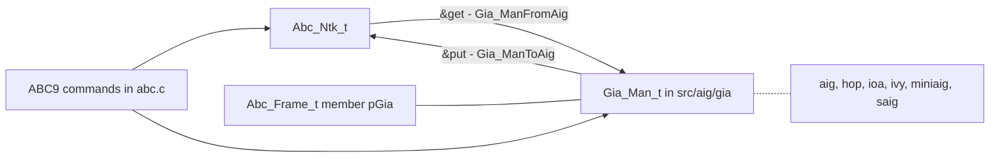
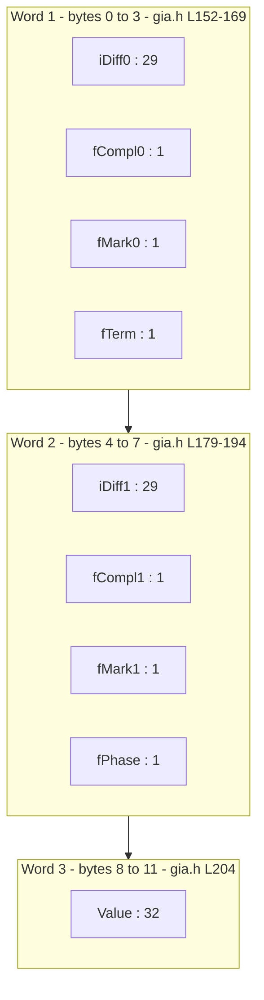
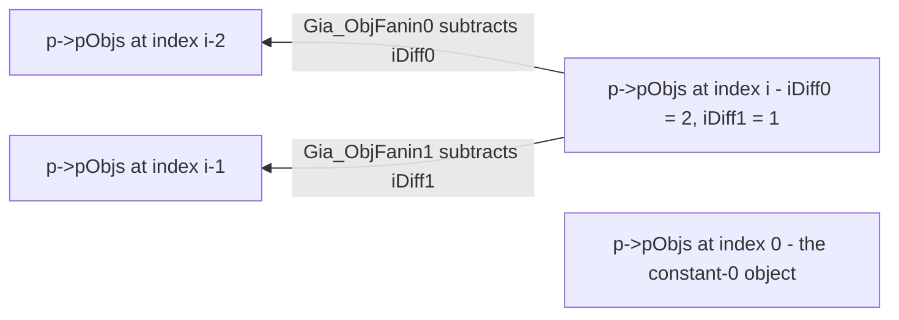
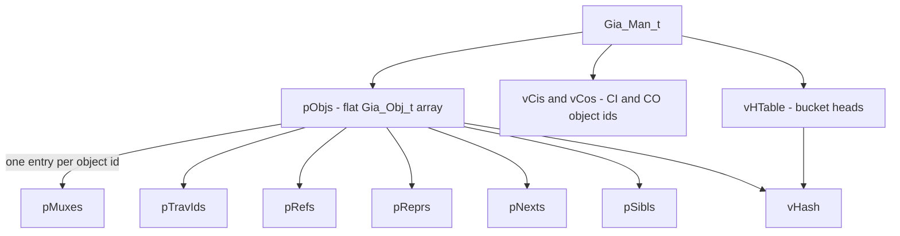
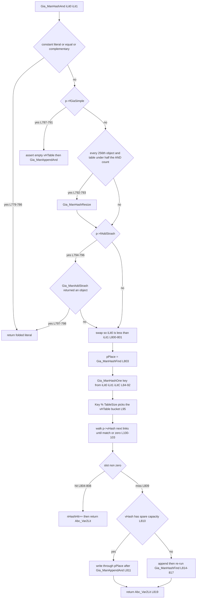
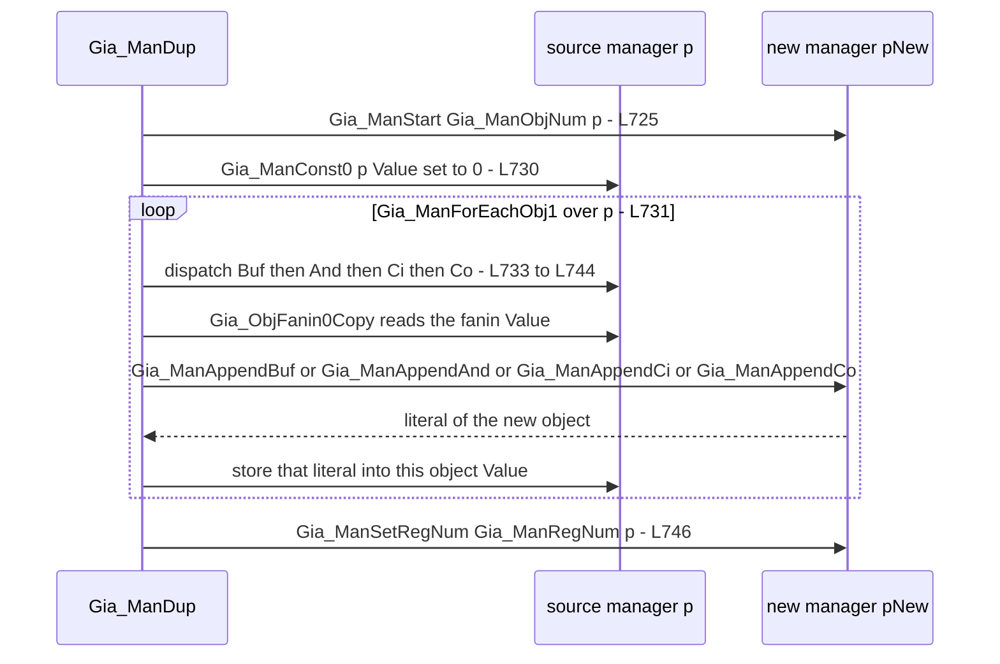
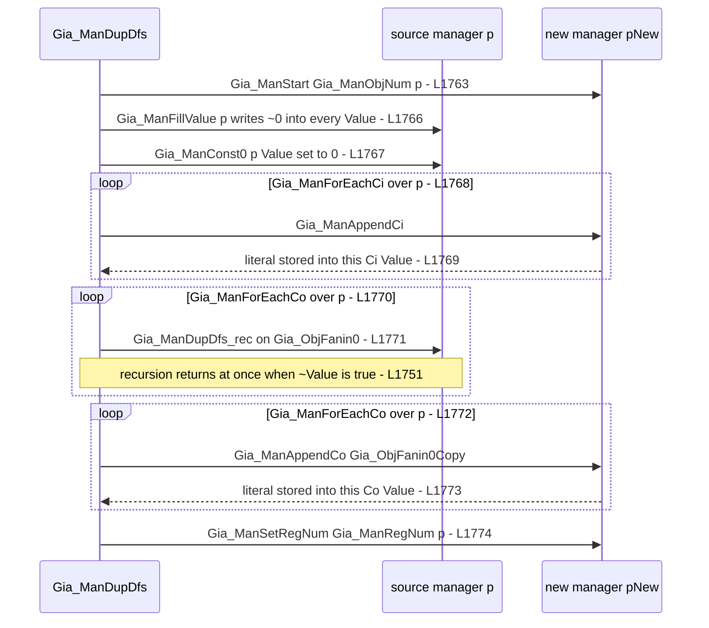
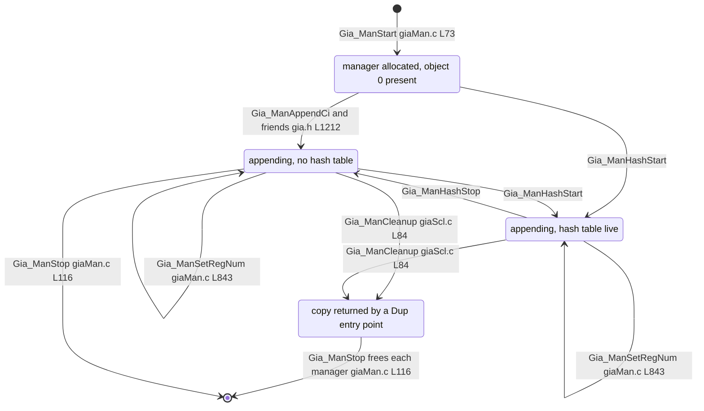

# GIA — Scalable AIG Package

This directory holds GIA, one of the And-Inverter Graph representations in ABC and the one most of
the modern code is written against. This document is the roadmap: it explains what the package is
responsible for, where it sits in the system, how an object and the manager are laid out, how the
graph is identified and walked, which fields carry more than one meaning, how the three central data
flows run, and which invariants, traps and limits a maintainer has to respect. The bit-level
treatment of the twelve-byte object encoding lives in a separate document,
[`./ENCODING.md`](./ENCODING.md); how to *call* the package from client code lives in the root
[`../../../readmeaig`](../../../readmeaig).

Statements here come in four kinds, and each is marked so a reader knows what backs it:

- **Statements about the code** carry an inline citation of the form `path:Lnnn` for a single line or
  `path:Lnnn-mmm` for a range, naming the file and the lines that establish them. Code snippets are
  quoted verbatim from the cited lines, so they can be found with `grep`.
- **Measurements** — the struct sizes in section 1 — are results of compiling and running a probe
  against the real header rather than deductions from the declarations. The command that produces
  each is given, so it can be re-run.
- **Counts and directory facts** — how many packages sit under `src/aig/`, how many commands a group
  registers, how many iterator macros the header defines — are derived by inspecting the tree rather
  than read off any single line. Each names the basis it was derived from, either as the command that
  reproduces it or as the file that was counted.
- **Statements about what the source does not establish** are labelled as such rather than filled in
  with a plausible explanation. Sections 5 and 13 carry most of them.

Contents:

- [1. What GIA Is and Why It Exists](#1-what-gia-is-and-why-it-exists)
- [2. Where GIA Sits in ABC](#2-where-gia-sits-in-abc)
- [3. Package Map and Reading Guide](#3-package-map-and-reading-guide)
- [4. The Object](#4-the-object)
- [5. Fanin Encoding: Relative Offsets](#5-fanin-encoding-relative-offsets)
- [6. The Manager](#6-the-manager)
- [7. Identity, Kinds, and Traversal](#7-identity-kinds-and-traversal)
- [8. Overloaded and Reused Fields](#8-overloaded-and-reused-fields)
- [9. Key Data Flows](#9-key-data-flows)
- [10. Invariants](#10-invariants)
- [11. Gotchas](#11-gotchas)
- [12. Limitations](#12-limitations)
- [13. Observed Discrepancies and Dead Code](#13-observed-discrepancies-and-dead-code)
- [14. Where to Look Next](#14-where-to-look-next)

## 1. What GIA Is and Why It Exists

The package describes itself in its own file banner, at `src/aig/gia/gia.h:L1-19`. Two of the
bracketed tags state the scope: `PackageName [Scalable AIG package.]` at `src/aig/gia/gia.h:L7` and
`Synopsis    [External declarations.]` at `src/aig/gia/gia.h:L9`. The header is the package's public
C contract; the implementation is spread over the rest of the directory.

An And-Inverter Graph is a directed acyclic graph in which every internal node is a two-input
conjunction and every edge carries an optional inversion, so a single node type plus edge
complementation suffices to represent any Boolean function. That is the *semantic* model, and GIA
carries the edge half of it directly: the two fanins of an internal object each have their own
complement bit, `fCompl0` at `src/aig/gia/gia.h:L156` and `fCompl1` at `src/aig/gia/gia.h:L182`.

The set of *physical* object kinds is wider than the semantic model, and the difference matters from
the first page. Besides plain ANDs, GIA has dedicated single-object encodings for a real XOR
`src/aig/gia/gia.h:L1307`, a real MUX `src/aig/gia/gia.h:L1350` and a buffer
`src/aig/gia/gia.h:L1388`, each with its own predicate `src/aig/gia/gia.h:L783-793` and its own
stored count `src/aig/gia/gia.h:L256-258`. The same operators also have *structural* forms built out
of several AND objects — `Gia_ManAppendXor` `src/aig/gia/gia.h:L1446` and `Gia_ManAppendMux`
`src/aig/gia/gia.h:L1433` — so a graph may express XOR and MUX either way. Section 7 gives the full
kind table. Inputs and outputs of the graph are terminal objects rather than gates, and the graph has
one distinguished constant object.

The word *scalable* in the banner is a claim about memory, and the numbers behind it are small
enough to state exactly. Sizes here were measured by compiling a probe against the real header
rather than deduced from the declarations, using the repository's default toolchain — `gcc` on
`x86_64` Linux, the `CC := gcc` of `Makefile:L2`, with no version pinned anywhere in the build:

```bash
printf '#include <stdio.h>\n#include "aig/gia/gia.h"\nint main(void){printf("%%zu %%zu %%zu %%zu\\n",sizeof(Gia_Obj_t),sizeof(Gia_Man_t),sizeof(Gia_Rpr_t),sizeof(Gia_Plc_t));return 0;}\n' > /tmp/probe.c
gcc -I src -DABC_USE_STDINT_H=1 -o /tmp/probe /tmp/probe.c -lm && /tmp/probe
```

It prints `12 1136 4 4`. One object is therefore twelve bytes, and one manager — the whole
bookkeeping structure, whatever the graph size — is 1136 bytes. There is no per-object allocation
and no per-edge allocation at all: objects live in a single flat array owned by the manager,
`p->pObjs`, declared at `src/aig/gia/gia.h:L254`, allocated zero-filled in one call,

```c
    p->pObjs = ABC_CALLOC( Gia_Obj_t, nObjsMax );
```

at `src/aig/gia/giaMan.c:L74`, and grown by doubling when it fills, at
`src/aig/gia/gia.h:L1166`. Edges are not stored as separate records: each object stores its fanins as
two backward offsets inside its own twelve bytes, which is the subject of section 5.

Two consequences of that layout shape everything else in the package. An object identifier is an
index into the flat array, so identifiers are dense, small and usable as a key into any parallel
side array — the manager keeps several, listed in section 6. And because the array is contiguous and
grows by reallocation, the encoding cannot hold addresses; it holds differences instead.

## 2. Where GIA Sits in ABC

GIA is one of seven coexisting AIG packages, not *the* AIG package. The count is a directory fact,
reproduced by `ls -1 src/aig/`, which lists exactly seven package directories — `aig`, `gia`, `hop`,
`ioa`, `ivy`, `miniaig`, `saig` — and, per `find src/aig -maxdepth 1 -type f`, no files of its own.
All seven are still registered build modules: each carries a `module.make`, and six of the seven list
sources in it, `src/aig/miniaig/module.make` being the exception with an empty `SRC +=` because that
package is header-only. What distinguishes GIA among them, in terms the tree shows directly, is
weight of use rather than any statement of intent: it is by a wide margin the largest of the seven by
registered source count — 119 against 31, 26, 22, 10, 3 and 0 for the others, counted out of each
package's `module.make` — and it is the representation the `&`-prefixed command group operates on.

Above GIA sits ABC's command layer. The frame carries a GIA manager alongside the classic network:
`Gia_Man_t * pGia;` is declared at `src/base/main/mainInt.h:L118`, with four further slots for copies
at `src/base/main/mainInt.h:L119-122` — `pGia2`, `pGiaBest`, `pGiaBest2` and `pGiaSaved`, each
commented in the source as a copy of `pGia` — and the frame accessors are declared at
`src/base/main/main.h:L86-87` as `Abc_FrameUpdateGia` and `Abc_FrameGetGia`. Commands that operate
on that manager are registered in the `"ABC9"` command group in `src/base/abci/abc.c`; the count of
those registrations is a derived figure, and `grep -c '"ABC9"' src/base/abci/abc.c` gives 233.

That frame member is how the command layer reaches the graph, and it is reached often. Counting the
lines that mention `pAbc->pGia` anywhere under `src/base/` gives 1041 matching lines; counting
individual occurrences instead gives 1155, because some lines mention it more than once. The 1041
lines are concentrated in the command file — `src/base/abci/abc.c` holds 984 of them — with the
remainder spread over `src/base/io/io.c` 19, `src/base/wlc/wlcCom.c` 15,
`src/base/cmd/cmdPlugin.c` 13, `src/base/acb/acbCom.c` 3, `src/base/bac/bacCom.c` 3,
`src/base/cba/cbaCom.c` 3 and `src/base/main/mainReal.c` 1. Both figures count textual references to
the frame member declared at `src/base/main/mainInt.h:L118`, not distinct commands.

Two of those commands are the bridge to the classic `Abc_Ntk_t` representation:

| Command | Registered at | Implementation | How it crosses over |
|---|---|---|---|
| `&get` | `src/base/abci/abc.c:L1230` | `Abc_CommandAbc9Get` at `src/base/abci/abc.c:L33791` | Three alternative routes, selected by the state of the current network and by two switches; every one of them ends at `Abc_FrameUpdateGia` `src/base/abci/abc.c:L33875` |
| `&put` | `src/base/abci/abc.c:L1231` | `Abc_CommandAbc9Put` at `src/base/abci/abc.c:L33903` | `Abc_NtkFromMappedGia` `src/base/abci/abc.c:L33946`, `Abc_NtkFromCellMappedGia` `src/base/abci/abc.c:L33948`, or `Gia_ManToAig( pAbc->pGia, 0 )` `src/base/abci/abc.c:L33953` |

`&get` is worth expanding, because no single call chain describes it. The outer test is whether the
current network is already strashed, at `src/base/abci/abc.c:L33825`:

| Condition | Route |
|---|---|
| Not strashed, and `fGiaSimple` or `fMapped` given | `Abc_NtkToAig` then `Abc_NtkAigToGia` `src/base/abci/abc.c:L33827-33832` — no AIG-package manager is built |
| Not strashed, neither switch given | `Abc_NtkStrash` `src/base/abci/abc.c:L33836`, `Abc_NtkToDar` `src/base/abci/abc.c:L33837`, `Gia_ManFromAig` `src/base/abci/abc.c:L33839`, then `Gia_ManDupZeroUndc` `src/base/abci/abc.c:L33843` to normalize the flop initial values |
| Already strashed | `Abc_NtkToDarChoices` or `Abc_NtkToDar` `src/base/abci/abc.c:L33850-33853`, then `Gia_ManFromAig` `src/base/abci/abc.c:L33854`. There is no `Abc_NtkStrash` call on this route |

Names and user timing information are copied onto the result afterwards, if present, at
`src/base/abci/abc.c:L33858-33862` and `src/base/abci/abc.c:L33864-33874`.

The conversion functions themselves belong to GIA and are declared in the package's bridge header:
`Gia_ManFromAig` at `src/aig/gia/giaAig.h:L53` and `Gia_ManToAig` at `src/aig/gia/giaAig.h:L57`, in
a 78-line header whose declarations all sit under a single group marker naming `giaAig.c`, at
`src/aig/gia/giaAig.h:L52`. Of the package's seven headers, `giaAig.h` is the only one that mentions
`Aig_Man_t` at all; the central header `src/aig/gia/gia.h` never names it, so the declared contract of
GIA itself does not depend on the older representation.

The command layer is named here and no further: this document covers the package, not the commands
that drive it.



Diagram: GIA's position in ABC. From `src/base/main/mainInt.h:L118`,
`src/base/abci/abc.c:L1230-1231`, `src/aig/gia/giaAig.h:L53`, `src/aig/gia/giaAig.h:L57` and the
directory listing of `src/aig/`.

## 3. Package Map and Reading Guide

The package is one flat directory with no subdirectories. Counted in the state of the tree described
in section 14, it holds 135 entries: 123 `.c` files, 4 `.cpp` files, 7 `.h` files and one
`module.make`. The
Markdown documents — this file and [`./ENCODING.md`](./ENCODING.md) — sit alongside them and are not
part of that source count. `src/aig/gia/module.make` enumerates 119 build sources, being 115 of the
`.c` files and all 4 `.cpp` files, the latter named `giaDecGraph.cpp`, `giaRrr.cpp`,
`giaTransduction.cpp` and `giaTtopt.cpp`. The seven headers, by the line count `wc -l` reports in
this checkout, are `gia.h` at 2658 lines, `giaTransduction.h` at 1768, `giaNewBdd.h` at 869,
`giaNewTt.h` at 292, `giaCSatP.h` at 117, `giaAig.h` at 78 and `giaIiff.h` at 54.

A census caveat, since the two figures above differ: `module.make` lists 115 `.c` files while 123
are present, so eight `.c` files are in the directory but not in the build. Matching each filename
against `module.make` with an anchored pattern identifies them as `gia.c`, `giaCTas2.c`,
`giaConstr.c`, `giaGiarf.c`, `giaHcd.c`, `giaMffc.c`, `giaProp.c` and `giaSat.c`. Nothing here was
changed on that account.

Because the directory is flat, the header supplies the only navigational structure the package has.
Its FUNCTION DECLARATIONS region, which opens at `src/aig/gia/gia.h:L2051-2053`, is partitioned by
group markers, one before each implementing file's block of declarations, each opening with `/*===`,
naming the implementing file, then closing with a run of `=` and `*/` — the first reads
`/*=== giaAiger.c ===========================================================*/` at
`src/aig/gia/gia.h:L2055` and the last is `giaBound.c` at
`src/aig/gia/gia.h:L2615`. Counting those marker lines gives 59, but only 58 distinct implementing
files, because `giaCTas.c` is marked twice, at `src/aig/gia/gia.h:L2094` and
`src/aig/gia/gia.h:L2602`. Between those markers sit the header's 516 `extern` declarations, so the
marker list doubles as a table of contents: to find where a declared function lives, scan up from it
to the nearest marker.

Four details of that marker list are worth knowing before relying on it. One marker carries a
leading space, at `src/aig/gia/gia.h:L2333`. Three name `.cpp` files: `giaTtopt.cpp` at
`src/aig/gia/gia.h:L2591`, `giaTransduction.cpp` at `src/aig/gia/gia.h:L2595` and `giaRrr.cpp` at
`src/aig/gia/gia.h:L2599`. One names `giaDecGraph.c` at `src/aig/gia/gia.h:L2611` while the file
present in the directory is `giaDecGraph.cpp`. And the run of `=` is not padded to a common width, so
the quoted example above is not a template: across the 59 marker lines the shortest is 74 characters,
`giaFx.c` at `src/aig/gia/gia.h:L2276`, and the longest is 87, `giaTransduction.cpp` at
`src/aig/gia/gia.h:L2595`, a derived figure from
`awk '/\/\*===/ { print length($0) }' src/aig/gia/gia.h | sort -n | sed -n '1p;$p'`. Matching on the
file name between `/*===` and the `=` run is what works.

A small core of the package defines and maintains the representation; the remaining hundred-plus
files implement algorithms over it — mapping, balancing, rewriting, simulation, equivalence
checking, AIGER input and output, and the rest. For the representation itself, five files carry
almost all of it:

| Read | Lines, as `wc -l` reports them in this checkout | What it holds |
|---|---|---|
| `src/aig/gia/gia.h` | 2658 | The whole declared contract: both structs, the two sentinels, 314 `static inline` primitives, 62 `ForEach` iterator macros, 68 `#define` directives, 516 `extern` declarations, the fourteen kind predicates and the sixteen object constructors |
| `src/aig/gia/giaMan.c` | 2475 | Manager lifecycle and ownership: `Gia_ManStart` `src/aig/gia/giaMan.c:L68`, `Gia_ManStop` `src/aig/gia/giaMan.c:L109`, `Gia_ManMemory` `src/aig/gia/giaMan.c:L239`, `Gia_ManStopP` `src/aig/gia/giaMan.c:L275`, `Gia_ManSetRegNum` `src/aig/gia/giaMan.c:L826` |
| `src/aig/gia/giaHash.c` | 1334 | Structural hashing end to end: the key function, the chain walk, the table lifecycle, the AND, real XOR and real MUX entry points, and the canonical rebuild |
| `src/aig/gia/giaDup.c` | 6784 | Duplication and rebuild. Counting definitions that return a new manager, with `grep -cE '^Gia_Man_t \* Gia_ManDup' src/aig/gia/giaDup.c`, gives 90 entry points |
| `src/aig/gia/giaUtil.c` | 3684 | The shared field-reuse protocol: the traversal-identifier counter, and the mark, value and phase helpers |

Two more files are cited in this document as corroborating evidence without being central:
`src/aig/gia/giaScl.c`, whose `Gia_ManCleanup` establishes the ownership convention of section 9, and
`src/aig/gia/giaFront.c`, which converts a frontier encoding back into the relative offsets of
section 5.

## 4. The Object

`Gia_Obj_t` is declared at `src/aig/gia/gia.h:L141-205` as nine members packed into three 32-bit words,
with blank lines at `src/aig/gia/gia.h:L170` and `src/aig/gia/gia.h:L195` marking the word boundaries.
The measured `sizeof(Gia_Obj_t)` is 12, so the three words are the whole object and nothing is left
for padding.

| Field | Width | Word | Declared | What it holds |
|---|---|---|---|---|
| `iDiff0` | 29 bits | 1 | `src/aig/gia/gia.h:L152` | Backward offset, in units of `Gia_Obj_t`, from this object to its first fanin; `GIA_NONE` when there is no first fanin |
| `fCompl0` | 1 bit | 1 | `src/aig/gia/gia.h:L156` | Complement attribute of the first fanin; read by `Gia_ObjFaninC0` `src/aig/gia/gia.h:L861` |
| `fMark0` | 1 bit | 1 | `src/aig/gia/gia.h:L164` | First user-controlled mark, per its declaration comment; carries three further meanings, listed in section 8 |
| `fTerm` | 1 bit | 1 | `src/aig/gia/gia.h:L169` | Set only by the two terminal constructors, `Gia_ManAppendCi` `src/aig/gia/gia.h:L1215` and `Gia_ManAppendCo` `src/aig/gia/gia.h:L1413`; read by `Gia_ObjIsTerm` `src/aig/gia/gia.h:L776` |
| `iDiff1` | 29 bits | 2 | `src/aig/gia/gia.h:L179` | Backward offset to the second fanin for a non-terminal; the combinational-I/O index instead when `fTerm` is set, read back by `Gia_ObjCioId` `src/aig/gia/gia.h:L746` |
| `fCompl1` | 1 bit | 2 | `src/aig/gia/gia.h:L182` | Complement attribute of the second fanin; read by `Gia_ObjFaninC1` `src/aig/gia/gia.h:L862` |
| `fMark1` | 1 bit | 2 | `src/aig/gia/gia.h:L185` | Second user-controlled mark, per its declaration comment; see section 8 |
| `fPhase` | 1 bit | 2 | `src/aig/gia/gia.h:L194` | The value under the all-zero pattern, per its declaration comment; recomputed under two manager flags, see section 8 |
| `Value` | 32 bits | 3 | `src/aig/gia/gia.h:L204` | Application-specific; the rebuild protocol of section 9 uses it as the copy literal. Read and written by `Gia_ObjValue` and `Gia_ObjSetValue` `src/aig/gia/gia.h:L748-749` |

There is no type-tag field in the list, and no fanin-count field. An object's kind is inferred, as
section 7 sets out. A third fanin exists only for a real MUX and is not in the object at all: its
control literal lives in the manager's `p->pMuxes` side array, written at
`src/aig/gia/gia.h:L1367` and `src/aig/gia/gia.h:L1375` and read by `Gia_ObjFanin2`
`src/aig/gia/gia.h:L876`.



Diagram: the three 32-bit words of `Gia_Obj_t`. From `src/aig/gia/gia.h:L141-205`. The expanded
version, with the sentinels and the per-kind field values, is in
[`./ENCODING.md`](./ENCODING.md#2-the-three-words).

## 5. Fanin Encoding: Relative Offsets

A fanin is not an address and not an absolute identifier. It is a **backward offset**, measured in
units of `Gia_Obj_t` from the referencing object down to its fanin, and it is resolved by a single
subtraction. In the address form:

```c
static inline Gia_Obj_t *  Gia_ObjFanin0( Gia_Obj_t * pObj )                   { return pObj - pObj->iDiff0;  }
```

at `src/aig/gia/gia.h:L874`, and in the identifier form, which performs the same arithmetic on
integers:

```c
static inline int          Gia_ObjFaninId0( Gia_Obj_t * pObj, int ObjId )      { return ObjId - pObj->iDiff0;    }
```

at `src/aig/gia/gia.h:L891`. The second fanin has the matching pair, `Gia_ObjFanin1`
`src/aig/gia/gia.h:L875` and `Gia_ObjFaninId1` `src/aig/gia/gia.h:L892`. The raw fields are also
readable directly, through `Gia_ObjDiff0` and `Gia_ObjDiff1` `src/aig/gia/gia.h:L859-860`.

Three consequences follow, and they are used throughout the rest of this document.

**The object array is topologically ordered by construction.** Subtracting a *positive*,
well-formed offset reaches an earlier object, so a fanin written that way has a smaller identifier
than its user. The field is unsigned `src/aig/gia/gia.h:L152`, so the arithmetic leaves no way to
express a forward reference at all. It does leave two degenerate values reachable: an offset of zero
resolves to the object itself, and an offset equal to the object's own identifier resolves to object
0. The second of those is written deliberately: `Gia_ManEquivFixOutputPairs`
`src/aig/gia/giaEquiv.c:L882-897` assigns `pObj0->iDiff0  = Gia_ObjId(p, pObj0);`
`src/aig/gia/giaEquiv.c:L892` to point a matched primary output's driver at object 0, and
`Gia_ManRelDerive2` `src/aig/gia/giaSimBase.c:L2959-2981` does the same with `pObj->iDiff0 = i`
`src/aig/gia/giaSimBase.c:L2970`, where `i` is the object's own identifier, on a duplicate manager.
`Gia_ManPatchCoDriver` `src/aig/gia/gia.h:L1534-1540`, the header's helper for redirecting a
combinational output, asserts the strict direction before writing, at `src/aig/gia/gia.h:L1537`; the
complete set of sites that write these fields directly is listed in
[`./ENCODING.md`](./ENCODING.md#7-terminal-overload).

**The encoding survives reallocation.** Growth reallocates the array, at
`src/aig/gia/gia.h:L1173`, which may move its base address. A difference is unaffected by the move,
because referrer and referent shift together, whereas a stored address would name a location the
object no longer occupies. That is the property the source demonstrates. It does **not** demonstrate
why deltas were chosen over absolute object identifiers, which would survive relocation just as well:
nothing in the pinned source compares the two schemes or records a reason for preferring one, so this
document does not supply one. What the source does show is that the package treats the difference as
the canonical storage form to be *restored*: `src/aig/gia/giaFront.c` holds a frontier representation
in which the offset fields temporarily carry frontier slot numbers, and `Gia_ManFrontTransform`
`src/aig/gia/giaFront.c:L65-93` converts them back to backward offsets by subtracting an absolute
identifier from the current index, at `src/aig/gia/giaFront.c:L76` and
`src/aig/gia/giaFront.c:L81-82`.

**An observed corollary: a held `Gia_Obj_t *` does not survive growth.** The same reallocation at
`src/aig/gia/gia.h:L1173` invalidates any address a caller is holding across an append. Identifiers
obtained from `Gia_ObjId` `src/aig/gia/gia.h:L745` are unaffected, which is why the identifier-form
accessors exist alongside the address-form ones throughout `src/aig/gia/gia.h:L859-920`.



Diagram: offset resolution over the flat array. The two labelled arrows are the only edges the
accessors establish, from `src/aig/gia/gia.h:L874` and `src/aig/gia/gia.h:L891`; both targets of the
object at index *i* sit at lower indices, so both precede it. The index-0 node is drawn only to fix
the low end of the array and is deliberately unconnected — no edge to it is implied.

The full treatment — the exact bit layout, why the fields are 29 bits wide, both sentinels, the field
values each constructor writes, and what the encoding cannot express — is in
[`./ENCODING.md`](./ENCODING.md).

## 6. The Manager

`Gia_Man_t` is declared at `src/aig/gia/gia.h:L245-454`. It is one flat object array plus a large
number of optional side tables, and the measured `sizeof(Gia_Man_t)` is 1136. That figure is the size
of the struct itself and nothing more. Almost every table it describes is reached through a pointer,
so the bytes a live manager actually occupies are dominated by heap allocations the 1136 does not
include — the object array first among them, at twelve bytes for every object. Eight members are
declared by value rather than by address, listed later in this section, and their descriptors *are*
inside the 1136; even for those, only the descriptor is inline and the elements are not. So treat 1136
as the fixed overhead per manager, not as its footprint.

Counting the semicolon-bearing declaration lines between `src/aig/gia/gia.h:L248` and
`src/aig/gia/gia.h:L453`
gives 153 fields; a naive count that also swallows the closing `};` at `src/aig/gia/gia.h:L454`
reports 154 instead. Reading it field by field is not the way in — most of the 153 belong to one
subsystem or another and are irrelevant to the representation. Grouped by role:

| Block | Lines | What it is for |
|---|---|---|
| Core storage and counts | `src/aig/gia/gia.h:L248-260` | `pName`, `pSpec`, `nRegs`, `nRegsAlloc`, `nObjs`, `nObjsAlloc`, `pObjs`, `pMuxes`, `nXors`, `nMuxes`, `nBufs`, and the identifier lists `vCis` and `vCos` |
| Structural hashing | `src/aig/gia/gia.h:L261-265` | `vHash`, `vHTable`, and the three mode flags `fAddStrash`, `fSweeper`, `fGiaSimple` |
| References and levels | `src/aig/gia/gia.h:L266-273` | `vRefs`, `pRefs`, `pLutRefs`, `vLevels`, `nLevels`, `nConstrs`, `nTravIds`, `nFront` |
| Equivalences and choices | `src/aig/gia/gia.h:L274-280` | `pReprsOld`, `pReprs`, `pNexts`, `pSibls`, `pIso`, and two ternary-state counters |
| Fanout | `src/aig/gia/gia.h:L281-284` | `pFanData` and `nFansAlloc` for dynamic fanout; `vFanoutNums` and `vFanout` for static fanout |
| Mapping, cells, packing | `src/aig/gia/gia.h:L285-298` | `vMapping`, `vMapping2`, `vFanouts2`, `vCellMapping`, `vPacking`, `vConfigs`, `pCellStr`, `vLutConfigs`, the four edge vectors |
| Counter-examples | `src/aig/gia/gia.h:L299-301` | `pCexComb`, `pCexSeq`, `vSeqModelVec` |
| Copy maps | `src/aig/gia/gia.h:L302-303` | `vCopies` and `vCopies2`, whose three access patterns are in section 8 |
| Classes and abstraction | `src/aig/gia/gia.h:L304-314` | `vVar2Obj`, `vTruths`, and the flop, gate, object, init and register class vectors |
| Switching, placement, holes | `src/aig/gia/gia.h:L315-317` | `pSwitching`, `pPlacement`, `pAigExtra` |
| Timing | `src/aig/gia/gia.h:L318-328` | Arrival and required times for inputs, outputs and combinational I/O, plus `And2Delay` and the defaults |
| Traversal identifiers | `src/aig/gia/gia.h:L329-330` | `pTravIds` and `nTravIdsAlloc`, the out-of-object mark scheme of section 7 |
| Names and user identifiers | `src/aig/gia/gia.h:L331-344` | The three name vectors, the user-assigned identifier vectors, the original-identifier vectors, `vClockDoms`, `vTiming` |
| Sub-managers and statistics | `src/aig/gia/gia.h:L345-356` | `pManTime`, `pLutLib`, `nHashHit`, `nHashMiss`, four generic user-data slots, `nAnd2Delay`, `fVerbose`, `MappedArea`, `MappedDelay` |
| Bit-parallel simulation | `src/aig/gia/gia.h:L357-384` | The block introduced by the comment at `src/aig/gia/gia.h:L357`; none of its 14 declaration lines carries a comment |
| Incremental simulation | `src/aig/gia/gia.h:L385-396` | The block introduced at `src/aig/gia/gia.h:L385`; none of its 4 declaration lines carries a comment |
| Truth tables, balancing, quantification | `src/aig/gia/gia.h:L397-425` | Small-function truth tables, the balancing scratch vectors, and the existential-quantification block |
| Retiming and box iteration | `src/aig/gia/gia.h:L426-448` | `vStopsF` and `vStopsB`; then the four box-boundary indices under the comment at `src/aig/gia/gia.h:L434` |
| ISOP and MFFC scratch | `src/aig/gia/gia.h:L449-453` | `vTTISOPs`, `vTTLut`, `vMFFCsInfo`, `vMFFCsLuts`, `vLutsRankings` |

All 153 declaration lines carry a comment. Twenty-five of them describe members that the declaration
by itself does not explain, and those twenty-five cluster: the built-in simulation
block at `src/aig/gia/gia.h:L371-384`, the incremental simulation block at
`src/aig/gia/gia.h:L393-396`, `pUData` at `src/aig/gia/gia.h:L425`, the two retiming stop vectors at
`src/aig/gia/gia.h:L432-433`, and the four box-boundary indices at `src/aig/gia/gia.h:L445-448`.

Some of those are recoverable from their use sites and some are not, and the difference is stated
rather than papered over:

- `nSimWords` `src/aig/gia/gia.h:L373` is the per-object stride into the simulation vector.
  `Gia_ManObjSim` `src/aig/gia/giaGen.c:L106-109` is
  `return Vec_WrdEntryP( p->vSims, p->nSimWords * iObj );` at `src/aig/gia/giaGen.c:L108`, which
  fixes the meaning exactly.
- The four box-boundary indices `src/aig/gia/gia.h:L445-448` are fixed by the iterators that consume
  them, at `src/aig/gia/gia.h:L2042-2049`: `iFirstAndObj` and `iFirstPoObj` bound the object walk,
  `iFirstNonPiId` bounds the combinational-input walk, and `iFirstPoId` starts the
  combinational-output walk.
- `pUData` `src/aig/gia/gia.h:L425` **is not determinable from the source.** Its type `Gia_Dat_t` is
  forward-declared at `src/aig/gia/gia.h:L80` and defined nowhere in `src/`; a tree-wide search for
  `Gia_Dat_t` returns exactly those two lines, and a search for `pUData` returns exactly one, its own
  declaration. The field is never read, written, allocated or freed.
- `vPolars` `src/aig/gia/gia.h:L384` **has no determinable meaning inside this package.** Nothing in
  `src/aig/gia/` assigns or reads it; the only reference to it here besides the declaration is its
  release, `Vec_BitFreeP( &p->vPolars );` at `src/aig/gia/giaMan.c:L125`. It is filled from outside
  the package — see item 6 of section 13.

Eight of the fields are `Vec_Int_t` **by value** rather than by address, which is why the code that
touches them takes their address: `vHash` `src/aig/gia/gia.h:L261`, `vHTable`
`src/aig/gia/gia.h:L262`, `vRefs` `src/aig/gia/gia.h:L266`, `vCopies` `src/aig/gia/gia.h:L302`,
`vCopies2` `src/aig/gia/gia.h:L303`, `vCopiesTwo` `src/aig/gia/gia.h:L422`, `vSuppVars`
`src/aig/gia/gia.h:L423` and `vVarMap` `src/aig/gia/gia.h:L424`. So the hashing layer writes
`&p->vHTable` and `&p->vHash`, for example at `src/aig/gia/giaHash.c:L85` and
`src/aig/gia/giaHash.c:L90`, and the copy-map helpers write `&p->vCopies` at
`src/aig/gia/gia.h:L993-1001`.

The other 145 declarations divide two ways, and the split is worth having because it decides which
members can be freed and which cannot. Classifying the 153 declaration lines by whether the
declaration carries a `*`, once comments are stripped, gives 99 pointer members and 46 plain scalars
— 42 `int`, 2 `float` and 2 `word`. The 99 pointers are the addresses the manager owns or borrows, and
they are what teardown deals with. The 46 scalars are counts, capacities, indices, thresholds and
flags stored inline — `nObjs` and `nObjsAlloc` `src/aig/gia/gia.h:L252-253`, the four box-boundary
indices `src/aig/gia/gia.h:L445-448`, the three mode flags `fAddStrash`, `fSweeper` and `fGiaSimple`
`src/aig/gia/gia.h:L263-265` — and nothing releases them, because there is nothing to release.

Counts are derived rather than stored, in the block at `src/aig/gia/gia.h:L698-714`:

```c
static inline int          Gia_ManPiNum( Gia_Man_t * p )       { return Vec_IntSize(p->vCis) - p->nRegs;                                   }
```

at `src/aig/gia/gia.h:L700`, and

```c
static inline int          Gia_ManAndNum( Gia_Man_t * p )      { return p->nObjs - Vec_IntSize(p->vCis) - Vec_IntSize(p->vCos) - 1;        }
```

at `src/aig/gia/gia.h:L704` — the `- 1` being the constant-0 object. `Gia_ManPoNum` is the same
subtraction over `vCos` `src/aig/gia/gia.h:L701`, and `Gia_ManAndNotBufNum`
`src/aig/gia/gia.h:L708` subtracts `Gia_ManBufNum` from the AND count. Choices are likewise derived:
`Gia_ManHasChoices` is `p->pSibls != NULL` `src/aig/gia/gia.h:L712`, and `Gia_ManChoiceNum`
`src/aig/gia/gia.h:L713` counts the non-zero entries of that array. Three counts *are* stored,
because they cannot be derived: `nXors`, `nMuxes` and `nBufs` `src/aig/gia/gia.h:L256-258`,
incremented by their constructors at `src/aig/gia/gia.h:L1329`, `src/aig/gia/gia.h:L1377` and
`src/aig/gia/gia.h:L1394`.

`Gia_ManMemory` `src/aig/gia/giaMan.c:L239-256` is the package's own size estimate, and it is a useful
starting point but *not* an ownership manifest. Its synopsis calls it "Returns memory used in
megabytes." `src/aig/gia/giaMan.c:L214`, and it sums fourteen terms
`src/aig/gia/giaMan.c:L241-254`: the manager struct, the object array, the two identifier lists, the
hash table, the reference array, and the level, cell-mapping, copy, arrival, required and three name
vectors. Many allocations the manager owns are absent from that sum — `pMuxes`, `pTravIds`, `pReprs`,
`pReprsOld`, `pNexts`, `pSibls`, `pLutRefs`, `pFanData`, `pName`, `pSpec` and the great majority of
its `Vec_` members among them, each of them released by teardown and none of them counted here — so
the figure understates both what a manager holds and what teardown has to release.

For ownership, then, read allocation and teardown rather than the estimate. `Gia_ManStart`
`src/aig/gia/giaMan.c:L68-80` shows what a manager is given at birth: the struct itself, the object
array, and the two identifier lists sized at `nObjsMax / 20`. `Gia_ManStop`
`src/aig/gia/giaMan.c:L109-210` is the definitive list of what it releases. Counting release
operations over that range, by lines whose first token matches: 20 active `ABC_FREE` calls, one
further `ABC_FREE` commented out at `src/aig/gia/giaMan.c:L197`, and 73 calls to a `Vec_` release
helper — a `Free`, `FreeP`, `FreeFree` or `Erase` form. Counted by a different pattern the last of
those three numbers changes, so it is quoted with its method. The function ends with a run of seven
`ABC_FREE` calls at `src/aig/gia/giaMan.c:L203-209` — `pRefs`, `pLutRefs`, `pMuxes`, `pObjs`,
`pSpec`, `pName`, and then the manager struct itself — with the closing brace at
`src/aig/gia/giaMan.c:L210`. `Gia_ManStopP` `src/aig/gia/giaMan.c:L275-281` is the same teardown
through a held slot: it returns early on null, stops the manager, and nulls the slot.



Diagram: the flat object array with the side arrays that are indexed by object identifier, and the
two identifier lists. From `src/aig/gia/gia.h:L245-454` and `src/aig/gia/giaMan.c:L239-256`.

## 7. Identity, Kinds, and Traversal

### Identity

An object's identifier is its index in the flat array, obtained by subtraction and guarded by a range
assertion:

```c
static inline int          Gia_ObjId( Gia_Man_t * p, Gia_Obj_t * pObj )        { assert( p->pObjs <= pObj && pObj < p->pObjs + p->nObjs ); return pObj - p->pObjs; }
```

at `src/aig/gia/gia.h:L745`. The reverse direction is `Gia_ManObj` `src/aig/gia/gia.h:L724`, which
asserts `v >= 0 && v < p->nObjs`, and the family around it resolves the indirect handles: object 0
through `Gia_ManConst0` `src/aig/gia/gia.h:L722`, its complement through `Gia_ManConst1`
`src/aig/gia/gia.h:L723`, and combinational I/O through `Gia_ManCi` and `Gia_ManCo`
`src/aig/gia/gia.h:L725-726`, which index the identifier lists. `Gia_ManPi`, `Gia_ManPo`,
`Gia_ManRo` and `Gia_ManRi` `src/aig/gia/gia.h:L727-730` are positional views of those same two
lists, each asserting its range.

Two conventions carry a complement alongside an object, and both are in use. A **literal** is
`id << 1 | compl`, and every object-writing constructor returns one — `Gia_ManAppendCi` ends with
`return Gia_ObjId( p, pObj ) << 1;` at `src/aig/gia/gia.h:L1219`, and so do the other five. The second
convention keeps the complement in the low bit of a `Gia_Obj_t *`, through `Gia_Regular`, `Gia_Not`,
`Gia_NotCond` and `Gia_IsComplement` at `src/aig/gia/gia.h:L679-682`. The sanctioned bridge between
them is `Gia_Obj2Lit` and `Gia_Lit2Obj` at `src/aig/gia/gia.h:L804-805`; both conventions are set out
in [`./ENCODING.md`](./ENCODING.md#8-literals-complementation-and-the-two-conventions).

### Kinds

There is no type-tag field. A kind is inferred from three things only: the `fTerm` bit, the presence
of the `GIA_NONE` sentinel `src/aig/gia/gia.h:L66` in `iDiff0`, and the relative ordering of `iDiff0`
against `iDiff1`. Fourteen predicates, declared as one block at `src/aig/gia/gia.h:L776-799` in the
order below, with explanatory comments interleaved between some of them, read that encoding back:

| Predicate | Line | What it answers |
|---|---|---|
| `Gia_ObjIsTerm` | `L776` | Is this a terminal — `fTerm` read directly |
| `Gia_ObjIsAndOrConst0` | `L777` | Is this a non-terminal — the negation of the above |
| `Gia_ObjIsCi` | `L778` | Terminal with the sentinel in `iDiff0`: a combinational input |
| `Gia_ObjIsCo` | `L779` | Terminal without it: a combinational output |
| `Gia_ObjIsAnd` | `L780` | Non-terminal with a real offset in `iDiff0` — true for plain ANDs, buffers, real XORs and real MUXes alike |
| `Gia_ObjIsXor` | `L783` | A `Gia_ObjIsAnd` object whose `iDiff0` is strictly less than `iDiff1`: a real XOR |
| `Gia_ObjIsMuxId` | `L784` | Does the `p->pMuxes` side array hold a control literal for this identifier — the one kind test that reads manager state rather than the object |
| `Gia_ObjIsMux` | `L785` | The same test reached from an address, via `Gia_ObjId`; it therefore also needs the manager |
| `Gia_ObjIsAndReal` | `L789` | A `Gia_ObjIsAnd` object with `iDiff0` greater than `iDiff1` that `Gia_ObjIsMux` rejects — so it needs the manager too |
| `Gia_ObjIsBuf` | `L793` | Equal offsets, neither of them the sentinel, `fTerm` clear: a buffer |
| `Gia_ObjIsAndNotBuf` | `L796` | A `Gia_ObjIsAnd` object whose offsets differ — the predicate that exists because the one at `L780` cannot exclude buffers |
| `Gia_ObjIsCand` | `L797` | An AND or a combinational input |
| `Gia_ObjIsConst0` | `L798` | Both offsets hold the sentinel |
| `Gia_ManObjIsConst0` | `L799` | This is the array's first object, tested by address |

The conditions above are stated in words; the exact expressions are on the cited lines, and
[`./ENCODING.md`](./ENCODING.md#6-offset-ordering-as-a-type-tag) tabulates them term by term.

Read as a field pattern, the seven kinds partition as follows. The rows are mutually exclusive: no
object satisfies two of them. The *Beyond the object* column records what a classifier needs on top
of the twelve bytes, and it is non-empty for exactly two rows — the pair that the object's own bits
cannot separate.

| Kind | `fTerm` | `iDiff0` | `iDiff1` | Beyond the object | Written by |
|---|---|---|---|---|---|
| constant-0 | 0 | `GIA_NONE` | `GIA_NONE` | — | `Gia_ManStart` `src/aig/gia/giaMan.c:L75` |
| combinational input | 1 | `GIA_NONE` | CI index | — | `Gia_ManAppendCi` `src/aig/gia/gia.h:L1212` |
| combinational output | 1 | offset | CO index | — | `Gia_ManAppendCo` `src/aig/gia/gia.h:L1407` |
| buffer | 0 | offset, not `GIA_NONE` | equal to `iDiff0` | — | `Gia_ManAppendBuf` `src/aig/gia/gia.h:L1388` |
| real XOR | 0 | offset, with `iDiff0 < iDiff1` | offset | — | `Gia_ManAppendXorReal` `src/aig/gia/gia.h:L1307` |
| real MUX | 0 | offset, with `iDiff0 > iDiff1` | offset | **positive entry in `p->pMuxes`** `src/aig/gia/gia.h:L784` | `Gia_ManAppendMuxReal` `src/aig/gia/gia.h:L1350` |
| AND | 0 | offset, with `iDiff0 > iDiff1` | offset | **no positive entry in `p->pMuxes`** `src/aig/gia/gia.h:L789` | `Gia_ManAppendAnd` `src/aig/gia/gia.h:L1253` |

Two notes on that table. The last two rows carry the *same* field pattern, which is why real-MUX and
plain-AND identity is settled by `p->pMuxes` and not by the object: `Gia_ObjIsMuxId` is
`p->pMuxes && p->pMuxes[iObj] > 0` `src/aig/gia/gia.h:L784`, and `Gia_ObjIsAndReal` spells the
complement out as `Gia_ObjIsAnd(pObj) && iDiff0 > iDiff1 && !Gia_ObjIsMux(p, pObj)`
`src/aig/gia/gia.h:L789`. And the AND row reads `iDiff0 > iDiff1` rather than `iDiff0 >= iDiff1`
because equal offsets are the buffer pattern `src/aig/gia/gia.h:L793`: `Gia_ManAppendAnd` writes
`iDiff0 >= iDiff1` `src/aig/gia/gia.h:L1259-1271`, and the assertion at `src/aig/gia/gia.h:L1258` keeps
that strict — except when `p->fGiaSimple` relaxes it, which is the one case where an AND is written
with the buffer pattern and is then classified as a buffer. That case is gotcha 13 of section 11 and
item 11 of section 13.

The consequence a maintainer meets first is a dispatch-order hazard. `Gia_ObjIsAnd`
`src/aig/gia/gia.h:L780` tests only `fTerm` and the sentinel, so it is true for buffers, real XORs
and real MUXes as well as for plain ANDs. Code that asks `Gia_ObjIsAnd` before asking
`Gia_ObjIsBuf`, `Gia_ObjIsXor` or `Gia_ObjIsMux` classifies all four as plain ANDs. The
structure-preserving branch order used in `src/aig/gia/giaDup.c` is buffer first, then within the AND
branch XOR, then MUX, then plain AND — see `src/aig/gia/giaDup.c:L1563-1573`.


Diagram: the kind-discrimination decision tree. From `src/aig/gia/gia.h:L776-799`. Every test above
the last one reads the object's own twelve bytes; the final `p->pMuxes` test
`src/aig/gia/gia.h:L784` reads the manager, which is why it is the one step a classifier cannot take
with the object alone.

### Traversal

The header defines 62 `ForEach` iterator macros — a derived figure, from
`grep -cE '^#define [A-Za-z_]*ForEach' src/aig/gia/gia.h` — running from
`src/aig/gia/gia.h:L1780` to `src/aig/gia/gia.h:L2048`. They are conventional `for` headers, so each
one must be followed by a statement, and the filtering ones end in a negated guard followed by
`{} else`, which skips non-matching objects without needing a nested block:

```c
#define Gia_ManForEachConst( p, i )                            \
    for ( i = 1; i < Gia_ManObjNum(p); i++ ) if ( !Gia_ObjIsConst(p, i) ) {} else
```

at `src/aig/gia/gia.h:L1780-1781`. The macros are not all in one place. The equivalence-class
iterators come first, at `src/aig/gia/gia.h:L1780-1793`, followed by the static-fanout iterators at
`src/aig/gia/gia.h:L1821-1826` and the LUT and cell iterators at `src/aig/gia/gia.h:L1876-1903`. Only
then comes the `MACRO DEFINITIONS` divider, at `src/aig/gia/gia.h:L1905-1907`, after which the main
family opens with `Gia_ManForEachObj` at `src/aig/gia/gia.h:L1931`.

The ten families below name every one of the 62 macros, in source order, and their counts add up to
62: 7 + 3 + 13 + 8 + 2 + 2 + 7 + 10 + 6 + 4. The count is of `#define` lines whose name contains
`ForEach` in `src/aig/gia/gia.h`.

| Family | Lines | Count | Members, named in source order, with behaviour |
|---|---|---|---|
| Equivalence classes | `src/aig/gia/gia.h:L1780-1793` | 7 | `Gia_ManForEachConst` and `Gia_ManForEachClass` scan from index 1, `Gia_ManForEachClass0` from index 0, and `Gia_ManForEachClassReverse` runs down to `i > 0`, all four filtering on the equivalence data in `p->pReprs` — the first on `Gia_ObjIsConst` `src/aig/gia/gia.h:L1757`, the three `Class` macros on `Gia_ObjIsHead` `src/aig/gia/gia.h:L1758`; then the three chain walks `Gia_ClassForEachObj`, which starts at the head itself, `Gia_ClassForEachObj1`, which starts at the head's `Gia_ObjNext`, and `Gia_ClassForEachObjStart`, which starts at the `Gia_ObjNext` of a caller-supplied object — all three follow `Gia_ObjNext` and assert that the given identifier is a class head |
| Static fanout | `src/aig/gia/gia.h:L1821-1826` | 3 | `Gia_ObjForEachFanoutStatic` yields each fanout as an object, `Gia_ObjForEachFanoutStaticId` yields it as an identifier, and `Gia_ObjForEachFanoutStaticIndex` additionally exposes the `p->vFanout` slot index and has no callers — see item 5 of section 13 |
| LUTs and cells | `src/aig/gia/gia.h:L1876-1903` | 13 | `Gia_ManForEachLut` scans from index 1 and `Gia_ManForEachLutReverse` runs down to `i > 0`; the three fanin walks at `src/aig/gia/gia.h:L1880-1884` are `Gia_LutForEachFanin`, which yields fanin identifiers, `Gia_LutForEachFaninIndex`, which also exposes the `p->vMapping` slot index, and `Gia_LutForEachFaninObj`, which yields objects; the `vMapping2` variants at `src/aig/gia/gia.h:L1887-1893` are `Gia_ManForEachLut2`, `Gia_ManForEachLut2Reverse`, `Gia_ManForEachLut2Vec` and `Gia_ManForEachLut2VecReverse`, the last two walking a caller-supplied identifier vector, with `Gia_LutForEachFanin2` and `Gia_LutForEachFanout2` at `src/aig/gia/gia.h:L1895-1897`; and `Gia_ManForEachCell` `src/aig/gia/gia.h:L1900`, which runs `i = 2` up to `2*Gia_ManObjNum(p)`, with `Gia_CellForEachFanin` `src/aig/gia/gia.h:L1902` — both iterate over literals rather than objects |
| All objects | `src/aig/gia/gia.h:L1931-1946` | 8 | `Gia_ManForEachObj` from index 0 and `Gia_ManForEachObj1` from index 1, plus the six identifier-vector forms `Gia_ManForEachObjVec`, `Gia_ManForEachObjVecStart`, `Gia_ManForEachObjVecStop`, `Gia_ManForEachObjVecStartStop`, `Gia_ManForEachObjVecReverse` and `Gia_ManForEachObjVecLit`, the last of which reads each vector entry as a literal and hands back both the object and its complement flag |
| Reverse | `src/aig/gia/gia.h:L1953-1956` | 2 | `Gia_ManForEachObjReverse` uses `i >= 0` and therefore does reach object 0; `Gia_ManForEachObjReverse1` uses `i > 0` and does not |
| Buffers | `src/aig/gia/gia.h:L1961-1964` | 2 | `Gia_ManForEachBuf` begins at `Gia_ManBufNum(p) ? 0 : p->nObjs`, so it self-disables in one comparison when the manager holds no buffers; `Gia_ManForEachBufId` has no such guard and always scans from index 0 |
| ANDs and MUXes | `src/aig/gia/gia.h:L1973-1986` | 7 | `Gia_ManForEachAnd` and its identifier form `Gia_ManForEachAndId`, `Gia_ManForEachMuxId`, `Gia_ManForEachCand`, the two reverse AND walks `Gia_ManForEachAndReverse` and `Gia_ManForEachAndReverseId` at `src/aig/gia/gia.h:L1981-1984` which use `i > 0`, and `Gia_ManForEachMux`, which filters on `Gia_ObjIsMuxId` exactly as the identifier form does |
| Combinational I/O | `src/aig/gia/gia.h:L1991-2010` | 10 | The four input walks `Gia_ManForEachCi`, `Gia_ManForEachCiId`, `Gia_ManForEachCiVec` and `Gia_ManForEachCiReverse`, and the four output walks `Gia_ManForEachCo`, `Gia_ManForEachCoVec`, `Gia_ManForEachCoId` and `Gia_ManForEachCoReverse`, all positional over `p->vCis` and `p->vCos` — the `Vec` forms take their positions from a caller-supplied vector rather than counting up — plus the two driver walks `Gia_ManForEachCoDriver`, which resolves each combinational output's fanin with `Gia_ObjFanin0`, and `Gia_ManForEachCoDriverId`, which does the same with `Gia_ObjFaninId0p` |
| Primary I/O and flops | `src/aig/gia/gia.h:L2018-2029` | 6 | `Gia_ManForEachPi` bounded by `Gia_ManPiNum` and `Gia_ManForEachPo` bounded by `Gia_ManPoNum`; `Gia_ManForEachRo` and `Gia_ManForEachRi`, each bounded by `Gia_ManRegNum` and offset into the same two lists by `Gia_ManPiNum(p)` and `Gia_ManPoNum(p)`; the paired `Gia_ManForEachRiRo`, which yields a flop input and its flop output together; and `Gia_ManForEachRoToRiVec`, which maps each flop output in a caller-supplied identifier vector to its flop input through `Gia_ObjRoToRi` — all positional views of `vCis` and `vCos` |
| Box-aware | `src/aig/gia/gia.h:L2042-2049` | 4 | Four macros bounded by the manager's box-boundary indices: `Gia_ManForEachObjWithBoxes` and `Gia_ManForEachObjReverseWithBoxes` run between `iFirstAndObj` and `iFirstPoObj`, `Gia_ManForEachCiIdWithBoxes` stops at `iFirstNonPiId` for combinational inputs, and `Gia_ManForEachCoWithBoxes` starts at `iFirstPoId` for combinational outputs |

The out-of-object alternative to the mark bits is a generation counter. `Gia_ManIncrementTravId`
`src/aig/gia/giaUtil.c:L215-230` allocates `p->pTravIds` lazily at `Gia_ManObjNum(p) + 100` entries
`src/aig/gia/giaUtil.c:L219-220`, doubles and zeroes the new half whenever the graph outgrows it
`src/aig/gia/giaUtil.c:L223-228`, and then increments `p->nTravIds`
`src/aig/gia/giaUtil.c:L229`. Because a mark means "this entry equals the current generation", one
increment clears every mark at once, in constant time. The twelve accessors at
`src/aig/gia/gia.h:L1092-1103` read and write it, each asserting that the identifier is inside
`p->nTravIdsAlloc`. Two generations are addressable at a time: `Gia_ObjSetTravIdPrevious`
`src/aig/gia/gia.h:L1093` writes `p->nTravIds - 1`, so a pass can distinguish "seen this round" from
"seen last round", and the `Update` forms `src/aig/gia/gia.h:L1096-1097` test and set in one call.

## 8. Overloaded and Reused Fields

Twelve bytes leave no room for a field per purpose, so several fields carry more than one meaning, and
which meaning applies depends on the object's kind or on a manager flag. The table gives, for each
meaning, who writes it and what selects it.

| Field | Meaning | Who writes it | What selects this meaning | Citation |
|---|---|---|---|---|
| `iDiff1` | Backward offset to the second fanin | `Gia_ManAppendAnd` and the other non-terminal constructors | `fTerm` is clear | `src/aig/gia/gia.h:L1259-1271` |
| `iDiff1` | Index of this object in the manager's combinational-input or combinational-output list | `Gia_ManAppendCi`, `Gia_ManAppendCo`, each taking the index *before* pushing | `fTerm` is set | `src/aig/gia/gia.h:L1217`, `src/aig/gia/gia.h:L1416` |
| `iDiff1` | Read back as that index | `Gia_ObjCioId`, `Gia_ObjSetCioId`, both asserting `fTerm` | caller asserts a terminal | `src/aig/gia/gia.h:L746-747` |
| `Value` | Copy literal during a rebuild, with `~0` meaning "not copied yet" | `Gia_ManFillValue` seeds `~0`; each append's return value overwrites it | a duplication or rebuild pass is running | `src/aig/gia/giaUtil.c:L449-454`, `src/aig/gia/giaDup.c:L1859-1860` |
| `Value` | Generic application-specific scratch, per its declaration comment | any pass | no pass owns it | `src/aig/gia/gia.h:L204` |
| `Value` | Frontier slot number, cleared to 0 at the end of the transform | `Gia_ManFrontTransform` | the frontier representation is in use | `src/aig/gia/giaFront.c:L80-90` |
| `Value` | Claimed by an old note to hold the hash-table next-link — it does not | nothing | never; see item 1 of section 13 | `src/aig/gia/gia.h:L206-208` |
| `fMark0`, `fMark1` | Two independent user-controlled marks, per their declaration comments | any pass; bulk-set and bulk-cleared by the five helpers in `src/aig/gia/giaUtil.c` | no other convention is active | `src/aig/gia/gia.h:L164`, `src/aig/gia/gia.h:L185`, `src/aig/gia/giaUtil.c:L249`, `src/aig/gia/giaUtil.c:L276`, `src/aig/gia/giaUtil.c:L302`, `src/aig/gia/giaUtil.c:L347`, `src/aig/gia/giaUtil.c:L373` |
| `fMark0`, `fMark1` | One four-valued ternary-simulation state, packed as 00, 10, 01 and 11 | `Gia_ObjTerSimSetC`, `Set0`, `Set1`, `SetX`; read by the four matching getters | ternary simulation is running; the same three states are named as values by `GIA_ZER`, `GIA_ONE` and `GIA_UND` `src/aig/gia/gia.h:L1563-1565`, which the ternary-value helpers just below consume `src/aig/gia/gia.h:L1567-1583` | `src/aig/gia/gia.h:L1585-1588`, `src/aig/gia/gia.h:L1590-1593` |
| `fMark0`, `fMark1` | A two-bit saturating fanout counter on each *fanin* of a new AND | `Gia_ManAppendAnd`, as `if ( pFan0->fMark0 ) pFan0->fMark1 = 1; else pFan0->fMark0 = 1;` | `p->fSweeper` is set | `src/aig/gia/gia.h:L1278-1283` |
| `fMark0` | Delete marker: a marked object is skipped, and the mark is cleared as it is consumed | callers mark; `Gia_ManDupMarked` counts, skips and clears | a marked duplication is running | `src/aig/gia/giaDup.c:L1545-1546`, `src/aig/gia/giaDup.c:L1557-1561` |
| `fPhase` | Value under the all-zero pattern, per its declaration comment | `Gia_ManSetPhase` over every object; `Gia_ManCleanPhase` clears it | the default convention | `src/aig/gia/gia.h:L194`, `src/aig/gia/giaUtil.c:L517-523`, `src/aig/gia/giaUtil.c:L583-589` |
| `fPhase` | Value under a caller-supplied input pattern | `Gia_ManSetPhasePattern`, which asserts one entry per combinational input | that function has been called | `src/aig/gia/giaUtil.c:L524-534` |
| `fPhase` | Value under the all-one input pattern | `Gia_ManSetPhase1`, which sets every combinational input to 1 first | that function has been called | `src/aig/gia/giaUtil.c:L555-564` |
| `fPhase` | Conjunction of the two fanin phases, computed at construction time | `Gia_ManAppendAnd` | `p->fSweeper` is set, or `p->fBuiltInSim` is set | `src/aig/gia/gia.h:L1284`, `src/aig/gia/gia.h:L1290` |
| `fPhase` | Read with a tagged address's complement folded in | `Gia_ObjPhaseReal`, versus the plain `Gia_ObjPhase` | the caller holds a possibly complemented address | `src/aig/gia/gia.h:L750-751` |
| `p->pTravIds` | An out-of-object mark with generation semantics, replacing the mark bits when a pass must not disturb them | `Gia_ManIncrementTravId` and the twelve accessors | the pass chooses it | `src/aig/gia/gia.h:L1092-1103`, `src/aig/gia/giaUtil.c:L215-230` |

Two of those rows deserve emphasis because choosing the wrong one is silent.

**`Gia_ManFillValue` and `Gia_ManCleanValue` are not interchangeable.** The first writes `~0` into
every `Value`, at `src/aig/gia/giaUtil.c:L452-453`; the second writes 0, at
`src/aig/gia/giaUtil.c:L423-424`. The rebuild protocol tests "already copied" as `~pObj->Value`, for
example at `src/aig/gia/giaDup.c:L1859-1860`, and `~0` is the only value for which that test is
false. Seeding with 0 instead marks every object as already copied to literal 0.

**`fPhase` is a shared field with no owner.** Any of the four phase helpers can have run last, and
`Gia_ManAppendAnd` overwrites it during construction under either of two manager flags
`src/aig/gia/gia.h:L1284` and `src/aig/gia/gia.h:L1290`. A pass that depends on a particular phase
convention sets it itself.

### The copy maps

Besides `Value`, three further copy mechanisms coexist, and they are separate storage with separate
lifetimes. They rest on two members, `vCopies` at `src/aig/gia/gia.h:L302` and `vCopies2` at
`src/aig/gia/gia.h:L303`, both `Vec_Int_t` embedded by value rather than by pointer — which is why
every helper family here takes the member's address, as in `&p->vCopies` at
`src/aig/gia/gia.h:L993`.

| Access pattern | Accessors | Index | Cleared to |
|---|---|---|---|
| Frame-indexed, for time-frame expansion | `Gia_ObjCopyF`, `Gia_ObjSetCopyF` `src/aig/gia/gia.h:L993-994` | `Gia_ManObjNum(p) * f + Gia_ObjId(p,pObj)`, so one full copy per frame `f` | no dedicated helper |
| Flat over `vCopies` | `Gia_ObjCopyArray`, `Gia_ObjSetCopyArray` `src/aig/gia/gia.h:L999-1000` | the object identifier | `Gia_ManCleanCopyArray` fills with −1 `src/aig/gia/gia.h:L1001` |
| Flat over `vCopies2` | `Gia_ObjCopy2Array`, `Gia_ObjSetCopy2Array` `src/aig/gia/gia.h:L1006-1007` | the object identifier | `Gia_ManCleanCopy2Array` fills with −1 `src/aig/gia/gia.h:L1008` |

The composed forms resolve a fanin and apply its complement in one call: `Gia_ObjFanin0Copy` and
`Gia_ObjFanin1Copy` `src/aig/gia/gia.h:L983-984` over `Value`, `Gia_ObjFanin2Copy`
`src/aig/gia/gia.h:L985` for a real MUX's control input, `Gia_ObjFanin0CopyF` and
`Gia_ObjFanin1CopyF` `src/aig/gia/gia.h:L1014-1015` over the frame-indexed map, and
`Gia_ObjFanin0CopyArray` and `Gia_ObjFanin1CopyArray` `src/aig/gia/gia.h:L1016-1017` over the flat one.
`Gia_ObjCopy` `src/aig/gia/gia.h:L973` reads `Value` as a literal and returns the object it names;
`Gia_ObjLitCopy` `src/aig/gia/gia.h:L974` maps a literal to the copy of that literal.

**The two "not copied yet" markers are the same bit pattern, read through different types.** `Value`
is `unsigned` `src/aig/gia/gia.h:L204`, is seeded to `~0` by `Gia_ManFillValue`
`src/aig/gia/giaUtil.c:L452-453`, and is tested by complementing it — `if ( ~pObj->Value )`, as at
`src/aig/gia/giaBalAig.c:L344`. The flat maps live in `Vec_Int_t` members held by value, `vCopies`
`src/aig/gia/gia.h:L302` and `vCopies2` `src/aig/gia/gia.h:L303`, are read back as `int` through
`Gia_ObjCopyArray` `src/aig/gia/gia.h:L999` and `Gia_ObjCopy2Array` `src/aig/gia/gia.h:L1006`, are
filled with −1 by `Gia_ManCleanCopyArray` `src/aig/gia/gia.h:L1001` and `Gia_ManCleanCopy2Array`
`src/aig/gia/gia.h:L1008`, and are tested by comparing against zero — `Gia_ObjCopyArray(p, iFan) >= 0`
at `src/aig/gia/giaMfs.c:L105`, `Gia_ObjCopyArray(p, i) > 0` at `src/aig/gia/giaMfs.c:L313`. Measured
with the toolchain named in section 1, `sizeof(int)` and `sizeof(unsigned)` are both 4 and
`~0u == (unsigned)-1` evaluates true, so `~0` and −1 are one and the same all-ones word here; the
difference between the two protocols is the declared type of the slot and the shape of the predicate
that reads it, not the value stored in it.

What does distinguish them is that they are separate storage. `Gia_ManFillValue` writes only into the
objects' `Value` fields `src/aig/gia/giaUtil.c:L449-454`, and `Gia_ManCleanCopyArray` writes only into
`p->vCopies` `src/aig/gia/gia.h:L1001`, so seeding one map leaves the other holding whatever it held
before — and the frame-indexed accessors index the same `vCopies` vector as the flat ones, at stride
`Gia_ManObjNum(p)` `src/aig/gia/gia.h:L993-994`, so a pass using frames and a pass using the flat form
are reading one vector under two indexing schemes.

## 9. Key Data Flows

Three flows carry most of the package's traffic: building a graph, hashing into it, and copying it.
Each is given here as an entry point, a step sequence and the hazards a caller meets.

### 9.1 Construction

Entry point `Gia_ManStart` `src/aig/gia/giaMan.c:L68-80`. It allocates the manager, allocates
`nObjsMax` objects with `ABC_CALLOC`, writes `GIA_NONE` into both offset fields of object 0
`src/aig/gia/giaMan.c:L75`, sets `nObjs` to 1 `src/aig/gia/giaMan.c:L76`, and sizes the two identifier
lists at one twentieth of the object budget `src/aig/gia/giaMan.c:L77-78`. From there the caller
appends: combinational inputs, then internal objects, then combinational outputs, then
`Gia_ManSetRegNum` `src/aig/gia/giaMan.c:L826-830`. The calling discipline — which inputs and outputs
must be created in which order — is spelled out in the client recipe at
[`../../../readmeaig`](../../../readmeaig), lines 26 to 47; section 10 of this document states the
structural invariant that discipline produces.

Every constructor routes its storage request through one function. `Gia_ManAppendObj`
`src/aig/gia/gia.h:L1162-1184` is the single growth point of the package, and it does six things in
order:

| Step | Behavior | Line |
|---|---|---|
| Capacity test | acts only when `p->nObjs == p->nObjsAlloc` | `src/aig/gia/gia.h:L1164` |
| New size | `Abc_MinInt( 2 * p->nObjsAlloc, (1 << 29) )` — doubling, capped | `src/aig/gia/gia.h:L1166` |
| Hard limit | at `1 << 29` objects it prints `Hard limit on the number of nodes (2^29) is reached. Quitting...` and calls `exit(1)` | `src/aig/gia/gia.h:L1167-1168` |
| Regrow | `ABC_REALLOC` the object array, then `memset` the grown tail to zero | `src/aig/gia/gia.h:L1173-1174` |
| Third-fanin array | `p->pMuxes`, when allocated, is reallocated and zeroed in lockstep | `src/aig/gia/gia.h:L1175-1179` |
| Hash bookkeeping | `if ( Vec_IntSize(&p->vHTable) ) Vec_IntPush( &p->vHash, 0 );` keeps the next-link array one entry per object, then `return Gia_ManObj( p, p->nObjs++ );` | `src/aig/gia/gia.h:L1182-1183` |

Sixteen constructors sit on top of it, at `src/aig/gia/gia.h:L1212-1525`. Counted by definition,
`gia.h` holds seventeen `static inline` functions whose names begin `Gia_ManAppend`: the growth helper
plus sixteen constructors. Of those sixteen, exactly six write an object's fields directly —
`Gia_ManAppendCi` `src/aig/gia/gia.h:L1212`, `Gia_ManAppendAnd` `src/aig/gia/gia.h:L1253`,
`Gia_ManAppendXorReal` `src/aig/gia/gia.h:L1307`, `Gia_ManAppendMuxReal` `src/aig/gia/gia.h:L1350`,
`Gia_ManAppendBuf` `src/aig/gia/gia.h:L1388` and `Gia_ManAppendCo` `src/aig/gia/gia.h:L1407`. The other
ten compose those six: four without a suffix — `Gia_ManAppendOr` `src/aig/gia/gia.h:L1429`,
`Gia_ManAppendMux` `src/aig/gia/gia.h:L1433`, `Gia_ManAppendMaj` `src/aig/gia/gia.h:L1439` and
`Gia_ManAppendXor` `src/aig/gia/gia.h:L1446` — and six `*2` forms: `Gia_ManAppendAnd2`
`src/aig/gia/gia.h:L1466`, `Gia_ManAppendOr2` `src/aig/gia/gia.h:L1481`, `Gia_ManAppendMux2`
`src/aig/gia/gia.h:L1485`, `Gia_ManAppendMaj2` `src/aig/gia/gia.h:L1491`, `Gia_ManAppendXor2`
`src/aig/gia/gia.h:L1498` and `Gia_ManAppendXorReal2` `src/aig/gia/gia.h:L1511`. Which fields each of
the six direct writers writes, and the resulting offset ordering, is
tabulated in [`./ENCODING.md`](./ENCODING.md#5-encoding-every-object-kind).

Hazards in this flow:

- `Gia_ManAppendAnd` performs no constant folding and no deduplication. It asserts distinct fanins
  unless `p->fGiaSimple` is set `src/aig/gia/gia.h:L1258`, and then writes the object. Folding lives in
  the `*2` variants `src/aig/gia/gia.h:L1466-1480` and `src/aig/gia/gia.h:L1511-1525`, and in the hashing
  entry points described next. The two differ on one point: a `*2` variant folds only when
  `p->fGiaSimple` is clear, since its whole fold block sits inside `if ( !p->fGiaSimple )`
  `src/aig/gia/gia.h:L1468`, whereas `Gia_ManHashAnd` folds first and tests the flag afterwards
  `src/aig/gia/giaHash.c:L718-730`.
- Five optional manager fields change what `Gia_ManAppendAnd` does beyond writing the object. Three
  of them are genuine flags — plain `int` members tested for truth: `p->fSweeper`
  `src/aig/gia/gia.h:L264` bumps the fanin mark bits and recomputes `fPhase`
  `src/aig/gia/gia.h:L1278-1285`, `p->fBuiltInSim` `src/aig/gia/gia.h:L371` recomputes `fPhase` and
  runs `Gia_ManBuiltInSimPerform` `src/aig/gia/gia.h:L1286-1292`, and `p->fGiaSimple`
  `src/aig/gia/gia.h:L265` relaxes the fanin assertion `src/aig/gia/gia.h:L1258`. The other two are
  not flags but pointers, tested for presence rather than for a boolean setting: `p->pFanData` is
  `int *` `src/aig/gia/gia.h:L281` and, when allocated, makes the constructor add fanout records
  `src/aig/gia/gia.h:L1273-1277`; `p->vSuppWords` is `Vec_Wrd_t *` `src/aig/gia/gia.h:L421` and, when
  allocated, makes it call `Gia_ManQuantSetSuppAnd` `src/aig/gia/gia.h:L1293-1294`.
- Every constructor returns a literal, not an address: `return Gia_ObjId( p, pObj ) << 1;`
  `src/aig/gia/gia.h:L1295`. A caller that keeps addresses across appends is holding storage that
  `ABC_REALLOC` may move `src/aig/gia/gia.h:L1173`.

### 9.2 Structural hashing

The hash table is optional and separately started. `Gia_ManHashAlloc`
`src/aig/gia/giaHash.c:L147-154` fills `p->vHTable` with a prime number of zeroed buckets and sizes
`p->vHash` to one entry per object. `Gia_ManHashStart` `src/aig/gia/giaHash.c:L177-188` calls the
allocator and then inserts every existing AND, so it can be run on a graph that already exists.
`Gia_ManHashStop` `src/aig/gia/giaHash.c:L208-212` erases both vectors.

The key mixes both fanin literals and, for a real MUX, the control literal, with distinct odd
multipliers per component. `Gia_ManHashOne` `src/aig/gia/giaHash.c:L74-82` has a six-line body — its
signature is at `src/aig/gia/giaHash.c:L74` and its statements at `src/aig/gia/giaHash.c:L76-81` — and
all six statements are reproduced here. The first three seed the accumulator from the control literal
and add the two fanin *variables*, at `src/aig/gia/giaHash.c:L76-78`:

```c
    unsigned Key = iLitC * 2011;
    Key += Abc_Lit2Var(iLit0) * 7937;
    Key += Abc_Lit2Var(iLit1) * 2971;
```

The last three add the two fanin *complement bits* under their own multipliers and reduce the
accumulator modulo the bucket count, at `src/aig/gia/giaHash.c:L79-81`:

```c
    Key += Abc_LitIsCompl(iLit0) * 911;
    Key += Abc_LitIsCompl(iLit1) * 353;
    return (int)(Key % TableSize);
```

So a literal contributes twice — once as a variable and once as a complement bit — which is what lets
two nodes over the same variables with different inversions land in different buckets. `Key` is
`unsigned`, so the accumulation wraps rather than overflowing into undefined behaviour, and
`TableSize` is the caller-supplied bucket count, always `Vec_IntSize(&p->vHTable)` at the one call
site `src/aig/gia/giaHash.c:L85`. Non-MUX callers pass `iLitC` as −1, for example at
`src/aig/gia/giaHash.c:L742`, so their accumulator starts from the wrapped product of −1 and 2011
rather than from zero.

**Where the chain actually lives.** `Gia_ManHashFind` `src/aig/gia/giaHash.c:L83-97` returns an
`int *` — the address of the slot that either holds the matching object identifier or is the zero
slot at the end of the chain. Bucket heads are entries of `p->vHTable`
`src/aig/gia/giaHash.c:L85`; the next link of object `iThis` is entry `iThis` of `p->vHash`
`src/aig/gia/giaHash.c:L90`; zero terminates. The function asserts one `vHash` entry per object
`src/aig/gia/giaHash.c:L86`, which is the invariant `Gia_ManAppendObj` maintains at
`src/aig/gia/gia.h:L1182`. No part of the chain is stored in the object.


Diagram: bucket heads in `p->vHTable`, next links in `p->vHash` indexed by object identifier.
From `src/aig/gia/giaHash.c:L83-97`.

`Gia_ManHashAnd` `src/aig/gia/giaHash.c:L716-760` is the flow a caller normally uses.



Diagram: structural-hashing lookup and insert — constant folding, canonical swap, key computation,
chain walk, hit versus miss, the auto-resize check, the append, and the pointer-invalidation
re-lookup. From `src/aig/gia/giaHash.c:L74-97`, `src/aig/gia/giaHash.c:L564-603` and
`src/aig/gia/giaHash.c:L716-760`. The first range is the key function and the chain walk the diagram
expands as `K1` to `K3`; the third is `Gia_ManHashAnd`, whose line numbers label the branches; the
middle range is `Gia_ManHashXorReal`, which runs the same shape — fold, resize check, canonicalize,
find, then the capacity guard at `src/aig/gia/giaHash.c:L592` and the append-then-re-look-up branch at
`src/aig/gia/giaHash.c:L594-600` — so the diagram reads for that constructor too, with the swap
direction and the complement push-out described below.

**The interior-slot hazard, and why there are three guards.** The `int * pPlace` that
`Gia_ManHashFind` returns points inside `p->vHash` or `p->vHTable`. Appending an object pushes onto
`p->vHash` `src/aig/gia/gia.h:L1182`, which can reallocate that vector and invalidate the slot
address. Each constructor that inserts therefore tests spare capacity first and, when there is none,
appends and then re-runs the lookup: `Gia_ManHashXorReal` at `src/aig/gia/giaHash.c:L592`,
`Gia_ManHashMuxReal` at `src/aig/gia/giaHash.c:L669`, and `Gia_ManHashAnd` at
`src/aig/gia/giaHash.c:L749`, all reading `if ( Vec_IntSize(&p->vHash) < Vec_IntCap(&p->vHash) )`.
This is a distinct hazard from the object-array reallocation at `src/aig/gia/gia.h:L1173`: one
invalidates an `int *` into a vector, the other invalidates a `Gia_Obj_t *` into the object array.

**Canonicalization differs per operator, and the hashing layer compares literals in all three
cases.** `Gia_ManHashAnd` swaps when `iLit0 > iLit1` `src/aig/gia/giaHash.c:L739`.
`Gia_ManHashXorReal` swaps when `iLit0 < iLit1` `src/aig/gia/giaHash.c:L578`, then strips both
complements and re-applies them to the returned literal `src/aig/gia/giaHash.c:L580-583`.
`Gia_ManHashMuxReal` swaps the two data literals when `iLit0 > iLit1` and negates the control literal
with them `src/aig/gia/giaHash.c:L657-658`, then normalizes on `Abc_LitIsCompl(iLit1)`
`src/aig/gia/giaHash.c:L659-660`. The append layer below compares differently: `Gia_ManAppendAnd`
compares literals `src/aig/gia/gia.h:L1259`, while `Gia_ManAppendXorReal`
`src/aig/gia/gia.h:L1315` and `Gia_ManAppendMuxReal` `src/aig/gia/gia.h:L1361` compare variables. The
two layers are not interchangeable on this point.

Further behavior in this flow:

- `Gia_ManHashAnd` folds the four constant cases at `src/aig/gia/giaHash.c:L718-725` *before* it
  reaches the `p->fGiaSimple` branch at `src/aig/gia/giaHash.c:L726-730`, so folding happens under
  that flag too.
- `Gia_ManHashAndTry` `src/aig/gia/giaHash.c:L787-805` folds and looks up but never creates: on a
  miss it returns −1 `src/aig/gia/giaHash.c:L803`.
- `Gia_ManHashResize` `src/aig/gia/giaHash.c:L240-268` re-buckets into a table of
  `Abc_PrimeCudd( 2 * Gia_ManAndNum(p) )` entries `src/aig/gia/giaHash.c:L247`, then checks its own
  work: it counts what it moved and asserts that count equals
  `Gia_ManAndNum(p) - Gia_ManBufNum(p)` `src/aig/gia/giaHash.c:L263-264`.
- `Gia_ManRehash` `src/aig/gia/giaHash.c:L928-958` rebuilds a whole graph through the table: start a
  new manager, allocate its table, seed constant 0, dispatch every object, stop the table, set the
  register count, then run the result through `Gia_ManCleanup` using the swap idiom
  `pNew = Gia_ManCleanup( pTemp = pNew );` then `Gia_ManStop( pTemp );`
  `src/aig/gia/giaHash.c:L955-956`. Its buffer branch is commented out
  `src/aig/gia/giaHash.c:L941-943`; the consequence is recorded as item 8 of section 13.

### 9.3 Duplication and rebuild

Copying is the package's normal way of transforming a graph: a pass reads an old manager and writes a
new one. `src/aig/gia/giaDup.c` holds ninety functions matching
`grep -cE '^Gia_Man_t \* Gia_ManDup' src/aig/gia/giaDup.c`, that is ninety definitions that begin at
column one and return a new manager. Counted differently the number differs, so the count is quoted
with its command.

Most of them, but not all, map old objects onto new ones through `Value`. Where that protocol is used
it runs like this:

1. Seed constant 0 with literal 0 — `Gia_ManConst0(p)->Value = 0;`
   `src/aig/gia/giaDup.c:L756`.
2. Walk the source objects and dispatch on kind.
3. Store each append's return literal into the **source** object's `Value`, so the old object records
   where its copy landed.
4. Resolve a fanin through `Gia_ObjFanin0Copy` and `Gia_ObjFanin1Copy`
   `src/aig/gia/gia.h:L983-984`, which read the fanin's `Value` and apply the edge's complement.

How far that generalizes is measurable rather than assumed. Scanning each definition's body for any
mention of `->Value`, with

```bash
awk '/^Gia_Man_t \* Gia_ManDup/ { if (name && !seen) print name; name=$3; seen=0 }
     /->Value/ { seen=1 }
     END { if (name && !seen) print name }' src/aig/gia/giaDup.c
```

names eight of the ninety whose bodies never touch the field at all: `Gia_ManDupCycled`
`src/aig/gia/giaDup.c:L691`, `Gia_ManDupWithAttributes` `src/aig/gia/giaDup.c:L802`, `Gia_ManDupZero`
`src/aig/gia/giaDup.c:L933`, `Gia_ManDupPermFlopGap` `src/aig/gia/giaDup.c:L1054`,
`Gia_ManDupTopAnd_iter` `src/aig/gia/giaDup.c:L2947`, `Gia_ManDupOneHot`
`src/aig/gia/giaDup.c:L4226`, `Gia_ManDupEncode` `src/aig/gia/giaDup.c:L6322` and
`Gia_ManDupChoicesFinish` `src/aig/gia/giaDup.c:L6701`. They reach their result another way. Most
delegate to another entry point that does the mapping for them — `Gia_ManDupWithAttributes` is
`Gia_ManDup(p)` plus attribute transfers `src/aig/gia/giaDup.c:L804`, `Gia_ManDupCycled` ends at
`Gia_ManDupFlip` `src/aig/gia/giaDup.c:L702`, and `Gia_ManDupPermFlopGap` composes
`Gia_ManDupPermFlop` with `Gia_ManDupSpreadFlop` `src/aig/gia/giaDup.c:L1057-1058`. One needs no
mapping at all: `Gia_ManDupZero` builds a shell from the input and output counts, appending
combinational inputs and then constant-0-driven combinational outputs in count-driven loops
`src/aig/gia/giaDup.c:L936-942`, and copies no structure. So read the protocol above as the family's
common case, not as a rule every one of the ninety obeys.

Among the ones that do use it, the visited discipline still differs. Straight-line variants rely on
iteration order: `Gia_ManDup` walks with `Gia_ManForEachObj1` `src/aig/gia/giaDup.c:L757`, so every
fanin has been copied before it is read, and no sentinel is needed. Variants that skip objects or
recurse call `Gia_ManFillValue` first, which writes `~0` into every `Value`
`src/aig/gia/giaUtil.c:L449-454`: `Gia_ManDupDfs` calls it at `src/aig/gia/giaDup.c:L1874` and then
uses `~0` as its visited test — `if ( ~pObj->Value )` guarding an early `return;` at
`src/aig/gia/giaDup.c:L1859-1860` — and `Gia_ManDupMarked` calls it at
`src/aig/gia/giaDup.c:L1547` and leaves the `Value` of every skipped object at `~0`.

Because the two disciplines order their calls differently, one diagram cannot show both honestly. The
first traces `Gia_ManDup` `src/aig/gia/giaDup.c:L746-776` line by line — the iteration-order variant,
which never calls `Gia_ManFillValue`:



Diagram: the iteration-order copy protocol, traced against `src/aig/gia/giaDup.c:L746-776`. There is
no `Gia_ManFillValue` call in this function, and none is needed: `Gia_ManForEachObj1` reaches every
fanin before its user.

The second traces `Gia_ManDupDfs` `src/aig/gia/giaDup.c:L1866-1887`, the recursive variant. Note the
order: the new manager is started *first*, at `src/aig/gia/giaDup.c:L1871`, and the source's `Value`
field is filled with `~0` afterwards, at `src/aig/gia/giaDup.c:L1874`:



Diagram: the recursive copy protocol, traced against `src/aig/gia/giaDup.c:L1866-1887` with the
recursion body at `src/aig/gia/giaDup.c:L1857-1865`. `Gia_ManDupDfs_rec` appends its two fanins before
itself `src/aig/gia/giaDup.c:L1862-1864`, so the new array still comes out topologically ordered even
though the walk is not in index order.

**Two entry points define the family's semantics, and they are not equivalent.**

`Gia_ManDup` `src/aig/gia/giaDup.c:L746-776` dispatches buffer, then AND, then combinational input,
then combinational output `src/aig/gia/giaDup.c:L759-770`, and carries choices across by allocating
and filling `pNew->pSibls` `src/aig/gia/giaDup.c:L754-755` and `src/aig/gia/giaDup.c:L764-765`. What
it does not have is a real-XOR branch or a real-MUX branch, and it never allocates `pNew->pMuxes`. A
real XOR therefore matches `Gia_ObjIsAnd` and is recreated by `Gia_ManAppendAnd`, whose ordering
normalization `if ( iLit0 < iLit1 )` `src/aig/gia/gia.h:L1259` writes `iDiff0 >= iDiff1` — the
`iDiff0 < iDiff1` pattern that marked it a real XOR is gone.

`Gia_ManDupMarked` `src/aig/gia/giaDup.c:L1539-1587` is the structure-preserving variant. It counts
marked objects `src/aig/gia/giaDup.c:L1545-1546`, calls `Gia_ManFillValue`
`src/aig/gia/giaDup.c:L1547`, sizes the new manager as `Gia_ManObjNum(p) - CountMarked`
`src/aig/gia/giaDup.c:L1548`, allocates `pNew->pMuxes` when the source has one
`src/aig/gia/giaDup.c:L1549-1550`, and dispatches buffer, then AND split into real XOR, real MUX and
plain AND, then combinational input, then combinational output
`src/aig/gia/giaDup.c:L1563-1584`. It treats `fMark0` as a delete marker, asserting that no buffer is
marked and clearing the mark as it skips `src/aig/gia/giaDup.c:L1557-1561`, and it finishes by
asserting that the new manager is exactly full `src/aig/gia/giaDup.c:L1586`.

Two smaller entry points show the same protocol used to merge one graph into another.
`Gia_ManDupAppend` `src/aig/gia/giaDup.c:L1202-1220` starts the destination's hash table if it is not
already live `src/aig/gia/giaDup.c:L1208-1209` yet appends its ANDs raw with `Gia_ManAppendAnd`
`src/aig/gia/giaDup.c:L1214`, and optionally reuses the destination's combinational inputs instead of
creating new ones `src/aig/gia/giaDup.c:L1216`. `Gia_ManDupAppendShare`
`src/aig/gia/giaDup.c:L1221-1238` requires equal combinational-input counts
`src/aig/gia/giaDup.c:L1225` and goes through `Gia_ManHashAnd` instead
`src/aig/gia/giaDup.c:L1232`.

**Ownership.** A duplicating call returns a new manager and does not free the input; freeing it is the
caller's business, which is what the `pTemp` swap idiom at `src/aig/gia/giaHash.c:L955-956` does.

That is ownership, not immutability; the two are distinct properties. A duplicating call routinely
*writes into the source manager* as it works, because the copy map lives in the source's own objects.
`Gia_ManDup` sets `Gia_ManConst0(p)->Value = 0` `src/aig/gia/giaDup.c:L756` and then writes a literal
into the `Value` of every object of `p` it copies `src/aig/gia/giaDup.c:L760-770`.
`Gia_ManDupMarked` goes further: it calls `Gia_ManFillValue( p )` `src/aig/gia/giaDup.c:L1547`, which
overwrites every `Value` in the source with `~0`, and it clears the source's `fMark0` on each object it
skips `src/aig/gia/giaDup.c:L1557-1561` — so the marks a caller set up are gone when it returns.
`Gia_ManDupCycled` brackets its work with `Gia_ManCleanMark0(p)` on the way in and on the way out
`src/aig/gia/giaDup.c:L697` and `src/aig/gia/giaDup.c:L704`, which is the same field being used as
scratch. What survives a duplication is the source's *structure* — its objects' offsets, complement
bits and kinds — not its scratch fields. Section 8 lists which fields are scratch.

The clearest case of the ownership rule is sweeping:

```c
Gia_Man_t * Gia_ManCleanup( Gia_Man_t * p )
{
    Gia_ManCombMarkUsed( p );
    return Gia_ManDupMarked( p );
}
```

`src/aig/gia/giaScl.c:L84-88`. It marks the unused objects and returns a marked duplicate; the
original is still allocated when it returns. The client recipe states the same thing at
`readmeaig:L43`, where `Gia_ManCleanup()` is described as returning a new AIG.

### 9.4 Manager lifecycle



Diagram: the order in which a client conventionally calls the lifecycle entry points, drawn from
`src/aig/gia/giaMan.c:L68`, `src/aig/gia/giaMan.c:L109`, `src/aig/gia/giaMan.c:L826`,
`src/aig/gia/giaHash.c:L177`, `src/aig/gia/giaHash.c:L208` and `src/aig/gia/giaScl.c:L84-88`, and
sequenced as the client recipe at `readmeaig:L29-46` prescribes. The states name what the manager
holds at each point; they are a description of the conventional sequence, not a mode the manager
records. `Gia_ManSetRegNum` is drawn as a self-transition because it writes one field and leaves
everything else as it was. The two hash-table transitions carry the function name alone; their
locators are the `giaHash.c` entries listed above.

**What the code enforces, and what it does not.** Nothing in `Gia_Man_t` stores a phase, so the
manager cannot reject an out-of-order call on the strength of a phase. The one enforcement on this
path is a single assertion in `Gia_ManSetRegNum`:

```c
void Gia_ManSetRegNum( Gia_Man_t * p, int nRegs )
{
    assert( p->nRegs == 0 );
    p->nRegs = nRegs;
}
```

`src/aig/gia/giaMan.c:L826-830`. The assertion at `src/aig/gia/giaMan.c:L828` tests the *current*
value of `p->nRegs`, not whether the function has run before, and the function records nothing else.
Two consequences follow from reading it: a second call is rejected only because the first call left a
nonzero count behind, and a call whose `nRegs` argument is zero leaves the field at zero, after which
the assertion passes again. Read the assertion as "the register count has not been set yet" rather
than as a use counter.

Two construction paths coexist in the repository, and they are examples with different purposes and
different coverage rather than two variants of one sequence. The client recipe at
[`../../../readmeaig`](../../../readmeaig) `readmeaig:L26-47` is a complete procedure for building a
sequential design: it starts and stops the hash table `readmeaig:L31-32`, builds through
`Gia_ManHashAnd` `readmeaig:L37`, requires primary inputs before flop outputs `readmeaig:L35` and
primary outputs before flop inputs `readmeaig:L41`, sets the register count `readmeaig:L42`, sweeps
with `Gia_ManCleanup` `readmeaig:L43` and writes the result out `readmeaig:L44`. The GoogleTest case
at [`../../../test/gia/gia_test.cc`](../../../test/gia/gia_test.cc)
`test/gia/gia_test.cc:L32-52` is a unit test of a much smaller claim: it starts a manager, appends
two combinational inputs, one AND and one combinational output through the raw append layer, then
simulates one pattern and checks the result. It has no flops, so it never calls `Gia_ManSetRegNum`;
it starts no hash table, so nothing deduplicates or folds; and it does not sweep. Both sequences are
valid uses of the package, but only the recipe is a template for building a design — the test shows
the smallest construction that produces a checkable value.

## 10. Invariants

These hold of every well-formed manager. Many are enforced by an assertion, and the assertion is
cited where one exists.

1. **Fanin offsets reach backward, never forward.** Both accessors subtract
   `src/aig/gia/gia.h:L874` and `src/aig/gia/gia.h:L891`, and the field is unsigned
   `src/aig/gia/gia.h:L152`, so no offset can name a later object and the array is in topological
   order by construction. A *positive* offset lands strictly earlier; the one degenerate value, an
   offset of zero, would resolve to the object itself, and no writer examined in section 5 produces
   it. The header's own rewiring helper asserts the strict direction:
   `assert( Gia_ObjId(p, pObjCo) > Abc_Lit2Var(iLit0) );` `src/aig/gia/gia.h:L1537`. Call sites that
   assign the fields directly, listed in [`./ENCODING.md`](./ENCODING.md#7-terminal-overload), carry
   their own assertions or none.
2. **Object 0 is the constant-0 object.** `Gia_ManStart` writes `GIA_NONE` into both of its offset
   fields `src/aig/gia/giaMan.c:L75` and sets the object count to 1
   `src/aig/gia/giaMan.c:L76`, so `Gia_ManObjIsConst0` can test identity by address
   `src/aig/gia/gia.h:L799`.
3. **An AND object has `iDiff0 >= iDiff1`, and `iDiff0 > iDiff1` whenever its fanin variables
   differ.** `Gia_ManAppendAnd` assigns the larger offset to `iDiff0` in both branches of its literal
   comparison `src/aig/gia/gia.h:L1259-1271`, and its assertion keeps the two fanin variables distinct
   unless `p->fGiaSimple` relaxes it `src/aig/gia/gia.h:L1258`. Equality is therefore reachable only
   under that flag, and an object written that way carries the buffer pattern
   `src/aig/gia/gia.h:L793` — gotcha 13 below.
4. **A real XOR object has `iDiff0 < iDiff1`.** `Gia_ManAppendXorReal` deliberately writes the
   opposite ordering `src/aig/gia/gia.h:L1315-1328`, which is what marks the object as a real XOR.
5. **A real MUX object has `iDiff0 > iDiff1` and requires `p->pMuxes`.**
   `Gia_ManAppendMuxReal` asserts the array exists `src/aig/gia/gia.h:L1353` before writing the two
   data offsets and the control literal `src/aig/gia/gia.h:L1361-1376`.
6. **A buffer has `iDiff0 == iDiff1`,** written in one statement
   `pObj->iDiff0  = pObj->iDiff1  = Gia_ObjId(p, pObj) - Abc_Lit2Var(iLit);`
   `src/aig/gia/gia.h:L1392`, with the complement bits likewise equal
   `src/aig/gia/gia.h:L1393`.
7. **A terminal has `fTerm` set,** and the two terminal kinds are separated by `iDiff0`: a
   combinational input has `GIA_NONE` there `src/aig/gia/gia.h:L1215-1216`, a combinational output has a
   real offset `src/aig/gia/gia.h:L1413-1414`, which is exactly what the two predicates test
   `src/aig/gia/gia.h:L778-779`.
8. **For a terminal, `iDiff1` is its index in the manager's identifier list.** Each terminal
   constructor takes the list size *before* pushing, so index and position agree —
   `src/aig/gia/gia.h:L1217-1218` for inputs and `src/aig/gia/gia.h:L1416-1417` for outputs — and
   `Gia_ObjCioId` reads it back under an assertion that the object is a terminal
   `src/aig/gia/gia.h:L746-747`.
9. **An object address handed to `Gia_ObjId` lies inside the live array,** asserted as
   `p->pObjs <= pObj && pObj < p->pObjs + p->nObjs` `src/aig/gia/gia.h:L745`.
10. **`p->nObjs` never exceeds `p->nObjsAlloc`, and neither exceeds `1 << 29`.** The growth path runs
    only on equality, caps the new size, and refuses to continue at the ceiling
    `src/aig/gia/gia.h:L1164-1181`.
11. **While the hash table is live, `p->vHash` holds exactly one entry per object.**
    `Gia_ManHashFind` asserts `Vec_IntSize(&p->vHash) == Gia_ManObjNum(p)`
    `src/aig/gia/giaHash.c:L86`, and `Gia_ManAppendObj` maintains it by pushing one zero per new
    object `src/aig/gia/gia.h:L1182`.
12. **A resized table holds every live AND except buffers.** `Gia_ManHashResize` counts what it
    re-buckets and asserts that count equals `Gia_ManAndNum(p) - Gia_ManBufNum(p)`
    `src/aig/gia/giaHash.c:L263-264`.
13. **`p->nRegs` is zero from allocation until `Gia_ManSetRegNum` assigns it.** `Gia_ManStart`
    allocates the manager with `ABC_CALLOC` `src/aig/gia/giaMan.c:L72`, so the field starts at zero,
    and `Gia_ManSetRegNum` asserts it is still zero `src/aig/gia/giaMan.c:L828` before assigning
    `src/aig/gia/giaMan.c:L829`. The assertion tests the current value rather than counting calls, so
    it does not by itself make the assignment single-use; section 9.4 reads it out in full.
14. **The identifier lists are partitioned by position, not by a flag.** All primary inputs precede
    all flop outputs in `p->vCis`, and all primary outputs precede all flop inputs in `p->vCos`,
    which is what lets `Gia_ManPiNum` be a subtraction `src/aig/gia/gia.h:L700` and lets `Gia_ManRo`
    and `Gia_ManRi` reach a flop by adding the primary count to the index —
    `return Gia_ManCi( p, Gia_ManPiNum(p)+v );` `src/aig/gia/gia.h:L729-730`. The calling discipline
    that produces this ordering is stated in the client recipe, at `readmeaig:L35` —
    "(It is important to create all PIs first, before creating flop outputs)." — and at
    `readmeaig:L41` — "(it is important to create all POs first, before creating register inputs)." —
    where *register inputs* is that document's wording for what this one calls flop inputs.
15. **Every traversal-identifier accessor stays inside the side array,** each asserting
    `Gia_ObjId(p, pObj) < p->nTravIdsAlloc` `src/aig/gia/gia.h:L1092-1103`; `Gia_ManIncrementTravId`
    is what keeps that true, by allocating and then doubling the array
    `src/aig/gia/giaUtil.c:L215-230`.
16. **`p->pMuxes`, when allocated, has the same length as the object array,** reallocated and zeroed
    inside the same growth step `src/aig/gia/gia.h:L1175-1179`.
17. **Static fanout is self-indexing.** The first entries of `p->vFanout` are offsets into the same
    vector: `Gia_ObjFoffsetId` reads the offset `src/aig/gia/gia.h:L1807` and `Gia_ObjFanoutId` adds
    the fanout number to it `src/aig/gia/gia.h:L1811`.
18. **Equivalence classes key on `GIA_VOID`, never on `GIA_NONE`.** A class head has representative
    `GIA_VOID` and a positive next link `src/aig/gia/gia.h:L1758`; an unclassified object has
    `GIA_VOID` and no next link `src/aig/gia/gia.h:L1759`; and undoing a pair writes `GIA_VOID`
    back `src/aig/gia/gia.h:L1765`.

## 11. Gotchas

Each entry below is a place where correct-looking code is wrong.

1. **`Gia_ObjIsAnd` is true for buffers, real XORs and real MUXes.** It tests only that the object is
   not a terminal and has a real first offset `src/aig/gia/gia.h:L780`, so a dispatch chain that
   tests it first will never reach the more specific kinds. `Gia_ObjIsAndNotBuf`
   `src/aig/gia/gia.h:L796` exists for that reason, and the working order is the one
   `Gia_ManDupMarked` uses: buffer, then AND split into real XOR, real MUX and plain
   `src/aig/gia/giaDup.c:L1563-1573`.
2. **There are two "none" sentinels, of two widths, differing by one hex digit.** `GIA_NONE` is
   `0x1FFFFFFF` and belongs to the 29-bit offset fields; `GIA_VOID` is `0x0FFFFFFF` and belongs to
   the 28-bit representative field `src/aig/gia/gia.h:L66-67`. Class code tests `GIA_VOID`
   `src/aig/gia/gia.h:L1758-1765`; offset code tests `GIA_NONE` `src/aig/gia/gia.h:L776-799`.
3. **A held `Gia_Obj_t *` does not survive an append that grows the array.** `ABC_REALLOC` may move
   the storage `src/aig/gia/gia.h:L1173`. Object identifiers and literals survive; addresses do not.
4. **A held `int *` into the hash vectors does not survive an append either.** Appending pushes onto
   `p->vHash` `src/aig/gia/gia.h:L1182`, so the slot address `Gia_ManHashFind` returned may be stale;
   the three insert paths guard against it at `src/aig/gia/giaHash.c:L592`,
   `src/aig/gia/giaHash.c:L669` and `src/aig/gia/giaHash.c:L749`. This is a second, separate hazard
   from the one above: there an object address into `p->pObjs` goes stale, here an `int *` into
   `p->vHash` does.
5. **`Gia_ManAppendAnd` does not fold constants.** Passing it a constant literal creates an AND with
   a constant fanin. The folding forms are `Gia_ManAppendAnd2` `src/aig/gia/gia.h:L1466-1480` and its
   siblings, and the hashing entry points `src/aig/gia/giaHash.c:L718-725`.
6. **`Gia_ManDup` and `Gia_ManDupMarked` are not interchangeable, and their banners do not say so.**
   `Gia_ManDup` `src/aig/gia/giaDup.c:L746` has no real-XOR and no real-MUX branch, so those objects
   are rebuilt as plain ANDs and lose their encoding; `Gia_ManDupMarked`
   `src/aig/gia/giaDup.c:L1539` preserves them. Both banners carry the identical `Synopsis` text
   `[Duplicates AIG without any changes.]`, at `src/aig/gia/giaDup.c:L711` and
   `src/aig/gia/giaDup.c:L1500`, so the difference is not visible from the banners.
7. **`Gia_ManCleanup` returns a new manager and does not free its input**
   `src/aig/gia/giaScl.c:L84-88`. The caller owns two managers after the call.
8. **`Gia_ManFillValue` and `Gia_ManCleanValue` are not interchangeable.** `~0`
   `src/aig/gia/giaUtil.c:L452-453` is the sentinel the rebuild test `if ( ~pObj->Value )` looks for
   `src/aig/gia/giaDup.c:L1859-1860`; `0` `src/aig/gia/giaUtil.c:L423-424` reads as a valid copy
   literal.
9. **`Gia_ManHashAndTry` returns −1 on a miss** `src/aig/gia/giaHash.c:L803` and creates nothing,
   unlike every other `Gia_ManHash*` constructor. A caller that treats the result as a literal will
   use −1 as one.
10. **A rehash silently removes buffers.** The buffer branch of `Gia_ManRehash` is commented out
    `src/aig/gia/giaHash.c:L941-943`, so a buffer falls through to `Gia_ObjIsAnd`
    `src/aig/gia/giaHash.c:L944` and is rebuilt as `Gia_ManHashAnd` of one literal with itself, which
    folds to that literal `src/aig/gia/giaHash.c:L722-723`.
11. **`Gia_ManSetRegNum` will not overwrite a register count that is already nonzero.** It asserts
    `p->nRegs == 0` `src/aig/gia/giaMan.c:L828` and then assigns `src/aig/gia/giaMan.c:L829`, so a
    second call after a nonzero one aborts rather than updating. The assertion inspects the field, not
    a call count, so it is not literally a once-per-manager guard: a call whose argument is zero leaves
    the field at zero and the following call passes. Treat the count as write-once-when-nonzero.
12. **`Gia_ObjFanin2` and `Gia_ObjFaninC2` do not check that the object is a MUX.** Both test only
    that `p->pMuxes` is non-null `src/aig/gia/gia.h:L876` and `src/aig/gia/gia.h:L872`, so on a plain
    AND in a manager that has the array they read that object's entry, which is zero, and report
    object 0 with no complement.
13. **Under `p->fGiaSimple`, an AND of a literal with itself is written as a buffer.** The distinct-
    fanin assertion is relaxed `src/aig/gia/gia.h:L1258`, and equal fanins produce
    `iDiff0 == iDiff1`, which is precisely what `Gia_ObjIsBuf` tests
    `src/aig/gia/gia.h:L793`.
14. **Two manager flags make `Gia_ManAppendAnd` write fields the caller did not ask it to write.**
    Under `p->fSweeper` it bumps each fanin's mark bits as a two-bit counter and overwrites the new
    object's `fPhase` `src/aig/gia/gia.h:L1278-1285`; under `p->fBuiltInSim` it overwrites `fPhase` and
    calls `Gia_ManBuiltInSimPerform` `src/aig/gia/gia.h:L1286-1292`.
15. **`Gia_ManForEachBuf` self-disables.** Its start index is `Gia_ManBufNum(p) ? 0 : p->nObjs`
    `src/aig/gia/gia.h:L1961-1962`, so on a manager with no buffers the loop body never runs — which
    is the intent, but it also means the macro cannot be used to discover buffers the counter does
    not know about.
16. **The reverse iterators are not uniform about object 0.** `Gia_ManForEachObjReverse` bounds with
    `i >= 0` and does visit it `src/aig/gia/gia.h:L1953-1954`, while `Gia_ManForEachObjReverse1`
    `src/aig/gia/gia.h:L1955-1956`, `Gia_ManForEachAndReverse` `src/aig/gia/gia.h:L1981-1982` and
    `Gia_ManForEachAndReverseId` `src/aig/gia/gia.h:L1983-1984` bound with `i > 0` and do not.
17. **A filtering iterator must be followed by a statement, and cannot be followed by an `else`.**
    The macros end in a negated guard followed by `{} else`, as in
    `if ( !Gia_ObjIsConst(p, i) ) {} else` `src/aig/gia/gia.h:L1781`, so the loop body
    binds to that dangling `else`.
18. **`Gia_ObjIsXor` takes only the object, but `Gia_ObjIsMux` needs the manager.** Real XOR is
    readable from the object's own fields `src/aig/gia/gia.h:L783`, while MUX-ness lives in the
    manager's side array `src/aig/gia/gia.h:L784-785`. Code holding only an object address cannot
    answer the second question.
19. **Four copy mechanisms coexist:** `Value`, the frame-indexed map, the flat `vCopies` map and the
    flat `vCopies2` map `src/aig/gia/gia.h:L993-1008`. `Value` is separate storage from the vectors, and
    the frame-indexed and flat forms share the one `vCopies` vector under two indexing schemes
    `src/aig/gia/gia.h:L993-999`. Their empty markers are written as `~0` and −1 respectively
    `src/aig/gia/giaUtil.c:L453` and `src/aig/gia/gia.h:L1001` — the same all-ones word, as section 8
    measures — but they are read through different types and different predicates.
20. **Two fanin helpers behave oddly at the edges.** `Gia_ObjFaninNum` reports 3, 2, 1 or 0 by kind
    and reports 2 for a buffer `src/aig/gia/gia.h:L933`; `Gia_ObjWhatFanin` ends in
    `assert(0); return -1;` `src/aig/gia/gia.h:L941`, so asking it about a non-fanin aborts a debug
    build and yields −1 otherwise.

## 12. Limitations

**A manager holds at most 2^29 objects, and the limit is fatal rather than reported.** The growth
path caps the new size at `1 << 29` `src/aig/gia/gia.h:L1166` and, once the count reaches that value,
ends the process `src/aig/gia/gia.h:L1168`:

```c
            printf( "Hard limit on the number of nodes (2^29) is reached. Quitting...\n" ), exit(1);
```

There is no return code and no error path for a caller to handle. The limit follows from the field
width: an offset has 29 bits `src/aig/gia/gia.h:L152`, and `GIA_NONE` `src/aig/gia/gia.h:L66` consumes
the largest of the values those bits can hold.

**Equivalence classes address at most 2^28 − 1 representatives.** `Gia_Rpr_t::iRepr` is 28 bits wide
`src/aig/gia/gia.h:L92`, with `GIA_VOID` `src/aig/gia/gia.h:L67` occupying its top value. The
representative space is therefore half the object space, so a manager can hold objects that no
representative field can name.

**A graph is a whole; the package's own transformations are copies.** The offsets are backward, so
inserting an object between two existing ones is not expressible without rewriting the offsets that
cross it, and the constructors only ever append `src/aig/gia/gia.h:L1183`. The header offers exactly
one function for rewiring an existing edge, `Gia_ManPatchCoDriver` `src/aig/gia/gia.h:L1534-1540`,
restricted to a combinational output's single driver and asserting the backward direction at
`src/aig/gia/gia.h:L1537`. That is a statement about the header, not about the repository: several
call sites assign the offset fields directly instead, inside the package at
`src/aig/gia/giaFront.c:L76`, `src/aig/gia/giaEquiv.c:L892` and `src/aig/gia/giaSimBase.c:L2970`, and
outside it at `src/sat/bmc/bmcChain.c:L264`, `src/base/wln/wlnRead.c:L2646`,
`src/base/abc/abcHieGia.c:L277` and `src/proof/acec/acecXor.c:L453`. The full list, with what each
one does, is in [`./ENCODING.md`](./ENCODING.md#7-terminal-overload). What remains true is that the
package's *own* transformations are copies: that is what makes the ninety duplication entry points in
`src/aig/gia/giaDup.c` its main working surface, and what makes `Gia_ManCleanup`
`src/aig/gia/giaScl.c:L84-88` return a manager rather than modify one.

**A manager is not shareable across threads while a pass is running.** The central header declares no
lock, no atomic and no thread-local storage: `src/aig/gia/gia.h` contains no reference to `pthread` or
to a mutex. Meanwhile a pass writes into the representation itself — the mark bits
`src/aig/gia/gia.h:L164` and `src/aig/gia/gia.h:L185`, `fPhase` `src/aig/gia/gia.h:L194`, `Value`
`src/aig/gia/gia.h:L204`, the traversal counter `src/aig/gia/giaUtil.c:L215-230`, and the two hash
vectors `src/aig/gia/gia.h:L1182`. Those are the same fields section 8 shows to be shared between
passes.

## 13. Observed Discrepancies and Dead Code

The twelve items below were found while writing this document. They are recorded as observations only:
**nothing in this list was changed, fixed, removed or worked around**, and each entry says so.

1. **A stale comment about `Value`.** The note at `src/aig/gia/gia.h:L206-208` states that `Value`
   holds the next node in the hash table during structural hashing. The chain is not in the object:
   bucket heads are in `p->vHTable` and next links are in `p->vHash`, indexed by object identifier
   `src/aig/gia/giaHash.c:L83-97`, which is why `Gia_ManAppendObj` pushes one `vHash` entry per new
   object `src/aig/gia/gia.h:L1182`. The comment text was not edited; a separate note recording where
   the chain actually lives sits immediately below it.
2. **A C23 keyword in a C translation unit.** `Gia_ManEvalCutHashing`
   `src/aig/gia/giaCut.c:L1078` contains `Vec_Int_t vTemp = {0, 0, nullptr};`
   `src/aig/gia/giaCut.c:L1081`. `nullptr` is a keyword in C23 and not in earlier C, and the makefile
   pins no standard for the C sources — `-std=c++17` is set for C++ only, at `Makefile:L158` — so
   whether this translation unit compiles depends on the compiler's default dialect. Compiled with
   `-std=gnu17` it fails with `'nullptr' undeclared (first use in this function)`; compiled by a
   toolchain whose default is C23 it succeeds. It is the only occurrence of `nullptr` in the package's
   123 `.c` files. The file was not edited.
3. **A header that declares nothing.** `src/aig/gia/giaIiff.h:L1-54` is 54 lines of include guard
   and namespace scaffolding with no declaration, no definition and no include. It was not deleted.
4. **A commented-out release inside the destructor.** `Gia_ManStop` carries
   `//    ABC_FREE( p->pMapping );` at `src/aig/gia/giaMan.c:L197`, between two live releases. The
   line was left byte-identical.
5. **A macro with no callers.** `Gia_ObjForEachFanoutStaticIndex`
   `src/aig/gia/gia.h:L1825-1826` is used nowhere in `src/`; a tree-wide search returns one hit, its
   own definition. Its loop guard is `&& (Index = Vec_IntEntry(p->vFanout, Id)+i) &&`, a conjunct that
   is false when the computed index is 0, which ends the iteration. The macro was not changed or
   removed.
6. **A manager field that is written only from outside the package and never read.**
   `Vec_Bit_t *    vPolars;` `src/aig/gia/gia.h:L384` is released by
   `Vec_BitFreeP( &p->vPolars );` `src/aig/gia/giaMan.c:L125`. Nothing inside `src/aig/gia/` assigns
   or reads it. Outside the package it is allocated as
   `pNew->vPolars = Vec_BitStart( Gia_ManObjNum(pNew) );` `src/base/acb/acbFunc.c:L509` and written at
   `src/base/acb/acbFunc.c:L518`, on a manager created by `Gia_ManStart( 10000 )`
   `src/base/acb/acbFunc.c:L487` inside `Gia_FileSimpleParse` `src/base/acb/acbFunc.c:L443`; no site
   in `src/` reads it back. Two similarly named fields are unrelated to this one — they belong to
   different structures *and* have a different type, `Vec_Int_t *`: `Seg_Man_t::vPolars`
   `src/aig/gia/giaSatEdge.c:L50`, assigned at `src/aig/gia/giaSatEdge.c:L159`, and
   `Sle_Man_t::vPolars` `src/aig/gia/giaSatLE.c:L431`, assigned at
   `src/aig/gia/giaSatLE.c:L465`. Nothing was changed.
7. **A type that is declared and never defined, and a field of that type that is never used.**
   `typedef struct Gia_Dat_t_            Gia_Dat_t;` `src/aig/gia/gia.h:L80` has no definition
   anywhere in `src/`, and `Gia_Dat_t *    pUData;` `src/aig/gia/gia.h:L425` is never read, written,
   allocated or freed. A tree-wide search for the type name returns exactly those two lines. Neither
   was removed.
8. **Dead code with a behavioral consequence.** The buffer branch of `Gia_ManRehash` is commented out
   at `src/aig/gia/giaHash.c:L941-943`. Because `Gia_ObjIsAnd` is true for a buffer, a buffer reaches
   the AND branch `src/aig/gia/giaHash.c:L944-945`, where both fanin copies are the same literal, and
   `Gia_ManHashAnd` folds equal arguments to that argument `src/aig/gia/giaHash.c:L722-723`. A rehash
   therefore removes buffers without reporting it. Nothing was changed.
9. **Two commented-out assertions.** `Gia_ManAppendXorReal` `src/aig/gia/gia.h:L1307` carries
   `//assert( !Abc_LitIsCompl(iLit0) );` and `//assert( !Abc_LitIsCompl(iLit1) );` at
   `src/aig/gia/gia.h:L1313-1314`. The corresponding canonicalization is done by the caller
   `src/aig/gia/giaHash.c:L580-583`. The lines were left as they are.
10. **Commented-out lines naming fields that no longer exist.** `Gia_ObjRecognizeMuxTwo`
    `src/aig/gia/giaHash.c:L315-386` carries several commented fragments referring to `p1` and `p2`,
    at `src/aig/gia/giaHash.c:L322-349`, for example `//        if ( FrGia_IsComplement(pNode1->p2) )`
    at `src/aig/gia/giaHash.c:L322`. `Gia_Obj_t` has no such members
    `src/aig/gia/gia.h:L141-205`. The comments were not removed.
11. **An encoding ambiguity that one flag makes reachable.** With `p->fGiaSimple` set, the
    distinct-fanin assertion in `Gia_ManAppendAnd` is relaxed `src/aig/gia/gia.h:L1258`, so an AND of a
    literal with itself is stored with `iDiff0 == iDiff1` — the pattern `Gia_ObjIsBuf` reports as a
    buffer `src/aig/gia/gia.h:L793`. Nothing was changed.
12. **Context only: an empty scaffold exists in a sibling package.** `src/aig/aig/aig_.c:L1-53` is
    53 lines of banner, includes and section dividers with no function. It belongs to `src/aig/aig`,
    which is outside this package; it is recorded here only as context for the observation that the
    codebase contains placeholder files. It was not touched.

## 14. Where to Look Next

| Destination | What is there |
|---|---|
| [`./ENCODING.md`](./ENCODING.md) | The bit-level deep-dive: the three words, why deltas, why 29 bits, the per-kind encoding table, offset ordering as a type tag, terminal overload, the two complement conventions, a worked example, and a source index |
| [`../../../readmeaig`](../../../readmeaig) | The client recipe for using this package from outside, lines 26 to 47 — the call sequence, in the author's own words |
| [`../../../test/gia/gia_test.cc`](../../../test/gia/gia_test.cc) | The only executable GIA example in the repository: 54 lines, four `TEST(GiaTest, ...)` cases at lines 7, 14, 22 and 32, wrapped in `ABC_NAMESPACE_IMPL_START` at line 5 and `ABC_NAMESPACE_IMPL_END` at line 54 |
| [`./gia.h`](./gia.h) | The package's own table of contents: the `/*===` group markers from `src/aig/gia/gia.h:L2055` to `src/aig/gia/gia.h:L2615`, which say which file implements what |
| [`./giaMan.c`](./giaMan.c), [`./giaHash.c`](./giaHash.c), [`./giaDup.c`](./giaDup.c), [`./giaUtil.c`](./giaUtil.c) | The four implementation files this document draws on, in the reading order given in section 3 |

This description was written against branch `master`, and every line number in it is a line number in
the files as they stand in the same commit as this document — upstream commit `17cadca08` with this
branch's GIA documentation comments applied on top of it. Any later edit to a cited file shifts the
numbers that follow the edit, so a locator reads as "this file, at about here, in the commit that
carries this document" and is confirmed by searching the named file for the construct described; the
counts and the measured sizes were re-checked against the files as they stand in this checkout.
Claims about the code
above cite the file and line range they came from, measurements name the probe that produced them,
counts name the file or command they were derived from, and the places where the source settles
nothing are marked as such — the four kinds are set out at the top of this document. A reader who
finds the code has moved on can therefore re-check any single statement against the source rather
than against this description.
